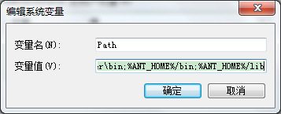

## Eclipse上解决方法数超过65536问题 ##

#### 1、合并jar ####

> 因为可能jar包太多，需要合并，我这里是通过ant来合并的。

**(1) Ant下载官网**

<a href="http://ant.apache.org/bindownload.cgi">http://ant.apache.org/bindownload.cgi</a>

**(2) 安装和配置**

在我的电脑 –> 右键属性 –> 高级系统配置 -> 环境变量 中配置ant

</img>

在系统变量的path后面加上%ANT_HOME%/bin;%ANT_HOME%/lib

</img>

**(3) 验证**

点击 开始 -> 运行 -> 输入cmd 
执行构建文件

输入如下命令：ant 
如果出现如下内容，说明安装成功： 
Buildfile: build.xml does not exist! 
Build failed 
注意：因为ant默认运行build.xml文件，这个文件需要我们创建。 
如果不想命名为build.xml，运行时可以使用 ant -buildfile test.xml 命令指明要运行的构建文件。

**(4) 编辑xml**

ant的执行需要一个xml文件(如下)，其中那么，表示工程名称，可以随便起，basedir表示存放jar包的路径 

在cmd里运行如下

</img>

build.xml中的内容：
```
<?xml version="1.0" encoding="utf-8"?>
<project
    name="hosa"
    basedir="F:\ant_test\hosa"
    default="makeSuperJar" >

    <target
        name="makeSuperJar"
        description="description" >

        <jar destfile="hosa.jar" >
        <zipfileset src="alipaySingle-20160111.jar" />
        <zipfileset src="AMap_Location_v2.0.0_20151117.jar" />
        <zipfileset src="android-support-v7-recyclerview.jar"/>
        <zipfileset src="com.umeng.message.lib_v2.5.0.jar" />
        <zipfileset src="dom4j-1.6.1.jar" />
        <zipfileset src="fastjson-1.1.22.jar" />
        <zipfileset src="gson-2.2.1.jar" />
        <zipfileset src="httpmime-4.1.3.jar" />
        <zipfileset src="jackson-core-asl-1.9.8.jar" />
        <zipfileset src="jackson-mapper-asl-1.9.8.jar" />
        <zipfileset src="json-lib.jar" />
        <zipfileset src="picasso-2.4.0.jar" />
        <zipfileset src="picture_utils.jar" />
        <zipfileset src="SocialSDK_email.jar" />
        <zipfileset src="SocialSDK_QQZone_1.jar" />
        <zipfileset src="SocialSDK_QQZone_2.jar" />
        <zipfileset src="SocialSDK_QQZone_3.jar" />
        <zipfileset src="SocialSDK_Sina.jar" />
        <zipfileset src="SocialSDK_sms.jar" />
        <zipfileset src="SocialSDK_WeiXin_1.jar" />
        <zipfileset src="SocialSDK_WeiXin_2.jar" />
        <zipfileset src="umeng_social_sdk.jar" />
        <zipfileset src="umeng-analytics-v5.6.4.jar" />
        <zipfileset src="umeng-update-v2.6.0.1.jar" />
        <zipfileset src="universal-image-loader-1.9.4.jar" />
        <zipfileset src="xUtils-2.6.14.jar" />
        </jar>
    </target>

</project>
```

其中的build.xml文件中有个target name，我们ant的执行方法就是ant makeSuperJar，makeSuperJar就是该name

#### 2、将jar转化为dex ####

通过dx工具将jar包中所有的类打包编译为一个名为classes.dex的文件。

该工具在

sdk的build-tools里面比如build-tools\19.1.0


cmd切换目录到该文件夹下,执行

> dx --dex --output 待统计.dex 待统计.jar

注意 待统计.jar 也应该在该目录下,或者其它目录,如：

> E:\java统计apk或者jar、dex方法数\待统计.jar


输入完命令,点击回车,等执行完后,在改目录已经生成了我们需要的dex文件。


**java统计apk或者jar、dex方法数**

首先需要下载一个工具类：

<a href="https://github.com/chenshouyin/DevNote/tree/master/%E5%B7%A5%E5%85%B7%E6%8A%80%E5%B7%A7%E7%AF%87/java%E7%BB%9F%E8%AE%A1apk%E6%88%96%E8%80%85jar%E3%80%81dex%E6%96%B9%E6%B3%95%E6%95%B0">java统计apk或者jar、dex方法数工具</a>

下载之后，cd到此目录


执行

> java -jar E:\java统计apk或者jar、dex方法数\dex-method-counts.jar 待统计.dex


我们可以看到已经成功的统计了该dex里面的方法数。

如果是apk呢，执行

> java -jar E:\java统计apk或者jar、dex方法数\dex-method-counts.jar 待统计.apk

即可。

那么如果是jar包呢？是否也可以直接执行该命令?

> java -jar E:\java统计apk或者jar、dex方法数\dex-method-counts.jar 待统计.jar


答案是不行的，需要先将jar转换为dex

#### 3、在eclipse中的操作 ####

将生成的dex文件改名为classes2.dex ,将该文件至于工程目录中的src目录 下。  
注意,在application里面就用到的jar包,必须放在主工程即lib目录下，不然会找不到。

从lib目录下剔除用来合并的jar 。但是剔除后为了能编译通过我们得使用外部引用：通过bulidPath下的add external archives引用被我们合并的之前的jar。

另外一种做法是在src目录下新建external-jars文件夹,把剔除的jar包放在这里


再到本地项目目录下找到


添加

	<classpathentry kind="lib" path="external-jars/zxing.jar"/>


再clean一下,项目就不会报错了。

#### 4、导入mutildex分包所需要的jar包 ####


然后在自定义的application类中声明载入dex文件的代码MultiDex.install(this);


到这里，理论上就可以正常的运行了，你运气好的话，注意报错不要惊慌，根据日志来排查，在application中使用的jar不能合并，并且放到classes2.dex中去，不然会报找不到该类的异常，因为初始化application的时候，还没有成功加载classes2.dex中去。