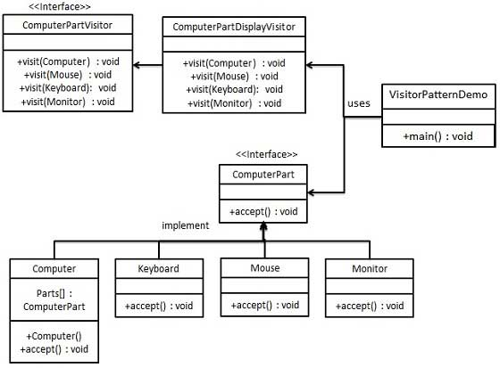

## 设计模式学习（六） ##

> 以下所学模式是行为型模式

#### 中介者模式 ####

&emsp;** 意图: **用一个中介对象来封装一系列的对象交互，中介者使各对象不需要显示地相互引用，从而使其耦合松散，而且可以独立的改变他们之间的交互。

&emsp;** 主要解决: **对象与对象之间存在大量的关联关系，这样势必会导致系统的结构变得很复杂，同时若一个对象发生改变，我们也需要跟踪与之相关联的对象，同时做出相应的处理。

&emsp;** 何时使用: **多个类相互耦合，形成了网状结构。

&emsp;** 如何解决: **将上述网状结构分离为星型结构。

&emsp;

&emsp;本模式的样例是本文件夹下的MediatorPattern工程

#### 备忘录模式 ####

&emsp;** 意图: **在不破坏封装性的前提下，捕获一个对象的内部状态，并在该对象之外保存这个状态。

&emsp;** 主要解决: **所谓备忘录模式就是在不破坏封装的前提下，捕获一个对象的内部状态，并在该对象之外保存这个状态，这样可以在以后将对象恢复到原先保存的状态。

&emsp;**何时使用: **很多时候我们总是需要记录一个对象的内部状态，这样做的目的就是为了允许用户取消不确定或者错误的操作，能够恢复到他原先的状态，使得他有“后悔药”可吃。

&emsp;** 如何解决: **通过一个备忘录类专门存储对象状态

&emsp;

&emsp;本模式的样例是本文件夹下的MementoPattern工程

#### 观察者模式 ####

&emsp;** 意图: **定义对象间的一种一对多的依赖关系，当一个对象的状态发生改变时，所有依赖于它的对象都得到通知并被自动更新。

&emsp;** 主要解决: **一个对象状态改变给其他对象通知的问题，而且要考虑到易用和低耦合，保证高度的协作。

&emsp;** 何时使用: **一个对象（目的对象）的状态发生改变，所有的依赖对象（观察者对象）都将得到通知，进行广播通知。

&emsp;** 如何解决: **使用面向对象技术，可以将这种依赖关系弱化。

&emsp;

&emsp;本模式的样例是本文件夹下的ObservePattern工程

#### 状态模式 ####

&emsp;** 意图: **允许对象在内部状态发生改变时改变它的行为，对象看起来好像修改了它的类。

&emsp;** 主要解决: **对象的行为依赖于它的状态（属性），并且可以根据他的状态改变而改变它的相关行为。

&emsp;** 何时使用: **代码中包含大量与对象状态有关的条件语句。

&emsp;** 如何解决: **将各种具体的状态类抽象出来。

&emsp;

&emsp;本模式的样例是本文件夹下的StatePattern工程

#### 空对象模式 ####

&emsp;

&emsp;本模式的样例是本文件夹下的NullPattern工程

### 策略模式 ###

&emsp;** 意图: **定义一系列的算法，把它们一个个封装起来，并且使它们可相互替换。

&emsp;** 主要解决: **在有多种算法相似的情况下，使用if...else所带来的复杂和难以维护。

&emsp;** 何时使用: **一个系统有许多许多类，而区别它们的只是他们直接的行为。

&emsp;** 如何解决: **将这些算法封装成一个一个的类，任意的替换。

&emsp;本模式的样例是本文件夹下的StrategyPattern工程

#### 模板模式 ####

&emsp;** 意图: **定一个操作中的算法的骨架，而将一些步骤延迟到子类中。模板方法使得子类可以不改变一个算法的结构即可重定义该算法的某些特定步骤。

&emsp;** 主要解决: **一些方法通用，却在每一个子类都重新写了这一方法。

&emsp;** 何时使用: **有一些通用的方法。

&emsp;** 如何解决: **将这些通用算法抽象出来

&emsp;

&emsp;本模式的样例是本文件夹下的TemplatePattern工程

#### 访问者模式 ####

&emsp;** 意图: **主要将数据结构与数据操作分离

&emsp;** 主要解决: **稳定的数据结构和易变的操作耦合问题

&emsp;** 何时使用: **需要对一个对象结构中的对象进行很多不同的并且不相关的操作，而需要避免让这些操作“污染”这些对象的类，使用访问者模式将这些封装到类中。

&emsp;** 如何解决: **在被访问的类里面加一个对外提供接待访问者的接口。

&emsp;

&emsp;本模式的样例是本文件夹中的VisitorPattern工程