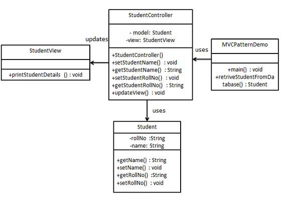
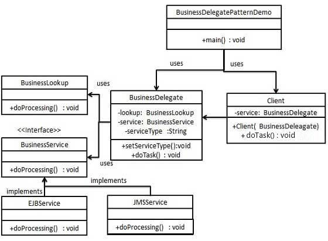

## 设计模式学习（七） ##

> 以下所学模式是J2EE模式

#### MVC模式 ####

&emsp;MVC模式代表Model-View-Controller(模型-视图-控制器)模式。这种模式用于应用程序的分层分发。

- ** Model（模型）**-模型代表一个存储数据的对象。它也可以带有逻辑，在数据变化时更新控制器。
- ** View（视图）**-视图代表模型包含的数据的可视化。
- ** Controller (控制器)**-控制器作用于模型和视图上。它控制数据流向模型对象，并在数据变化时更新视图。它使视图与模型分离开。

&emsp;

&emsp;

&emsp;本模式的样例是本文件夹下的MVCPattern工程

#### 业务代表模式 ####

&emsp;业务代表模式（Business Delegate Pattern）用于对表示层和业务层解耦。它基本上是用来减少通信或对表示层代码中的业务层代码的远程查询功能。在业务层中我们有以下实体。

- ** 客户端 **-表示层代码可以是JSP、serclet或UI java代码
- ** 业务代表 **-一个为客户端实体提供的入口类，它提供了对业务服务方法的访问。
- ** 查询服务 **-查找服务对象负责获取相关的业务实现，并提供业务对象对业务员代表对象的访问。
- ** 业务服务 **-业务服务接口。实现了该业务服务的实体类，提供了实际的业务实现逻辑。

&emsp;

&emsp;本模式的样例是本文件夹下的BusinessDelegatePattern工程

#### 组合实体模式 ####

&emsp;组合实体模式用在EJB持久化机制中。一个组合实体是一个EJB实体bean,代表了对象的图解。当更新一个组合实体时，内部依赖对象beans会自动更新，因为它们是由EJB实体bean管理的。以下是组合实体bean的参与者。

- ** 组合实体 **-他是主要的实体bean。它可以是粗粒的，或者可以包含一个粗粒度对象，用于持续生命周期
- ** 粗粒度对象 **-该对象包含依赖对象。他有自己的生命周期，也能管理依赖对象的生命周期。
- ** 依赖对象 **-依赖对象是一个持续生命周期依赖于粗粒度对象的对象。
- ** 策略 **-策略表示如何实现组合实体

&emsp;

&emsp;本模式的样例是本文件夹下的CompositeEntityPattern工程

#### 数据访问对象模式 ####

&emsp;数据访问对象模式或DAO模式用于把低级的数据访问API或操作从高级的业务服务中分离出来。以下是数据访问对象模式的参与者。

- ** 数据访问对象接口 **-该接口定义了在一个模型对象上要执行的标准操作。
- ** 数据访问对象实体类 **-该类实现了上述的接口。该类负责从数据源获取数据，数据源可以是数据库，也可以是xml，或者是其他的存储机制。
- ** 模型对象/数值对象**-该对象是简单的POJO，包含了get/set方法来存储通过使用DAO类检索到的数据。

&emsp;

&emsp;本模式的样例是本文件夹下的DaoPattern工程

#### 前端控制器模式 ####

&emsp;前端控制器模式是用来提供一个集合的请求处理机制，所有的请求都将由一个单一的处理程序处理。该处理程序可以做认证/授权/记录日志，或者跟踪请求，然后把请求传给相应的处理程序。以下是这种设计模式的实体。

- ** 前端控制器 **-处理应用程序所有类型请求的单个处理程序，应用程序可以是基于web的应用程序，也可以是基于桌面的应用程序
- ** 调度器 **-前端控制器可能使用一个调度器对象来调度请求到相应的具体处理程序。
- ** 视图 **-视图是为请求而创建的对象。

&emsp;

&emsp;本模式的样例是本文件夹下的FrontControllerPattern工程

#### 拦截过滤器模式 ####

&emsp;拦截过滤器模式用于对应用程序的请求或响应做一些预处理/后处理。定义过滤器，并在把请求传给实际目标应用程序之前应用在请求上。过滤器可以做认证/授权/记录日志，或者跟踪请求，然后把请求传给相应的处理程序。以下是这种设计模式的实体。

- ** 过滤器 **-过滤器在请求处理程序执行请求之前或之后，执行某些任务。
- ** 过滤器链 **-过滤器链带有多个过滤器，并在Target上按照定义的顺序执行这些过滤器。
- ** Target **-Target对象是请求处理程序。
- ** 过滤管理器 **-过滤管理器管理过滤器和过滤器链。
- ** 客户端 **-Client是向Target对象发送请求的对象。

&emsp;

&emsp;本模式的样例是本文件夹下的InterceptingFilter工程

#### 服务定位器模式 ####

&emsp;服务定位器模式用在我们想使用JNDI查询定位各种服务的时候。考虑到为某个服务查找JNDI的代价很高，服务定位器模式充分利用了缓存技术。在首次请求某个服务时，服务定位器在JNDI中查找服务，并缓存该服务对象。当再次请求相同的服务时，服务定位其会在他的缓存中查找，这样可以在很大程度上提高应用程序的性能。以下是这种设计模式的实体。

- ** 服务 **-实际处理请求的服务。对这种服务的引用可以在JNDI服务器中查找到。
- ** Context/初始化的Context **-JNDI Context带有对要查找的服务的引用。
- ** 服务定位器 **-服务定位器是通过JNDI查找和缓存服务来获取服务的单点接触。
- ** 缓存 **-缓存存储服务的引用，以便复用它们。
- ** 客户端 **-Client是通过ServiceLocator调用服务的对象。

&emsp;

&emsp;本模式的样例是本文件夹上的ServiceLocatorPattern工程

#### 传输对象模式 ####

&emsp;传输对象模式用于从客户端向服务器一次性传递带有多个属性的数据。传输对象也被称为数值对象。传输对象是一个具有getter/setter方法的简单的POJO类，它是可序列化的，所以它可以通过网络传输。他没有任何的行为。服务器端的业务类通常从数据库读取数据，然后填充POJO，并把它发送到客户端或按值传递它。对于客户端，传输对象是只读的。客户端可以创建自己的传输对象，并把它传递给服务器，以便一次性更新数据库中的数值。以下是这种设计模式的实体。

- ** 业务对象 **-为传输对象填充数据的业务服务。
- ** 传输对象 **-简单的POJO，只有设置/获取属性的方法。
- ** 客户端 **-客户端可以发送请求或者发送传输对象到业务对象

&emsp;

&emsp;本模式的样例的本文件夹上的TransferObjectPattern工程