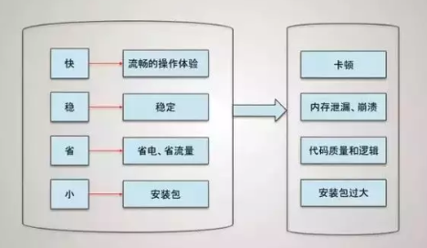
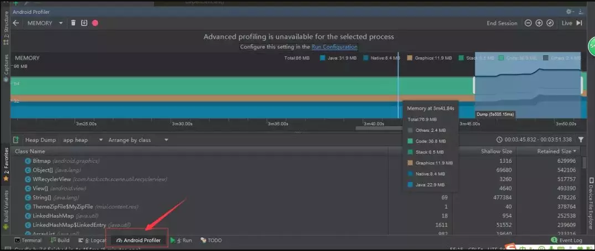

## Android App 性能优化 ##

### 性能优化的目标 ###

> 性能优化的目标：快、稳、省、小，如下图



### 快 ###

1. 优化UI绘制，刷新等
2. 启动，包括冷启动、热启动、温启动，不同环境使用不同启动方式。
3. 跳转，页面跳转、前后台切换
4. 及时反馈，点击事件、滑动、系统事件

##### UI #####

显示原理：

&emsp;Android 显示过程可以简单概括为：Android 应用程序把经过测量，布局、绘制后的 surface 缓存数据，通过 SurfaceFlinger 把数据渲染到显示屏幕上，通过 Android 的刷新机制来刷新数据。也就是说应用层负责绘制，系统层负责渲染，通过进程间通信把应用层需要绘制的数据传递到系统层服务，系统层服务通过刷新机制把数据更新到屏幕上。

&emsp;换一种方式说：Android 系统每隔 16ms 发出 VSYNC 信号，触发对 UI 进行渲染，如果每次渲染都成功，这样就能够达到流畅的画面所需要的 60FPS。（注：FPS 表示每秒传递的帧数。）在理想情况下，60FPS就感觉不到卡，这意味着每个绘制时长应该在16ms左右。如果某个操作花费的时间是24ms,系统在得到VSYNC信号时就无法正常进行正常渲染，这样就发生了丢帧现象。也就是延迟了，这种现象在执行动画或滑动列表比较常见，还有可能是你的 Layout 太过复杂，层叠太多的绘制单元，无法在 16ms 完成渲染，最终引起刷新不及时。

&emsp;如何解决刷新不及时的问题？主要通过UI布局、绘制优化、主线程优化这些方面去解决！

##### 布局优化 #####

- 避免 UI 布局优化可以先从合理使用背景色开始，比如：如果子view和父布局公用一个背景色就没有必要了。
- 减少不必要的嵌套，一般建议不超过5层
- 合理使用各种布局，尽量使用 LinearLayout 和 FrameLayout，因为 RelativeLayout 需要比较复杂，测绘也比较费时，强调一下这个是相对的，不是说LinearLayout 一定比 RelativeLayout 好。
- 合理使用 include、merge 和 ViewStub，使用 include 和 merge 增加复用，减少层级； ViewStub 按需加载。
- 推荐使用 google 已经出来的新的布局 ConstrainLayout，这个有机会说。

##### 绘制优化 #####

我们之前说过根据 Android 系统显示的原理，View 的绘制频率保证 60fps 是最佳的，这就要求每帧绘制时间不超过 16ms(16ms = 1000/60)，因此要减轻 onDraw() 的负担。所以在绘制时要注意两点：

&emsp;1.onDraw 中不要创建新的局部对象。

&emsp;2.onDraw 方法中不要做耗时的任务。

还有就是刷新，刷新的话尽量减少不必要的刷新和尽可能减少刷新面积

##### 启动优化 #####

&emsp;**冷启动**
&emsp;&emsp;冷启动是指安装 apk 后首次启动应用程序，或者应用程序上次结束，进程被杀死后重新打开app.
&emsp;&emsp;在冷启动开始时，系统有三个任务。这些任务是：
&emsp;&emsp;&emsp;1.加载并启动应用程序
&emsp;&emsp;&emsp;2.启动后立即显示应用程序的空白启动窗口
&emsp;&emsp;&emsp;3.创建应用程序进程
&emsp;&emsp;当系统为我们创建了应用进程之后，会执行以下的操作：
&emsp;&emsp;&emsp;application 的初始化
&emsp;&emsp;&emsp;启动 UI 线程
&emsp;&emsp;&emsp;创建 Activity
&emsp;&emsp;&emsp;导入视图(inflate view)
&emsp;&emsp;&emsp;计算视图大小(onmesure view)
&emsp;&emsp;&emsp;得到视图排版(onlayout view)
&emsp;&emsp;&emsp;绘制视图(ondraw view)
&emsp;&emsp;应用程序进程完成首次绘制后，系统进程会交换当前显示的背景窗口，将其替换为主活动。此时至此启动完成，用户可以使用程序(app)了，那么这里就会有两类创建：
&emsp;&emsp;&emsp;Application的创建
&emsp;&emsp;&emsp;当 Application 启动时，会有一个空白的启动窗口保留在屏幕上，直到系统首次完成绘制应用程序，白屏才会消失，这也是为什么启动app会出现白屏，这个问题，我也有提到过解决方式 Android 白屏
&emsp;&emsp;&emsp;Activity的创建
&emsp;&emsp;&emsp;当 Application 首次启动完成绘制后，我们的 UI 线程会执行主活动进行以下操作：
&emsp;&emsp;&emsp;&emsp;初始化值
&emsp;&emsp;&emsp;&emsp;执行其构造函数
&emsp;&emsp;&emsp;&emsp;执行其回调方法，比如 Activity 的 onCreate() 对应生命周期的状态，onCreate() 方法做的事情越多，冷启动消耗的时间越长。

&emsp;**暖(温)启动**

&emsp;&emsp;暖启动比冷启动时间更短。在暖启动中，系统都会把你的 Activity 带到前台。如果应用程序的 Activity 仍然驻留在内存中，那么应用程序可以避免重复对象初始化、布局加载和渲染，但系统依然会展示闪屏页，直到第一个 Activity 的内容呈现为止。比如：当应用中的Activities 被销毁，但在内存中常驻时，应用的启动方式就会变为暖启动。

&emsp;**热启动**

&emsp;&emsp;热启动的启动时间比暖启动还要更短。你比如，我用户 Back 退出应用程序，然后又重新启动，应用程序会再次执行 Activity 的 onCreate()，但会从 Bundle(savedInstanceState)获取数据，我们平时应用程序崩溃，不也是通过该方法保存数据的吗。

&emsp;**针对启动方式的优化**

&emsp;&emsp;Application 的创建过程中尽量少的进行耗时操作。比如：

&emsp;&emsp;Application 的 onCreate() 中进行友盟、bugly、okhttp、地图、推送等 init() 等操作。如果是必须在 onCreate 中进行的如：okhttp 等网络请求框架我们在 onCreate 中进行，其他的友盟，百度地图啥的我们可以等程序起来后在 onResume 方法中执行，bugly 等 sdk 可以异步加载。

&emsp;**在生命周期回调的方法中尽量减少耗时的操作**

这个里面的优化方式就是：避免I/O操作、反序列化、网络操作、布局嵌套等。

### 稳 ###

主线程的优化大部分是指内存优化，不要内存泄漏，那么通常哪些地方容易引起内存泄露呢？

&emsp;1. 集合类泄漏
&emsp;2. 单例/静态变量造成的内存泄漏
&emsp;3. 匿名内部类/非静态内部类
&emsp;4. 资源未关闭造成的内存泄漏

**解决方式**

比如我们的List集合add()元素之后，会引用着集合元素对象，导致该集合中的元素对象无法被回收，从而导致内存泄漏。当我们的List集合没有用的时候，一定要
```
list.clear()
list = null
```
针对单例引起的内存泄漏，通常是由于引用的 context 是生命周期短造成的，也就是说生命周期长的持有了生命周期短的引用，造成了内存泄漏。比如Toast，我们传入的是ManiActivity、但MainActivity没有用了，需要被销毁，但我们的 Toast 依然持有其引用导致无法回收，这就导致了内存泄漏。

匿名内部类或非静态内部类导致的内存泄漏，这个我们可以采用合理使用Java的引用机制来解决。

资源未关闭导致的内存泄漏就比较好说了，我们平时要多检查，用完后及时关闭无用资源：
- 网络、文件等流忘记关闭
- 手动注册广播时，退出时忘记 unregisterReceiver()
- Service 执行完后忘记 stopSelf()
- EventBus 等观察者模式的框架忘记手动解除注册
- 注意 Bitmap,用完及时 Recycle()

### 小 ###

“小”大多指应用程序 apk 体积要小。我们先看看一个 apk 文件有哪些解压后有哪些文件：
- assets 文件夹
存放一些配置文件、资源文件、assets 不会自动生成对应的 ID，而是通过 AssetManager 类的接口获取。

- res 目录
res 是 resource 的缩写，这个目录存放资源文件，会自动生成对应的 ID 并映射到 .R 文件中，访问直接使用资源 ID。

- META-INF
保存应用的签名信息，签名信息可以验证 APK 文件的完整性。

- AndroidManifest.xml
这个文件用来描述 Android 应用的配置信息，一些组件的注册信息、可使用权限等。

- classes.dex
Dalvik 字节码程序，让 Dalvik 虚拟机可执行，一般情况下，Android 应用在打包时通过 Android SDK 中的 dx 工具将 Java 字节码转换为 Dalvik 字节码。

- resources.arsc
记录着资源文件和资源 ID 之间的映射关系，用来根据资源 ID 寻找资源。

通常减小 APK 体积的方式都是：先用 studio 自带的代码扫描分析工具 lint 删除无用资源；开启混淆，设置shrinkResources true和minifyEnabled true;当然你也可以借助第三方工具如：乐固加固、360压缩啥的；还有注意不要重复使用库；插件化，比如功能模块放在服务器上，按需下载，可以减少安装包大小等都是常见的减少 apk 体积的方式。

### 省 ###

##### 省电 #####

谷歌推荐使用 JobScheduler，来调整任务优先级等策略来达到降低损耗的目的。JobScheduler 可以避免频繁的唤醒硬件模块，造成不必要的电量消耗。避免在不合适的时间（例如低电量情况下、弱网络或者移动网络情况下的）执行过多的任务消耗电量。

##### 省内存 #####

主要是加载图片，动不动就 OOM,对于图片的压缩无非是：

- 图片尺寸压缩

- 图片质量压缩

此处代码省略，网上一大堆。Glide 就是采用了 Lrucache 和 LruDiskCache 推荐使用。

##### 省 CPU 资源 #####

比如：线程的使用，这里我推荐使用线程池，我也写过相关文章，感兴趣的可以了解一下。Android-ThreadPool:

	https://www.jianshu.com/p/07eb2f7db0ee

##### 其他 #####

这就是本人的一些建议：

- 序列化采用推荐的 Parcelable 代替 Serializable
- 集合如果是插入和删除用的多，建议使用 LinkList。如果修改用的多，建议 ArrayList。
- 写程序要思考，避免创建不必要的对象。
- 对常量使用 static final，适用于基本类型和 String 常量。
- 使用增强的 for 循环语法(foreach)
- 避免使用浮点数，浮点数比 Android 设备上的整数慢约2倍。
- 尽可能少用 wrap_content，wrap_content 会增加布局 measure 是计算成本。
- 删除控件中无用的属性。
- 合理使用动画，某些情况下可以用硬件加速方式来提供流畅度，或者采用自定义 view 代替动画，最后记得在 Activity 的 ondestroy()方法中调用Animation.cancel()进行动画停止。
- 注意 webview 和 handler，一般在首次加载后 webview 就会存在内存中，容易内存泄漏。
- 考虑 StringBuilder 代替 String
- 数据量比较大或者内存比较宽裕考虑 HashMap，其他建议使用 SpareArray

### 最后 ###

要学会使用 AndroidStudio 自带的各种工具如：
- Lint：提示未使用到资源，不规范的代码，优化建议等。
使用：选择 Analyze > Inspect Code 具体百度
- 使用 Android Profiler 查看内存，已经各个操作内存和网络的变化。
- 借助第三方工具，这个就多了去了，比如 LeakCanary，MemoryAnalyzer 等

