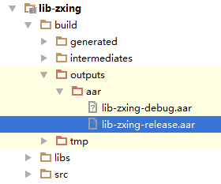

## Android Studio将Module打包成Jar包 ##

#### 1. 默认生成的jar包 ####

> 默认情况下，Android Studio会在项目运行之后生成jar包，路径为/build/intermediates/packaged-classes/release/classes.jar（创建的工程中的jar包位置也不一定一样，在老的版本中它在/build/intermediates/bundles/release），如果没有出现该包，可以看你的主工程运行时是否依赖了library。

#### 2. 自定义生成jar包（不包含资源文件） ####

- 首先，确保你的Module是Library状态，在build.gradle开头，同下   
**apply plugin:'com.android.library**

- 第一种方式

```
def _BASENAME = "Leezps";	//报名
def _VERSION = "_V1.0";		//版本号
def _DestinationPath = "build"; //生成jar包的位置
def zipFile = file('build/intermediates/packaged-classes/release/classes.jar'); //待打包文件位置
task deleteBuild(type:Delete){
    delete _DestinationPath + _BASENAME + _VERSION + ".jar"		//删除上个版本生成的jar包
}
task makeJar(type:Jar){
    from zipTree(zipFile)	//将classes.jar打入我们的jar包中
    from fileTree(dir:'src/main',includes:['assets/**']) //将src/main与assets目录打入jar包  
    baseName = _BASENAME + _VERSION		//包名
    destinationDir = file(_DestinationPath)		//文件目录地址
}
makeJar.dependsOn(deleteBuild, build)		//调用这个函数生成相应jar包
```

- 第二种方式——将classes.jar改名变成我们需要的jar文件，但是这样的包**不包含我们的资源文件**

```
task makeJar(type: Copy) {
    delete 'build/Leezps_V1.0.jar' //删除之前的旧jar包
    from('build/intermediates/packaged-classes/release/') //从这个目录下取出默认jar包
    into('build/') //将jar包输出到指定目录下
    include('classes.jar')
    rename('classes.jar', 'Leezps_V1.0.jar') //自定义jar包的名字
}
makeJar.dependsOn(build)
```

- 第三种方式

```
task clearJar(type: Delete) {
    delete 'build/Leezps_V1.0.jar' //jar包的名字，随便命名 
}
task makeJar(type:org.gradle.api.tasks.bundling.Jar) {
    //指定生成的jar名 
    baseName 'Leezps_V1.0'
    //从哪里打包class文件 
    from('build/intermediates/packaged-classes/release/'')
    //打包到jar后的目录结构 
    into('build/')
    //去掉不需要打包的目录和文件 
    exclude('test/', 'BuildConfig.class', 'R.class')
    //去掉R开头的文件  
    exclude{it.name.startsWith('R');}
}
makeJar.dependsOn(clearJar, build)
```

- 最后，在Terminal中输入gradlew makeJar命令就好了。

**当然过程中可能出现问题，这是网上常说的问题，可以借鉴借鉴**

> Execution failed for task ':mylibrary.lint'.
> Lint found errors in the project; aborting build.

解决在 build.gradle 文件中，加入下面的代码块（注意代码块所在的位置）,重新执行 gradlew makeJar 命令。

```
android {
    lintOptions {
        abortOnError false
    }
    ...
}
```

**最后注意：**

>　　将被嵌入的应用打包成 jar 包，但是这样的方式有局限性，无法将被嵌入的应用所使用的资源性文件一起打包。下面介绍 aar 打包方式。

#### 3. 直接使用 aar 包 ####
> 　　将被嵌入的应用打包成 aar 包，这也是 Android Studio 的一种新特性，可以将应用所使用的资源性文件一起打包。编译即可打包生成 aar 包，而且也不用担心漏掉资源问题。

> 　　如果Project 中 Module 是一个应用，则在 Module 的 build.gradle 文件中定义属性为：apply plugin: 'com.android.application'；而如果 Mudule 是一个被引用的依赖 lib 库的话，则在 Module 的 build.gradle 文件中定义属性为： apply plugin: 'com.android.library；所以当我们将应用 Module 打包出 aar 文件的时候，需要修改类型属性。正常情况下，直接重新编译 Module，生成的 aar 包在 Module 根目录的／build／outputs／aar／，如下图：



> 下面介绍将 aar 包添加到其他 Android 工程：
> 首先，将 aar 包复制到 libs 目录下
> 其次，配置build.gradle文件：
> A 在 android 中加入，如下：
```
repositories {  
    flatDir {  
        dirs 'libs'  
    }  
}
```
> B 在 dependencies 中加入 compile(name:lib-zxing-release', ext:'aar')
> 
> 完整 build.gradle 文件如下：

```
apply plugin: 'com.android.application'  
  
android {  
    ...
    repositories {  
        flatDir {  
            dirs 'libs'  
        }  
    }  
}  
  
dependencies {  
    ...
    compile(name:'lib-zxing-release', ext:'aar')  
}  
```

> 最后，重新编译 Rebuild 下工程。