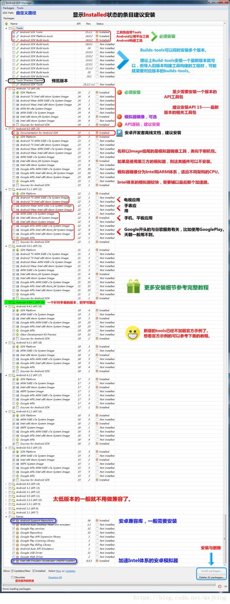

## 应用宝移动游戏SDK接入的各种问题 ##

#### 正文 ####

> &emsp;&emsp;昨天到今天，两天都在搞那个YSDK，我是真的醉了，我感觉各种奇葩的问题围绕着我转，主要还是感觉应用宝的文档写的不好，很多配置都没说，都要自己去摸索，不吐槽了，毕竟别人比我牛逼，我就只能默默忍受了…………

——**老板，上菜！**
——**来了…………**

&emsp;&emsp;我用的移动游戏YSDK接入版本是1.4.2，电脑上的开发环境什么都没有，可以说从零开始，因为公司里主要用的eclipse做开发，我首先肯定是配置环境啦，所以电脑上开始了安装配置环境的步骤，今天也按照这个步骤来讲我所遇到的问题。

jdk->eclipse->adt->sdk->ndk->导入项目YSDK-Eclipse->Boom、Boom……

**jdk、eclipse、adt这些都没遇到问题**

- jdk版本 1.8.0_111(本来有10.0.0的，但是公司需要装低版本的AndroidStudio，装了10.0.0之后发现低版本的AndroidStudio直接识别不到jdk了，所以又装回去了 (- . -!))
- eclipse 最新版本（这个无所谓)
- adt 23.0.6

#### Android SDK ####

> &emsp;&emsp;下载sdk，我们需要明白哪些sdk文件需要装，哪些sdk文件不装

从网上扣了张图，自己画太麻烦了，有现成的不用就对不起作者了，如果侵权，请联系我。



- tools目录最好全下载，因为你可能导入一些低版本的build tools的工程，只是建议，当然你也可以遇到低版本的build tools之后再去下，随便你。

- 下面就是Android XXX(API X)了，其中你主要下载除了Image结尾之外的所有文档就行了，当然你也可以按照自己的需求去下载对应API版本，Image主要的作用就是模拟器需要，如果你是真机或者其他第三方模拟器，那就不需要了…………

- Support Repository需要，因为它是兼容库，其实还有Support Library,但是Support Library没有出现在sdk manager上，你也可以不要，但是在eclipse创建文件的时候可能会出现问题，后面再讲这个问题

- 如果你是真机调试，那Google USB Driver必须要，Extras的其他文件的可选择

> 根据官方文档的描述
SDK Tools 必须
SDK Platform-tools 必须
SDK Platform必须至少安装一个版本
System Image建议安装
Android Support建议安装
SDK Samples建议安装

SDK好了，现在我们来讲讲上面所说缺少Support Library会遇到的问题

<a style='color:blue'>当我们用eclipse创建Android项目时，会有个Theme进行选择，如果我们选择Holo Light with Dark Action Bar以及Minimum Required SDK低于12还是多少，具体不是很清楚了，我选择的是8，创建项目完成之后，就会出现一个异常，如下：</a>

<a style='color:red'>error:Error retrieving parent for item:No resource found that matches the given name 'Theme.AppCompat.Light'</a>

<a style='color:blue'>为什么会出现这样的情况呢？因为低版本的无法识别这个，那要怎么弄呢？两种方式</a>

1. 就是在网上去下载那个Support Library的包，然后将其导入项目，让你新建的项目依赖这个包就行了

2. 那就是：
```
将出错的地方作如下修改，将
<style name="AppBaseTheme" parent="Theme.AppCompat.Light">
改为
<style name="AppBaseTheme" parent="android.Theme.Light">
同理，将
<style name="AppBaseTheme" parent="Theme.AppCompat.Light.DarkActionBar">
改为
<style name="AppBaseTheme" parent="android:Theme.Holo.Light.DarkActionBar">
```

好了，SDK这块就这样了，下次遇到说不定会补充…………

**ndk也没遇到问题，就是解压，配置环境变量以及设置Eclipse的NDK目录等等，网上都有**

#### 导入YSDK-Eclipse ####

然后报错就开始来了，突破天际…………

<a style='color:red'>Android NDK: Application targets deprecated ABI(s): armeabi mips mips64</a>

这是什么意思呢？因为我用的16b版本的NDK,就是说NDK版本比较新，这个armeabi,mips,mips64这些架构都不支持了，那要怎么解决呢？还是两种方法

1.（这个不算，因为它主要针对AndroidStudio有build.gradle配置文件的)jni使用Cmake编译
直接修改app/build.geadle，在其中添加如下代码，如下：
```
externalNativeBuild {
	cmake {
		arguments '-DANDROID_TOOLCHAIN=clang'
				'-DANDROID_STL=c++_static'
		//abiFilters "arm64-v8a"
		abiFilters 'arm64-v8a','armeabi-v7a','x86','x86_64'
	}
}
```

2.jni使用mk文件编译
删除在jni文件夹中Application.mk文件或者修改Application.mk中的内容，将不支持的架构去掉即可，修改如下：

```
#APP_ABI := all
#App_ABI := armeabi arm64-v8a x86 x86_64 mips mips64
APP_ABI := arm64-v8a x86 x86_64
APP_PLATFORM := android-19
```

3.降低NDK版本，我采用的这种方式，因为简单方便，出现问题好解决。NDK版本号降成了10b

<a style='color:red'>java.lang.UnsatisfiedLinkError:couldn't load YSDK from loader dalvik.system.</a>

这什么鬼问题呢？网上一搜，原来是armeabi中没有so文件，但是回去一找，有啊…………

——**emmmmmmmm**
——**这个真流弊，怎么解决呢？嗯…………摸着石头过河吧！（浑水摸鱼，说不定就中了）**

然后通过网上文件的对比以及Library与Demo的对比，我将Library中的armeabi复制了3份，分别是armeabi-v7a、mips、x86三个放到当前文件目录下，再次运行，OK，成功了。

**Boom 项目乱码了**

<a href="https://blog.csdn.net/raniy_black_dog/article/details/52403735">乱码解决方案</a>

最后添加几个markdown的语法

首行缩进(记得把分号加上)：

	半方大的空白&ensp;或&#8194；
	全方大的空白&emsp;或&#8185；
	不断行的空白格&nbsp;或&#160；

有颜色的字体：

	<a style='color:red'>……</a>

图片:

	
