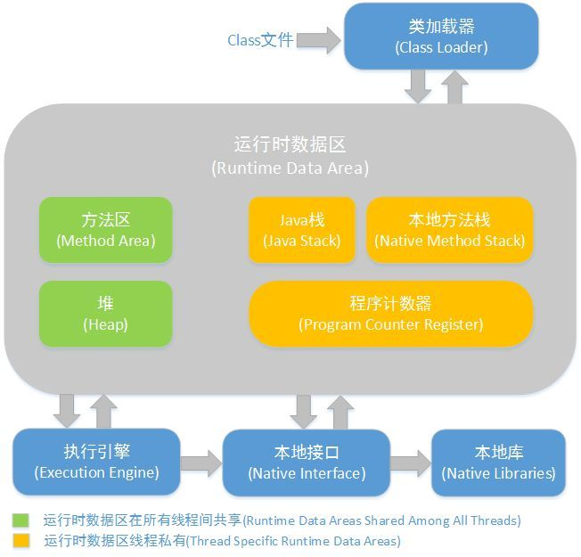

## 博客总结 ##

#### 1. Java反射机制 ####

> 首先，我们来张图，看看JVM虚拟机是如何工作的？



> 一张图，你看懂了吗？反正我是没看懂！下面我来具体讲讲：
> 我们先写一段java代码，例如
```
Object o = new Object();
```
> 然后编译运行，代码生成.class文件，类加载器将.class文件加载到JVM内存中，你的Object**这行代码**加载到方法区中，创建了Object类的class对象到堆中，注意这个不是new出来的对象，而是类的类型对象，每个类只有一个class对象，作为方法区类的数据结构的接口。jvm在new对象前，会去检查类的是否加载，寻找对应的class对象，若加载好了，则给你new的对象分配内存，也就是执行new Object()。如果没加载好，则先加载类的类型对象，然后再new对象。

**那反射是什么？有什么用呢？**

> 当我们程序在运行时，需要动态的加载一些类，而且这些类可能之前没有用到过所以不用加载到jvm中，而只有我们运行时根据条件判断才需要加载。例如：我们写个后台框架，这个框架中要使用到数据库，但是市场上的数据库有很多，像MySql、Oracle、SQLServer等等，但是为了让你的框架兼容更多数据库，那你就需要根据运行时检测到的数据库配置来动态加载对应的数据库驱动类。

	Java的反射机制需要借助到4个类，分别是：
	Class、Constructor、Field、Method
	Class代表的是类对象
	Constructor代表的是构造器对象
	Field代表的是类的属性对象
	Method代表的是方法对象

**获取Class对象的方式**

- 对象.getClass()
- 类.class
- Class.forName("包名+"."+类名")

**使用上面Class对象通过反射的方式实例化对象**

- newInstance()

```
eg:
	//获取Class对象
	Class<?> cls = Class.forName("cn.mldn.demo.Person");
	//反射的方式实例化对象
	Object obj = cls.newInstance();
```

> 对于程序的开发模式之前一直强调：尽量减少耦合，而减少耦合的最好做法是使用接口，但是就算使用了接口也逃不出关键字new，所以实际上new是造成耦合的关键元凶。

> 范例：

```
packagecn.mldn.demo;

interface Fruit {
	public void eat() ;
}

class Apple implements Fruit {
	public void eat() {
		System.out.println("吃苹果。");
	};
}

class Factory {
	public static Fruit getInstance(String className) {
		if("apple".equals(className)){
			return new Apple() ;
		}
		return null;
	}
}

public class FactoryDemo {
	public static void main(String[] args) {
		Fruit f = Factory.getInstance("apple") ;
		f.eat() ;
	}
}
```

> 以上为之前所编写最简单的工厂设计模式，但是在这个工厂设计模式之中有一个最大的问题：如果现在接口的子类增加了，那么工厂类肯定需要修改，这是它所面临的最大问题，而这个最大问题造成的关键性的病因是new，那么如果说现在不使用关键字new了，变为了反射机制呢？反射机制实例化对象的时候实际上只需要“包.类”就可以，于是根据此操作，修改工厂设计模式。

```
packagecn.mldn.demo;

interface Fruit {
	public void eat() ;
}

class Apple implements Fruit {
	public void eat() {
		System.out.println("吃苹果。");
	};
}

class Orange implements Fruit {
	public void eat() {
		System.out.println("吃橘子。");
	};
}

class Factory {
	public static Fruit getInstance(String className) {
		Fruit f = null;
		try{
			f = (Fruit) Class.forName(className).newInstance() ;
		} catch(Exception e) {
			e.printStackTrace();
		}
		returnf ;
	}
}

public class FactoryDemo {
	public static void main(String[] args) {
		Fruit f = Factory.getInstance("cn.mldn.demo.Orange") ;
		f.eat() ;
	}
}
```

> 发现，这个时候即使增加了接口的子类，工厂类照样可以完成对象的实例化操作，这个才是真正的工厂类，可以应对于所有的变化。如果单独从开发角度而言，与开发者关系不大，但是对于日后学习的一些框架技术这个就是它实现的命脉，在日后的程序开发上，如果发现操作的过程之中需要传递了一个完整的“包.类”名称的时候几乎都是反射机制作用。

**获取构造函数**

- Constructor getConstructor(Class[] params)
//获得使用特殊的参数类型的公共构造函数

- Constructor[] getConstructors()
//获得类的所有公共构造函数

- Constructor getDeclaredConstructor(Class[] params)
//获得使用特定参数类型的构造函数(与访问级别无关)

- Constructor[] getDeclaredConstructor()
//获得类的所有构造函数(与访问级别无关)

> 范例：观察没有无参构造的情况

```
package cn.mldn.demo;

class Person {

	private String name;
	private int age;
	
	public Person(String name,int age) {
		this.name= name ;
		this.age= age ;
	}

	@Override
	public String toString() {
		return "Person [name="+ name+ ", age="+ age+ "]";
	}
}

public class TestDemo {
	public static void main(String[] args) throwsException {
		Class<?> cls = Class.forName("cn.mldn.demo.Person") ; // 取得Class对象
		Object obj = cls.newInstance(); // 实例化对象
		System.out.println(obj);
	}
}
```

> 此时程序运行的时候出现了错误提示“java.lang.InstantiationException”，因为以上的方式使用反射实例化对象时需要的是类之中要提供无参构造方法，但是现在既然没有了无参构造方法，那么就必须明确的找到一个构造方法，而后利用Constructor类之中的新方法实例化对象：

> 实例化对象：public T newInstance(Object... initargs) throws InstantiationException, IllegalAccessException, IllegalArgumentException, InvocationTargetException

```
package cn.mldn.demo;

import java.lang.reflect.Constructor;

class Person {
	private String name;
	private int age;
	public Person(String name,int age) {
		this.name= name ;
		this.age= age ;
	}
	@Override
	public String toString() {
		return "Person [name="+ name+ ", age="+ age+ "]";
	}
}

public class TestDemo {
	public static void main(String[] args) throws Exception {
		Class<?> cls = Class.forName("cn.mldn.demo.Person") ; // 取得Class对象
		// 取得指定参数类型的构造方法
		Constructor<?> cons = cls.getConstructor(String.class,int.class) ;
		Object obj = cons.newInstance("张三", 20); // 为构造方法传递参数
		System.out.println(obj);
	}
}
```

> 很明显，调用无参构造方法实例化对象要比调用有参构造的更加简单、方便，所以在日后的所有开发之中，凡是有简单Java类出现的地方，都一定要提供无参构造。

**获取字段信息的方法** 

- Field getField(String name) -- 获得命名的公共字段

- Field[] getFields() -- 获得类的所有公共字段

- Field getDeclaredField(String name) -- 获得类声明的命名字段

- Field[] getDeclaredFields() -- 获得类声明的所有字段

> Field类提供了两个函数可以设置对应的属性，分别是set与get，但是要使用set与get，首先要解除私有也可以访问，解除私有属性函数是public void setAccessible(boolean flag)。

> 范例：利用反射操作类中的属性

```
package cn.mldn.demo;

import java.lang.reflect.Field;

class Person {

	private String name;

}

public class TestDemo {

	public static void main(String[] args) throwsException {

		Class<?> cls = Class.forName("cn.mldn.demo.Person"); // 取得Class对象
		Object obj = cls.newInstance(); // 对象实例化属性才会分配空间
		Field nameField = cls.getDeclaredField("name") ; // 找到name属性

		nameField.setAccessible(true) ; // 解除封装了
		nameField.set(obj, "张三") ; // Person对象.name = "张三"
		System.out.println(nameField.get(obj)); // Person对象.name

	}
}
```

**获得方法信息的方法**

- Method getMethod(String name, Class[] params)
//使用特定的参数类型，获得命名的公共方法

- Method[] getMethods()
//获得类的所有公共方法

- Method getDeclaredMethod(String name, Class[] params)
//使用特写的参数类型，获得类声明的命名方法

- Method[] getDeclaredMethods()
//获得类声明的所有方法

> 获得方法之后要调用一个函数才能执行这个方法

- Object invoke(Object obj, Object...args) --Object指new的对象， args指函数的参数列表

> 范例：利用反射调用Person类之中的setName()、getName()方法

```
package cn.mldn.demo;

import java.lang.reflect.Method;

class Person {
	private String name;

	public void setName(String name) {
		this.name= name;
	}

	public String getName() {
	 return name;
	}
}

public class TestDemo {

	public static void main(String[] args) throws Exception {

		Class<?> cls = Class.forName("cn.mldn.demo.Person") ; // 取得Class对象
		Object obj = cls.newInstance(); // 实例化对象，没有向Person转型
		String attribute = "name"; // 要调用类之中的属性

		Method setMet = cls.getMethod("set"+ initcap(attribute), String.class);// setName()
		Method getMet = cls.getMethod("get"+ initcap(attribute));// getName()
		setMet.invoke(obj, "张三") ; // 等价于：Person对象.setName("张三")

		System.out.println(getMet.invoke(obj));// 等价于：Person对象.getName()
	}

	public static String initcap(String str) {

		return str.substring(0,1).toUpperCase().concat(str.substring(1)) ;

	}
}
```

> 在日后的所有框架技术开发之中，简单Java类都是如此应用的，所以必须按照标准进行。