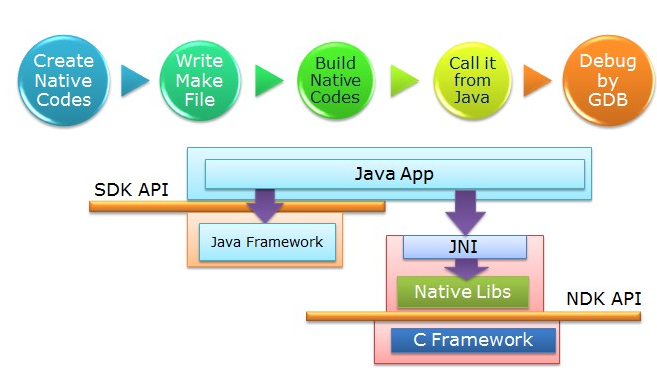
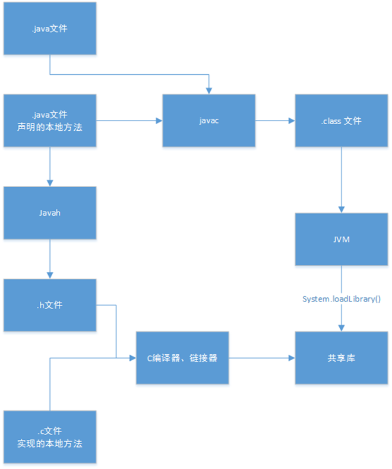
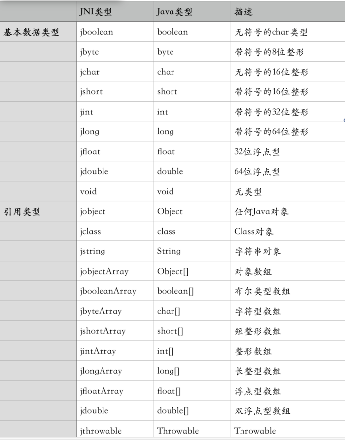

## Native方法的实现 ##

#### 正文 ####

> &emsp;&emsp;最近在接触一些游戏与Android系统之间的配置问题，不可避免的要去看一些Java中的native方法实现，今天在此总结一下我对native方法的看法

**1. native方法是什么？**

> &emsp;&emsp;native方法是Java中以native声明，需要用其他语言实现的的方法就是native方法，通常我们经常使用C与C++来实现方法。在开发某些类型应用时，有助于你重复使用这些语言编写的代码库。

**2. Android中与native对应的就是NDK，那NDK的价值在哪？**

> 1. 在平台之间移植应用
> 2. 重复使用现在的库
> 3. 提升性能，例如像游戏这样的计算密集型应用
> 4. 很多第三方的库都是由C/C++库编写的
> 5. 不依赖于Dalvik Java虚拟机的设计
> 6. 保护代码（C/C++库反编译难度比Java层代码更难）

**3. NDK到SO**

> 首先，我们先来张图

> 从上图这个Android系统框架来看，我们上层通过JNI来调用native方法。因为C语言的不跨平台性，要使得在Mac系统的下的native方法在Linux下也能执行，则需创建一个函数库——so文件。其本质就是一堆C、C++的头文件和实现文件打包成一个库。目前Android系统支持以下七种不用的CPU架构，每一种对应着各自的应用程序二进制接口ABI：(Application Binary Interface)定义了二进制文件(尤其是.so文件)如何运行在相应的系统平台上，从使用的指令集，内存对齐到可用的系统函数库。对应关系如下：

- ARMv5————armeabi
- ARMv7————armeabi-v7a
- ARMv8————arm64-v8a
- x86——————x86
- MIPS—————mips
- MIPS64———mips64
- x86_64———x86_64

**4. 什么是JNI**

> &emsp;&emsp;JNI，全称为Java Native Interface，即Java本地接口，JNI是Java调用Native 语言的一种特性。通过JNI可以使得Java与C/C++机型交互。即可以在Java代码中调用C/C++等语言的代码或者在C/C++代码中调用Java代码。由于JNI是JVM规范的一部分，因此可以将我们写的JNI的程序在任何实现了JNI规范的Java虚拟机中运行。同时，这个特性使我们可以复用以前用C/C++写的大量代码JNI是一种在Java虚拟机机制下的执行代码的标准机制。代码被编写成汇编程序或者C/C++程序，并组装为动态库。也就允许非静态绑定用法。这提供了一个在Java平台上调用C/C++的一种途径，反之亦然。

> **注意**：开发JNI程序会受到系统环境限制，因为用C/C++ 语言写出来的代码或模块，编译过程当中要依赖当前操作系统环境所提供的一些库函数，并和本地库链接在一起。而且编译后生成的二进制代码只能在本地操作系统环境下运行，因为不同的操作系统环境，有自己的本地库和CPU指令集，而且各个平台对标准C/C++的规范和标准库函数实现方式也有所区别。这就造成了各个平台使用JNI接口的Java程序，不再像以前那样自由的跨平台。如果要实现跨平台， 就必须将本地代码在不同的操作系统平台下编译出相应的动态库

**5. 如何实现JNI**

- 第一步：在Java中先声明一个native方法
- 第二步：编译Java源文件javac得到.class文件
- 第三步：通过javah -jni命令导出JNI的.h头文件
- 第四步：创建一个cpp文件，导入先前生成的.h头文件，实现在Java中声明的Native方法（如果Java需要与C++交互，那么就用C++实现Java的Native方法）
- 第五步：将本地代码编译成动态库（Windows系统下是.dll文件，Linux系统下是.so文件，mac系统下是.jnilib文件）

> **注意**：javah是JDK自带的一个命令，-jni参数表示将class中用到native声明的函数生成JNI规则的函数

> jni的开发流程如下图：

> Java类型与JNI类型的区别：

**6. 与JNIEnv相关的常用函数**

1.创建Java中的对象

> - jobject NewObject(JNIEnv *env, jclass clazz, jmethodID methodID, ...);
> - jobject NewObjectA(JNIEnv *env, jclass clazz, jmethodID method, const jvalue *args);
> - jobject NewObjectV(JNIEnv *env, jclass clazz, jmethodID methodID, va_list args);

> 其中jclass代表你要创建哪个类的对象，jmethodID代表你要使用哪个构造方法ID来创建对象。

2.创建Java中的String对象

> - jstring NewString(JNIEnv *env, const jchar* unicodeChars, jsize len);

> 通过Unicode字符的数组来创建一个新的String对象。
> JNIEnv是JNI接口指针；jchar是指Unicode字符串的指针；jsize是Unicode字符串的长度，返回值是对应的字符串对象，无法创建则返回null

> - jstring NewStringUTF(JNIEnv *env, const char *bytes)

> 这个方法就是直接new一个编码为utf-8的字符串

3.创建类型为基本类型Primitive Type的数组

> - ArrayType New&lt;PrimitiveType&gt;Array(JNIEnv *env, jsize length);

> 指定一个长度后返回相应的Java基本类型的数组

|	方法		|	返回值	|
|:---------:|:---------:|
|New&lt;PrimitiveType&gt;Array Routines|Array Type|
|NewBooleanArray()|jbooleanArray|
|NewByteArray()|jbyteArray|
|NewCharArray()|jcharArray|
|NewShortArray()|jshortArray|
|NewIntArray()|jintArray|
|NewLongArray()|jlongArray|
|NewFloatArray()|jfloatArray|
|NewDoubleArray()|jdoubleArray|

4.创建类型为elementClass的数组

> - jobjectArray NewObjectArray(JNIEnv *env, jsize length, jclass elementClass, jobject initialElement);

> 制造一个新的数组，类型是elementClass，所有类型都被初始化为initialElement

5.获取数组中某个位置的元素

> - jobject GetObjectArrayElement(JNIEnv *env, jobjectArray array, jsize index);

> 返回Object数组的一个元素

6.获取数组的长度

> - jsize GetArrayLength(JNIEnv *env, jarray array);

> 获取array数组的长度

#### 参考 ####

- <a href="https://www.jianshu.com/p/87ce6f565d37">系统学习Android JDK</a>

- <a href="https://www.jianshu.com/p/b4431ac22ec2">样例解析Android的NDK创建(AndroidStudio版)</a>

