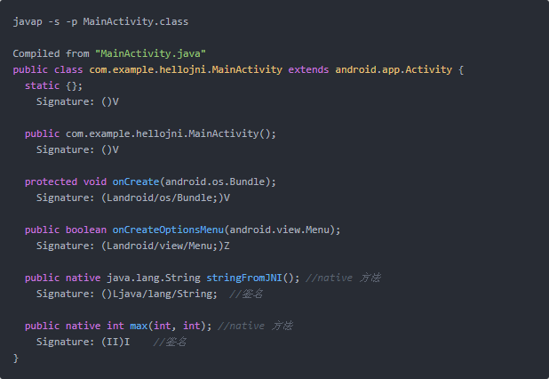

## Native方法深入学习 ##

> 当Java代码中执行native代码的时候，首先需要找到这个native方法，这儿通过注册的方式来让Java代码找到native方法。

#### 1. 注册Native函数 ####

JNI有两种注册native方法的途径：

> 1. 静态注册：
> 先由Java得到本地方法的声明，然后再通过JNI实现该声明方法
> 2. 动态注册
> 先通过JNI重载JNI_OnLoad()实现本地方法，然后直接在Java中调用本地方法。

**(1) 静态注册native函数**

> 静态注册就是根据函数名来遍历Java和JNI函数之间的关联，而且要求JNI层函数的名字必须遵循特定的格式。具体的实现很简单，首先在Java代码中声明native函数，然后通过javah来生成native函数的具体形式，接下来在JNI代码中实现这些函数即可。

举个例子：

```
public class JniDemo1 {
	static {
		System.loadLibrary("samplelib_jni");
	}

	private native void nativeMethod();
}
```

接下来通过javah来产生jni的代码，假设你的包名为com.gebilaolitou.jnidemo

	javah -d ./jni/ -classpath /Users/YOUR_NAME/Library/Android/sdk/platforms/android-21/android.jar:../../build/intermediates/classes/debug/ com.gebilaolitou.jnidemo.JniDemo1

然后就会得到一个JNI的.h文件，里面包含这几个native函数的声明，观察一下文件名以及函数名。其实JNI方法名的规范就出来了：

**返回值+Java前缀+包名+类名+方法名+参数1(JNIEnv *)+参数2(jclass/jobject)+其他参数值**

jclass是当方法为静态方法时
jobject是当方法为非静态方法

注意事项：
> - 注意分隔符：
> Java前缀与包名、类名、方法名之间使用“_”进行分割；
> - 注意静态：
> 如果在Java中声明的方法是“静态的”，则native方法也是static。否则不是
> - 如果你的JNI的native方法不是通过静态注册方式来实现的，则不需要符合上面的这些规范，可以格局自己习惯随意命名

**(2) 动态注册native函数**

> &emsp;&emsp;使用System.loadLibrary()方法加载so库的时候，Java虚拟机就会找到这个JNI_OnLoad函数，这个函数的作用是告诉Dalvik虚拟机链接的C库使用哪个JNI版本。因为JNI最新版本做了很多扩充与优化，所以要使用最新的版本，就需在JNI_OnLoad中声明JNI的版本。同时也可以做一些其他的初始化工作，例如像注册之类的，该函数有三个关键字需注意，分别是JNIEXPORT、JNICALL、jint。其中JNIEXPORT和JNICALL是两个宏定义，用于只想该函数的JNI函数，jint是JNI定义的数据类型（上章对JNI的常用数据类型做了一定讲解）

举个例子：

> 首先加载so库

```
public class JniDemo2 {
	static {
		System.loadLibrary("samplelib_jni");
	}
}
```

> 在jni文件夹中创建一个cpp文件，实现如下代码

```
#include <jni.h>
#include "Log4Android.h"
#include <stdio.h>
#include <stdlib.h>

using namespace std;

#ifdef __cplusplus
extern "C" {
#endif

static const char *className = "com/gebilaolitou/jnidemo/JNIDemo2";

static void sayHello(JNIEnv *env, jobject, jlong handle) {
    LOGI("JNI", "native: say hello ###");
}

static JNINativeMethod gJni_Methods_table[] = {
    {"sayHello", "(J)V", (void*)sayHello},
};

static int jniRegisterNativeMethods(JNIEnv* env, const char* className,
    const JNINativeMethod* gMethods, int numMethods)
{
    jclass clazz;

    LOGI("JNI","Registering %s natives\n", className);
    clazz = (env)->FindClass( className);
    if (clazz == NULL) {
        LOGE("JNI","Native registration unable to find class '%s'\n", className);
        return -1;
    }

    int result = 0;
    if ((env)->RegisterNatives(clazz, gJni_Methods_table, numMethods) < 0) {
        LOGE("JNI","RegisterNatives failed for '%s'\n", className);
        result = -1;
    }

    (env)->DeleteLocalRef(clazz);
    return result;
}

jint JNI_OnLoad(JavaVM* vm, void* reserved){
    LOGI("JNI", "enter jni_onload");

    JNIEnv* env = NULL;
    jint result = -1;

    if (vm->GetEnv((void**) &env, JNI_VERSION_1_4) != JNI_OK) {
        return result;
    }

    jniRegisterNativeMethods(env, className, gJni_Methods_table, sizeof(gJni_Methods_table) / sizeof(JNINativeMethod));

    return JNI_VERSION_1_4;
}

#ifdef __cplusplus
}
#endif
```

**cpp文件讲解：**

> JNI_OnLoad函数中主要有两块，分别是if语句与jniRegisterNativeMethods函数的实现

```
if(vm->GetEnv((void**) &env, JNI_VERSION_1_4) != JNI_OK) {
	return result;
}
```

> GetEnv函数是获取JNIEnv结构体的指针，其实JNIEnv结构体指向了一个函数表，该函数表指向对应的JNI函数，找到JNI函数就实现了JNI编程。

> jniRegisterNativeMethods函数是实现了注册的功能，其中参数中有个gJni_Methods_table这个静态变量。它代表的是一个native方法数组，如果你在一个Java类中有一个native方法，它的size就是1，如果是两个native方法，它的size就是2。

```
static JNINativeMethod gJni_Methods_table[] = {
	{"sayHello", "(J)V", (void*)sayHello},
};
```

> JNINativeMethod的结构体：

```
typedef struct {
	const char* name;
	const char* signature;
	void* fnPtr;
} JNINativeMethod;
```

> name: Java中的函数名
> signature: Java中的参数和返回值
> fnPtr: C函数的函数指针

jniRegisterNativeMethods函数实现讲解：

```
static int jniRegisterNativeMethods(JNIEnv* env, const char* className,
    const JNINativeMethod* gMethods, int numMethods)
{
    jclass clazz;

    LOGI("JNI","Registering %s natives\n", className);
    clazz = (env)->FindClass( className);
    if (clazz == NULL) {
        LOGE("JNI","Native registration unable to find class '%s'\n", className);
        return -1;
    }

    int result = 0;
    if ((env)->RegisterNatives(clazz, gJni_Methods_table, numMethods) < 0) {
        LOGE("JNI","RegisterNatives failed for '%s'\n", className);
        result = -1;
    }

    (env)->DeleteLocalRef(clazz);
    return result;
}
```

> 首先通过FindClass找到声明native方法的Java类，然后通过RegisterNatives来注册函数，就这样让函数与Java类实现了绑定。

#### 2. JNI中的签名 ####

为什么JNI中要多个签名概念？

> 因为Java是支持函数重载的，也就是说JNI也要能够识别重载，但是JNI寻找函数就是根据函数名来识别的，所以为了解决这个问题，JNI就衍生了一个“签名”的概念，即将参数类型和返回值类型进行组合。如果拥有这个函数的签名信息以及函数名，我们就能准确找到这个函数了。

使用javap命令查看类的签名

</img>

其中()V， (Landroid/os/Bundle;)V， (Landroid/view/Menu;)Z， (II)I是什么东西呢？

**JNI的签名信息规范**

格式如下：

（参数1类型标示；参数2类型标示；参数3类型标示...）返回值类型标示

> 当参数为引用类型的时候，参数类型的标示的根式为"L包名"，其中包名的"."要换成"/"。例如：String就是Ljava/lang/String

基本类型签名如下：

|	类型标示	|	Java类型		|
|:----------|:-------------:|
|Z|boolean|
|B|byte|
|C|char|
|S|short|
|I|int|
|J|long|
|F|float|
|D|double|

返回值是void，对应的签名是V

数组：

|类型标示|Java类型|
|:------|:-----:|
|[签名|数组|
|[i|int[]|
|[Ljava/lang/Object|String[]|

#### 3. native代码反调用Java层代码 ####

**(1) 获取Class对象**

> 为了能够在C/C++中调用Java中的类，jni.h专门定义了jclass类型表示Java中的Class类。JNIEnv中有3个函数可以获取jclass

> - jclass FindClass(const char* clsName)
> 通过类的名称(类的全名，这时候包名不是用"."，而是用"/"来区分的)来获取jclass。比如：

```
jclass jcl_string = env->FindClass("java/lang/String");
```

> - jclass GetObjectClass(jobject obj);
> 通过对象实例来获取jclass，相当于Java中的getClass()函数

> - jclass getSuperClass(jclass obj)
> 通过jclass可以获取其父类的jclass对象

**(2) 获取属性的方法**

> 在JNI中为了调用Java类的属性和方法，JNI在jni.h头文件中定义了jfieldID和jmethodID这两种类型来分别代表该Java端的属性和方法。

```
jfieldID GetFieldID(JNIEnv *env, jclass clazz, const char *name, const char *sig);
//获取某个属性
jmethodID GetMethodID(JNIEnv *env, jclass clazz, const char *name, const char *sig);
//获取某个方法
jfieldID GetStaticFieldID(JNIEnv *env, jclass clazz, const char *name, const char *sig);
//获取某个静态属性
jmethodID GetStaticMethodID(JNIEnv *env, jclass clazz, const char *name, const char *sig);
//获取某个静态方法
```

> - JNIEnv JNI环境接口
> - jclass Java层中的类
> - name   方法名或者属性名
> - sig    签名(上面已经讲解过了)

**(3) 创建对象**

> 创建对象的方法

```
jobject NewObject(JNIEnv *env, jclass clazz, jmethodID methodID)
```

例如：

```
jmethodID mid = (*env)->GetMethodID(env, cls, "<init>", "()V");
obj = (*env)->NewObject(env, cls, mid);
```

> 参数中有数组的方法

```
jobject NewObjectA(JNIEnv *env, jclass clazz, jmethodID methodID, jvalue *args);
//将参数传入jvalue类型的args数组中
```

> 参数中无数组的方法

```
jobject NewObjectV(JNIEnv *env, jclass clazz, jmethodID methodID, va_list args);
//将参数放入va_list类型的args中
```

<a href="https://www.jianshu.com/p/67081d9b0a9c">JNI的常用方法的中文API</a>

#### 参考 ####

- <a href="https://www.jianshu.com/p/b71aeb4ed13d">Java与Native相互调用</a>
- <a href="https://juejin.im/entry/575588ff207703006c0487f1">深入理解JNI</a>
- <a href="http://doslin.com/2017/07/17/jni-ndk-tutorial-second/">很好的一个例子</a>