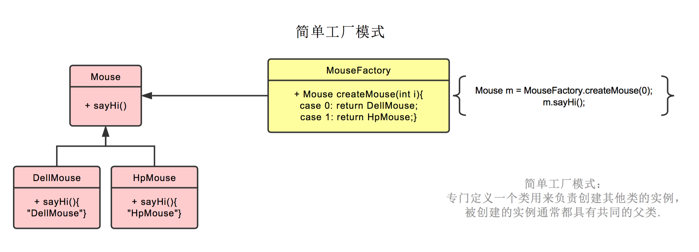

## 设计模式学习(一) ##

#### 设计模式的类型 ####

|序号|模式&描述|包括|
|:--:|:----|:--|
|1|**创建型模式**<br>这些设计模式提供了一种在创建对象的同时隐藏创建逻辑的方式，<br>而不是使用new运算符直接实例化对象。这使得程序在判断针对某<br>个给定实例需要创建哪些对象时更加灵活。|1. 工程模式(Factory Pattern)<br>2. 抽象工厂模式(Abstract Factory Pattern)<br>3. 单例模式(Singleton Pattern)<br>4. 建造者模式(Builder Pattern)<br>5. 原型模式(Prototype Pattern)|
|2|**结构型模式**<br>这些设计模式关注类和对象的组合。继承的概念被用来组合接口和<br>定义组合对象获得新功能的方式|1. 适配器模式(Adapter Pattern)<br>2. 桥接模式(Bridge Pattern)<br> 3. 过滤器模式(Filter、Criteria Pattern)<br> 4. 组合模式(Composite Pattern)<br> 5. 装饰器模式(Decorator Pattern)<br> 6. 外观模式(Facade Pattern)<br> 7. 享元模式(Flyweight Pattern)<br> 8. 代理模式(Proxy Pattern)|
|3|**行为型模式**<br>这些设计模式特别关注对象之间的通信|1. 责任链模式(Chain of Responsibility Pattern)<br>2. 命令模式(Command Pattern)<br>3. 解释器模式(Interpreter Pattern)<br>4. 迭代器模式(Iterator Pattern)<br>5. 中介者模式(Mediator Pattern)<br>6. 备忘录模式(Memento Pattern)<br>7. 观察者模式(Observer Pattern)<br>8. 状态模式(State Pattern)<br>9. 空对象模式(Null Object Pattern)<br>10. 策略模式(Strategy Pattern)<br>11. 模板模式(Template Pattern)<br>12. 访问者模式(Visitor Pattern)|
|4|**J2EE模式**<br>这些设计模式特别关注表示层。这些模式是由Sun Java Center鉴<br>定的。|1. MVC模式(MVC Pattern)<br>2. 业务代表模式(Business Delegate Pattern)<br>3. 组合实体模式(Composite Entity Pattern)<br>4. 数据访问对象模式(Data Access Object Pattern)<br>5. 前端控制器模式(Front Controller Pattern)<br>6. 拦截过滤器模式(Intercepting Filter Pattern)<br>7. 服务定位器模式(Service Locator Pattern)<br>8. 传输对象模式(Transfer Object Pattern)|

> 今天只研究创建型模式

#### 工厂模式 ####

&emsp;**意图：**定义一个创建对象的接口，让其子类自己决定实例化哪一个工厂类，工厂模式使其创建过程延迟到子类进行。

&emsp;**主要解决：**主要解决接口选择的问题

&emsp;**何时使用：**我们明确的计划不同条件下创建不同实例时。

&emsp;**如何解决：**让其子类实现工厂接口，返回的也是一个抽象的产品。

&emsp;

&emsp;样例就是本文件夹下的FactoryPattern工程

#### 抽象工厂模式 ####

&emsp;**意图：**提供一个创建一系列相关或相互依赖对象的接口，而无需指定他们具体的的类。

&emsp;**主要解决：**主要解决接口选择的问题

&emsp;**何时使用：**系统的产品有多于一个的产品族，而系统只消费其中某一族的产品。

&emsp;**如何解决：**在一个产品族里面，定义多个产品。

&emsp;

&emsp;样例就是本文件夹下的AbstractFactoryPattern工程

**/\*\*-------------------- 来自涛的分享 --------------------\*\*/**
下面例子中鼠标，键盘，耳麦为产品，惠普，戴尔为工厂。

**简单工厂模式**
简单工厂模式不是 23 种里的一种，简而言之，就是有一个专门生产某个产品的类。

比如下图中的鼠标工厂，专业生产鼠标，给参数 0，生产戴尔鼠标，给参数 1，生产惠普鼠标。


**工厂模式**
工厂模式也就是鼠标工厂是个父类，有生产鼠标这个接口。

戴尔鼠标工厂，惠普鼠标工厂继承它，可以分别生产戴尔鼠标，惠普鼠标。

生产哪种鼠标不再由参数决定，而是创建鼠标工厂时，由戴尔鼠标工厂创建。

后续直接调用**鼠标工厂.生产鼠标()**即可


**抽象工厂模式**
抽象工厂模式也就是不仅生产鼠标，同时生产键盘。

也就是 PC 厂商是个父类，有生产鼠标，生产键盘两个接口。

戴尔工厂，惠普工厂继承它，可以分别生产戴尔鼠标+戴尔键盘，和惠普鼠标+惠普键盘。

创建工厂时，由戴尔工厂创建。

后续**工厂.生产鼠标()**则生产戴尔鼠标，**工厂.生产键盘()**则生产戴尔键盘。


> 在抽象工厂模式中，假设我们需要增加一个工厂

假设我们增加华硕工厂，则我们需要增加华硕工厂，和戴尔工厂一样，继承 PC 厂商。

之后创建华硕鼠标，继承鼠标类。创建华硕键盘，继承键盘类即可。


> 在抽象工厂模式中，假设我们需要增加一个产品

假设我们增加耳麦这个产品，则首先我们需要增加耳麦这个父类，再加上戴尔耳麦，惠普耳麦这两个子类。

之后在PC厂商这个父类中，增加生产耳麦的接口。最后在戴尔工厂，惠普工厂这两个类中，分别实现生产戴尔耳麦，惠普耳麦的功能。 以上。


**/\*\*-------------------- 来自涛的分享结束 --------------------\*\*/**

#### 单例模式 ####

&emsp;**意图：**保证一个类仅有一个实例，并提供一个访问他的全局访问点。

&emsp;**主要解决：**一个全局使用的类频繁的创建与销毁。

&emsp;**何时使用：**当你想控制实例数目，节省系统资源的时候。

&emsp;**如何解决：**判断系统是否已经有这个单例，如果有则返回，如果没有则创建。

&emsp;

&emsp;样例就是本文件夹下的SingletonPattern工程

**单例模式的几种实现方式**

**1. 懒汉式，线程不安全**

**是否Lazy初始化：**是
**是否多线程安全：**否
**实现难度：**易
```
public class Singleton {
	private static Singleton instance;
	private Singleton (){}

	public static Singleton getInstance() {
		if(instance == null) {
			instance = new Singleton();
		}
		return instance;
	}
}
```

**2. 懒汉式，线程安全**

**是否Lazy初始化：**是
**是否多线程安全：**是
**实现难度：**易
```
public class Singleton {
	private static Singleton instance;
	private Singleton (){}
	public static synchronized Singleton getInstance() {
		if(instance == null) {
			instance = new Singleton();
		}
		return instance; 
	}
}
```

**3. 饿汉式**

**是否Lazy初始化：**否
**是否多线程安全：**是
**实现难度：**易
```
public class Singleton {
	private static Singleton instance = new Singleton();
	private Singleton (){}
	public static Singleton getInstance() {
		return instance;
	}
}
```

**4. 双检锁/双重校验锁**

**JDK版本：**JDK1.5起
**是否Lazy初始化：**是
**是否多线程安全：**是
**实现难度：**较复杂
```
public class Singleton {
	private volatitle static Singleton singleton;
	private Singleton (){}
	public static Singleton getSingleton() {
		if(singleton == null) {
			synchronized(Singleton.class) {
				if(singleton == null) {
					singleton = new Singleton();
				}
			}
		}
		return singleton;
	} 
}
```

**5. 登记式/静态内部类**

**是否Lazy初始化：**是
**是否多线程安全：**是
**实现难度：**一般
```
public class Singleton {
	private static class SingletonHolder {
		private static final Singleton INSTANCE = new Singleton();
	}
	private Singleton() {}
	public static final Singleton getInstance() {
		return SingletonHolder.INSTANCE;
	}
}
```

**6. 枚举**

**JDK版本：**JDK1.5起
**是否Lazy初始化：**	否
**是否多线程安全：**是
**实现难度：**易
```
public enum Singleton {
	INSTANCE;
	public void whateverMethod() {
	}
}
```

> **经验之谈：**一般情况下，不建议使用第1种和第2中懒汉方式，建议使用第3种饿汉方式。只有在要明确实现lazy loading效果时，才会使用第5种登记方式。如果涉及到反序列创建对象时，可以尝试使用第6种枚举方式。如果有其他特殊的要求，可以考虑使用第4种双检锁方式。