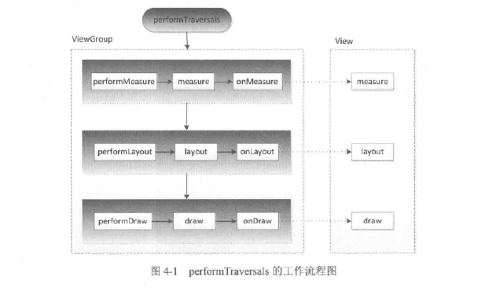

#### ViewRoot和DecorView的概念 ####

> ViewRoot对应于ViewRootImpl类，它是连接WindowManager和DecorView的纽带。

> View的三大流程（测量、布局、绘制）是通过ViewRoot来完成的。

> 在ActivityThread中，当Activity对象被创建完毕后，会将DecorView添加到Window中，同时会创建ViewRootImpl对象，并将ViewRootImpl对象和DecorView建立关联，这个过程可参看如下源码：

```
root = new ViewRootImpl(view.getContext(), display);
root.setView(view, wparams, panelParentView);
```

> View的绘制流程是从ViewRoot的performTraversals方法开始的，如下图所示：




> DecorView分为标题栏和内容栏，而平常我们setContentView是给内容栏设置布局。

> 获取内容栏的布局：

	ViewGroup content = findViewById(R.android.id.content);

#### 理解MeasureSpec ####

> MeasureSpec很大程度上决定了一个View的尺寸规格，之所以说是很大程度上是因为这个过程还受父容器的影响，因为父容器影响View的MeasureSpec的创建过程。在测量过程中，系统会将View的LayoutParams根据父容器所施加的规则转换成对应的MeasureSpec，然后再根据这个measureSpec来测量出View的宽/高。

**1. MeasureSpec**

> MeasureSpec代表一个32位int的值，高2位代表SpecMode,低30位代表SpecSize，SpecMode是指测量模式，而SpecSize是指在某种测量模式下的规格大小。

MeasureSpec源码中的常量定义：
```
private static final int MODE_SHIFT = 30;
private static final int MODE_MASK = 0x3 << MODE_SHIFT;
public static final int UNSPECIFIED = 0 << MODE_SHIFT;
public static final int EXACTLY = 1 << MODE_SHIFT;
public static final int AT_MOST = 2 << MODE_SHIFT;

public static int makeMeasureSpec(int size, int mode) {
	if(sUseBrokenMakeMeasureSpec) {
		return size + mode;
	} else {
		return (size & ~MODE_MASK) | (mode & MODE_MASK);
	}
}

public static int getMode(int measureSpec) {
	return (measureSpec & MODE_MASK);
}

public static int getSize(int measureSpec) {
	return (measureSpec & ~MODE_MASK);
}
```

SpecMode有三类：

- UNSPECIFIED

> &emsp;&emsp;父容器不对View做任何限制，要多大给多大，这种情况一般用于系统内部，表示一种测量的状态。

- EXACTLY

> &emsp;&emsp;父容器已经检测出View所需要的精确大小，这个时候View的最终大小就是SpecSize所指定的值。它对应于LayoutParams中的match_parent和具体的数值这两种模式。

- AT_MOST

> &emsp;&emsp;父容器指定了一个可用大小即SpecSize，View的大小不能大于这个值，具体是什么值要看不同View的具体实现。它对应于LayoutParams中的wrap_content。

**2. MeasureSpec和LayoutParams的对应关系**

> 系统内部通过MeasureSpec来进行View的测量，但是正常情况下我们使用View指定MeasureSpec,尽管如此，但是我们可以给View设置LayoutParams。在View测量的时候，系统会将LayoutParams在父容器的约束下转换成对应的MeasureSpec，然后再根据这个MeasureSpec来确定View测量后的宽/高。需要注意的是，MeasureSpec不是唯一由LayoutParams决定的，LayoutParams需要和父容器一起才能决定View的MeasureSpec,从而进一步决定View的宽/高。另外，对于顶级View（即DecorView）和普通View来说，MeasureSpec的转换过程略有不同。对于DecorView，其MeasureSpec由窗口的尺寸和其自身的LayoutParams来共同确定；对于普通View，其MeasureSpec由父容器的MeasureSpec和自身的LayoutParams来共同决定，MeasureSpec一旦确定后，OnMeasure中就可以确定View测量宽/高。

剖析DecorView的创建过程(其中desiredWindowWidth和desiredWindowHeight是屏幕的尺寸)：
```
childWidthMeasureSpec = getRootMeasureSpec(desiredWidth, lp.width);
childHeightMeasureSpec = getRootMeasureSpec(desireWindowHeight, lp.height);
performMeasure(childWidthMeasureSpec, chiledHeightMeasureSpec);
```

getRootMeasureSpec方法的实现：

```
private static int getRootMeasureSpec(int windowSize, int rootDimension) {
	int measureSpec;
	switch(rootDimension) {
	case ViewGroup.LayoutParams.MATCH_PARENT:
		// Window can't resize. Force root view to be windowSize.
		measureSpec = MeasureSpec.makeMeasureSpec(windowSize, MeasureSpec.EXACTLY);
		break;
	case ViewGroup.LayoutParams.WRAP_CONTENT:
		// Window can resize. Set max size for root view.
		measureSpec = MeasureSpec.makeMeasureSpec(windowSize, MeasureSpec.AT_MOST);
		break;
	default:
		//Window wants to be an exact size. Force root view to be that size.
		measureSpec = MeasureSpec.makeMeasureSpec(rootDimension, MeasureSpec.EXACTLY);
		break;
	}
	return measureSpec;
}
```

通过上方代码展示可以看出DecorView有如下规则：

- LayoutParams.MATCH_PARENT: 精确模式，大小就是窗口的大小；

- LayoutParams.WRAP_CONTENT: 最大模式，大小不定，但是不能超过窗口的大小

- 固定大小（比如100dp）: 精确模式，大小为LayoutParams中指定的大小。

剖析普通View的创建过程：

View的measure过程由ViewGroup传递而来，先看一下ViewGroup的measureChildWithMargins方法：
```
protected void measureChildWithMargins(View child, int parentWidthMeasureSpec, int widthUsed, int parentHeightMeasureSpec, int heightUsed) {
	final MarginLayoutParams lp = (MarginLayoutParams) child.getLayoutParams();

	final int childWidthMeasureSpec = getChildMeasureSpec(parentWidthMeasureSpec, mPaddingLeft + mPaddingRight + lp.leftMargin + lp.rightMargin + widthUsed, lp.width);
	
	final int childHeightMeasureSpec = getChildMeasureSpec(parentHeightMeasureSpec, mPaddingTop + mPaddingBottom + lp.topMargin + lp.topMargin + lp.bottomMargin + heightUsed, lp.height);

	child.measure(childWidthMeasureSpec, childHeightMeasureSpec);
}
```

通过上述方法可以看出，对资源进行measure之前，会先通过getChildMeasureSpec方法来得到子元素的MeasureSpec，也可以看出子元素的MeasureSpec的创建与父容器的MeasureSpec和子元素本身的LayoutParams有关，此外还和View的margin及padding有关，具体情况可见ViewGroup的getChildMeasureSpec方法。

```
public static int getChildMeasureSpec(int spec, int padding, int childDimension) {
	int specMode = MeasureSpec.getMode(spec);
	int specSize = MeasureSpec.getSize(spec);
	
	int size = Math.max(0, specSize-padding);
	
	int resultSize = 0;
	int resultMode = 0;

	switch(specMode) {
		//Parent has imposed an exact size on us
		case MeasureSpec.EXACTLY:
			if(childDimension >= 0) {
				resultSize = childDimension;
				resultMode = MeasureSpec.EXACTLY;
			} else if(childDimension == LayoutParams.MATCH_PARENT) {
				//Child wants to be our size. So be it.
				resultSize = size;
				resultMode = MeasureSpec.EXACTLY;
			} else if(childDimension == LayoutParams.WRAP_CONTENT) {
				//Child wants to determine its own size.It can't be
				//bigger than us.
				resultSize = size;
				resultMode = MeasureSpec.AT_MOST;
			}
			break;
		//Parent has imposed a maximum size on us
		case MeasureSpec.AT_MOST:
			if(childDimension >= 0) {
				//Child wants a specific size...so be it
				resultSize = childDimension;
				resultMode = MeasureSpec.EXACTLY;
			} else if(childDimension == LayoutParams.MATHCH_PARENT) {
				//Child wants to be our size, but our size is not fixed.
				//Constrain child to not be bigger than us.
				resultSize = size;
				resultMode = MeasureSpec.AT_MOST;
			} else if(childDimension == LayoutParams.WRAP_CONTENT) {
				//Child wants to determine its own size. It can't be
				//bigger than us.
				resultSize = size;
				resultMode = MeasureSpec.AT_MOST;
			}
			break;
		//Parent asked to see how big we want to be
		case MeasureSpec.UNSPECIFIED:
			if (childDimension >= 0) {
				//Child wants a specific size...let him have it
				resultSize = childDimension;
				resultMode = MeasureSpec.EXACTLY;
			} else if(childDimension == LayoutParams.MATCH_PARENT) {
				//Child wants to be our size...find out how big it should
				//be
				resultSize = 0;
				resultMode = MeasureSpec.UNSPECIFIED;
			} else if(childDimension == LayoutParams.WRAP_CONTENT) {
				//Child wants to determine its own size...find out how
				//big it should be
				resultSize = 0;
				resultMode = MeasureSPec.UNSPECIDIEDl
			}
			break;
	}
	return MeasureSpec.makeMeasureSpec(resultSize, resultMode);
}
```

上述方法的主要作用是根据父容器的MeasureSpec同时结合View本身的LayoutParams来确定子元素的MeasureSpec，参数中的padding是指父容器中已占用的空间大小，因此子元素可用的大小为父容器的尺寸减去padding。

**表4-1 普通View的MeasureSpec的创建规则**

| childLayoutParams\parentSpecMode | EXACTLY | AT_MOST | UNSPECIFIED |
| :----: | :----: | :----: | :----: |
|**de/px**|EXACTLY<br>childSize|EXACTLY<br>childSize|EXACTLY<br>childSize|
|**match_parent**|EXACTLY<br>parentSize|AT_MOST<br>parentSize|UNSPECIFIED<br>0|
|**wrap_content**|AT_MOST<br>parentSize|AT_MOST<br>parentSize|UNSPECIFIED<br>0|

