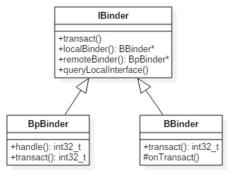

# Binder概述 #

### Binder 概述 ###

> Android系统中，每个应用程序是由Android的Activity、Service、Broadcast、ContentProvider这四剑客的中一个或多个组合而成，这四剑客所涉及的多进程间的通信底层都是依赖于Binder IPC机制。例如当进程A中的Activity要向进程B中的Service通信，这便需要依赖于Binder IPC。不仅于此，整个Android系统架构中，大量采用了Binder机制作为IPC（进程间通信）方案，当然也存在部分其他的IPC方式，比如Zygote通信便是采用socket。

> Binder作为Android系统提供的一种IPC机制，无论从事系统开发还是应用开发，都应该有所了解，这是Android系统中最重要的组成，也是最难理解的一块知识点，错综复杂。要深入了解Binder机制，最好的方法便是阅读源码，借用Linux鼻祖Linus Torvalds曾说过的一句话：Read The Fucking Source Code。

### 为什么选择Binder ###

**在开始回答前，先简单概括性的说说Linux现有的所有进程间IPC方式：**
**1.管道：**在创建时分配一个page大小的内存，缓存区大小比较有限；
**2.消息队列：**信息复制两次，额外的CPU消耗；不合适频繁或信息量大的通信；
**3.共享内存：**无需复制，共享缓冲区直接附加到进程虚拟地址空间，速度快；但进程间的同步问题操作系统无法实现，必须各进程利用同步工具解决；
**4.套接字：**作为更通用的接口，传输效率低，主要用于不通机器或跨网络的通信；
**5.信号量：**常作为一种锁机制，防止某进程正在访问共享资源时，其他进程也访问该资源。因此，主要作为进程间以及同一进程内不同线程之间的同步手段。
**6.信号：**不适用于信息交换，更适用于进程中断控制，比如非法内存访问，杀死某个进程等；

**Android的内核也是基于Linux内核，为何不直接采用Linux现有的进程IPC方案呢，难道Linux社区那么多优秀人员都没有考虑到有Binder这样一个更优秀的方案，是google太过于牛B吗？事实是真相并非如此，请细细往下看，你就明白了。**

--------

**接下来正面回答这个问题，从5个角度来展开对Binder的分析：**

**(1)从性能的角度 数据拷贝次数**
Binder数据拷贝只需要一次，而管道、消息队列、Socket都需要2次，但共享内存方式一次内存拷贝都不需要；从性能角度看，Binder性能仅次于共享内存。

**(2)从稳定性的角度**
Binder是基于C/S架构的，简单解释下C/S架构，是指客户端(Client)和服务端(Server)组成的架构，Client端有什么需求，直接发送给Server端去完成，架构清晰明朗，Server端与Client端相对独立，稳定性较好；而共享内存实现方式复杂，没有客户与服务端之别，需要充分考虑到访问临界资源的并发同步问题，否则可能会出现死锁等问题；从这稳定性角度看，Binder架构优越于共享内存。

仅仅从以上两点，各有优劣，还不足以支撑google去采用binder的IPC机制，那么更重要的原因是：

**(3)从安全的角度**
传统Linux IPC的接收方无法获得对方进程可靠的UID/PID，从而无法鉴别对方身份；而Android作为一个开放的开源体系，拥有非常多的开发平台，App来源甚广，因此手机的安全显得额外重要；对于普通用户，绝不希望从App商店下载偷窥隐射数据、后台造成手机耗电等等问题，传统Linux IPC无任何保护措施，完全由上层协议来确保。

Android为每个安装好的应用程序分配了自己的UID，故进程的UID是鉴别进程身份的重要标志，前面提到C/S架构，**Android系统中对外只暴露Client端，Client端将任务发送给Server端，Server端会根据权限控制策略，判断UID/PID是否满足访问权限，目前权限控制很多时候是通过弹出权限询问对话框，让用户选择是否运行。**Android 6.0，也称为Android M，在6.0之前的系统是在App第一次安装时，会将整个App所涉及的所有权限一次询问，只要留意看会发现很多App根本用不上通讯录和短信，但在这一次性权限时会包含进去，让用户拒绝不得，因为拒绝后App无法正常使用，而一旦授权后，应用便可以胡作非为。

针对这个问题，google在Android M做了调整，不再是安装时一并询问所有权限，而是在App运行过程中，需要哪个权限在弹框询问用户是否给相应的权限，对权限做了更细的控制，让用户有了更多的可控性，但**同时也带来了另一个用户诟病的问题，那也就是权限询问的弹框的次数大幅度增多。**对于Android M平台上，有些App开发者可能会写出让手机异常频繁的App，企图直到用户授权为止，这对用户来说是不能忍的，用户最后吐槽的可不光是App，还有Android系统以及手机厂商，有些用户可能就跳果粉了，这还需要广大Android开发者以及手机厂商共同努力，共同打造安全与体验俱佳的Android手机。

**传统IPC**只能由用户在数据包里填入UID/PID；另外，可靠的身份标记只有由IPC机制本身在内核中添加。其次传统IPC访问接入点是开放的，无法建立私有通道。从安全角度，Binder的安全性更高。

**说到这，可能有人要反驳**，Android就算用了Binder架构，而现如今Android手机的各种流氓软件，不就是干着这种偷窥隐射，后台偷偷跑流量的事吗？没错，确实存在，但这不能说Binder的安全性不好，因为Android系统仍然是掌握主控权，可以控制这类App的流氓行为，只是对于该采用何种策略来控制，在这方面android的确存在很多有待进步的空间，这也是google以及各大手机厂商一直努力改善的地方之一。在Android 6.0，google对于app的权限问题作为较多的努力，大大收紧的应用权限；另外，在**Google举办的Android Bootcamp 2016**大会中，google也表示在Android 7.0(也叫Android N)的权限隐私方面会进一步加强加固，比如SELinux、Memory、safe language(还在research中)等等。

**(4)从语言层面的角度**
大家多知道Linux是基于C语言(面向过程的语言)，而Android是基于Java语言(面向对象的语言)，而对于Binder恰恰也符合面向对象的思想，将进程间通信转化为通过对某个Binder对象的引用调用该对象的方法，而其独特之处在于Binder对象是一个可以跨进程应用的对象，它的实体位于一个进程中，而它的引用却遍布于系统的各个进程之中。可以从一个进程传给其他进程，让大家都能访问同一Server，就像将一个对象或引用赋值给另一个应用一样。Binder模糊了进程边界，淡化了进程间通信过程，整个系统仿佛运行于同一个面向对象的程序之中。从语言层面，Binder更适合基于面向对象语言的Android系统，对于Linux系统可能会有点“水土不服”。

**另外，Binder是为Android这类系统而生，而并非Linux社区没有想到Binder IPC机制的存在，对于Linux社区的广大开发人员，我还是表示深深佩服，让世界有了如此精湛而美妙的开源系统。**也并非Linux现有的IPC机制不够好，相反地，经过这么多优秀工程师的不断打磨，依然非常优秀，每种Linux的IPC机制都有存在的价值，同时在Android系统中也依然采用了大量Linux现有的IPC机制，根据每类IPC的原理特性，因时制宜，不同场景特性往往会采用其下最适宜的。比如在**Android OS中的Zygote进程的IPC采用的是Socket(套接字)机制**，Android中的**Kill Process采用的signal(信号)机制**等等。而**Binder更多则用在system_server进程与上层App层的IPC交互**。

**(5)从公司战略的角度**
总所周知，Linux内核是开源的系统，所开发源代码许可协议GPL保护，该协议具有“病毒式感染”的能力，怎么理解这句话呢？受GPL保护的Linux Kernel是运行在内核空间，对于上层的任何类库、服务、应用等运行在用户空间，一旦进行SysCall(系统调用)，调用到底层Kernel，那么也必须遵循GPL协议。

而Android之父Andy Rubin对于GPL显然是不能接受的，为此，Google巧妙的将GPL协议控制在内核空间，将用户空间的协议采用Apache-2.0协议（允许基于Android的开发商不向社区反馈源码），同时在GPL协议与Apache-2.0之间的Lib库中采用BSD证授权方法，有效隔断了GPL的传染性，仍有较大争议，但至少目前缓解Android，让GPL止步于内核空间，这是Google在GPL Linux下开源与商业化共存的一个成功典范。

**有了这些铺垫，我们再说说Binder的今世前缘**
Binder是基于开源的OpenBinder实现的，OpenBinder是一个开源的系统IPC机制，最初是由BeInc.开发，接着由Palm，Inc.公司负责开发，现在OpenBinder的作者在Google工作，既然作者在Google公司，在用户空间采用Binder作为核心的IPC机制，再用Apache-2.0协议保护，自然而然是没什么问题，减少法律风险，以及对开发成本也大有裨益的，那么从公司战略角度，Binder也是不错的选择。

另外，再说一点关于OpenBinder，在2015年OpenBinder以及合入到Linux Kernel主线3.19版本，这也算是Google对Linux的一点回馈吧。

**综上所述，可知Binder是Android系统上层进程间通信的不二选择**

### Binder架构 ###

#### Binder简介 ####

从进程角度来看IPC机制，每个Android的进程，只能运行在自己进程所拥有的虚拟地址空间。对应一个4GB的虚拟地址空间，其中3GB是用户空间，1GB是内核空间，当然内核空间的大小是可以通过参数配置调整的。对于用户空间，不同进程之间彼此是不能共享的，而内核空间却是可共享的。Client进程向Server进程通信，恰恰是利用进程间可共享的内核内存空间来完成底层通信工作的，Client端与Server端进程往往采用ioctl等方法跟内核空间的驱动进行交互。

Binder通信采用C/S架构，从组件视角来说，包含Client、Server、ServiceManager以及binder驱动，其中ServiceManager用于管理系统中的各种服务。架构图如下所示：

可以看出无论是注册服务和获取服务的过程都需要ServiceManager，需要注意的是此处的ServiceManager是指Native层的ServiceManager(C++)，并非指framework层的ServiceManager(Java)。ServiceManager是整个Binder通信机制的大管家，是Android进程间通信机制Binder的守护进程，要掌握Binder机制，首先需要了解系统是如何首次启动Service Manager。当Service Manager启动之后，Client端和Server端通信时都需要先获取Service Manager接口，才能开始通信服务。

图中Client/Server/ServiceManager之间的相互通信都是基于Binder机制。既然基于Binder机制通信，那么同样也是C/S架构，则图中的3大步骤都有相应的Client端与Server端。

&emsp;**1.注册服务(addService)**:Server进程要先注册Service到ServiceManager。该过程：Server是客户端，ServiceManager是服务端。

&emsp;**2.获取服务(getService)**:Client进程使用某个Service前，须先向ServiceManager中获取相应的Service。该过程：Client是客户端，ServiceManager是服务端。

&emsp;**3.使用服务**:Client根据得到的Service信息建立与Service所在的Server进程通信的通路，然后就可以直接与Service交互。该过程：Client是客户端，Server是服务端。

图中的Client、Server、Service Manager之间交互都是虚线表示，是由于它们彼此之间不是直接交互的，而是都通过与Binder驱动进行交互的，从而实现IPC通信方式。其中Binder驱动位于内核空间，Client、Server、Service Manager位于用户空间。Binder驱动和Service Manager可以看做是Android平台的基础架构，而Client和Server是Android的应用层，开发人员只需自定义实现Client、Server端，借助Android的基本平台架构便可以直接进行IPC通信。

从类图来看，BpBinder(客户端)和BBinder(服务端)都是Android中Binder通信相关的代表，它们都从IBinder类中派生而来，关系图如下：

client端：BpBinder.transact()来发送事务请求；
server端：BBinder.onTransact()会接收到相应事务。
