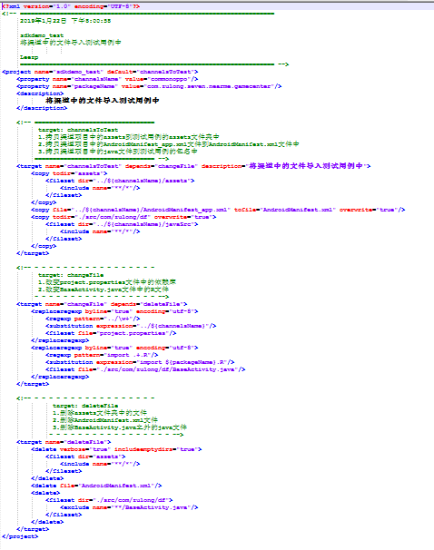

## 使用ANT编写工程的脚本文件 ##

### 1、概述 ###

&emsp;&emsp;ant 是一个将软件编译、测试、部署等步骤联系在一起加以自动化的一个工具，大多用于Java环境中的软件开发。在实际软件开发中，有很多地方可以用到ant。

### 2、优点 ###

&emsp;&emsp;ant 是Apache软件基金会JAKARTA目录中的一个子项目，它有以下的优点： 

- 跨平台性：Ant是纯Java语言编写的，所以具有很好的跨平台性。 

- 操作简单：Ant是由一个内置任务和可选任务组成的，用ant任务就像是在dos中写命令行一样。Ant运行时需要一个XML文件(构建文件)。 Ant通过调用target树，就可以执行各种task。每个task实现了特定接口对象。 

- 维护简单、可读性好、集成简单：由于Ant构建文件 时XML格式的文件，所以很容易维护和书写，而且结构很清晰。Ant可以集成到开发环境中。由于Ant的跨平台性和操作简单的特点，它很容易集成到一些开发环境中去。

具体学习资料：

- <a href="https://zhuanlan.zhihu.com/p/26473584">ant脚本教程（一）</a>
- <a href="https://zhuanlan.zhihu.com/p/26474875">Ant脚本教程（二）</a>

### 3、问题 ###

- **在运行ant脚本之后工程的有些文件可能出现一些乱码的问题**
> <a href="https://blog.csdn.net/rfjian123/article/details/8742870">ant编译乱码问题</a>
> <a href="https://blog.csdn.net/BugRunner/article/details/8599448">Ant replace 含有中文时的乱码问题</a>

### 4、用例展示 ###

图片有一点失真，所以样例就是当前文件目录下的build.xml文件，直接打开就可观看