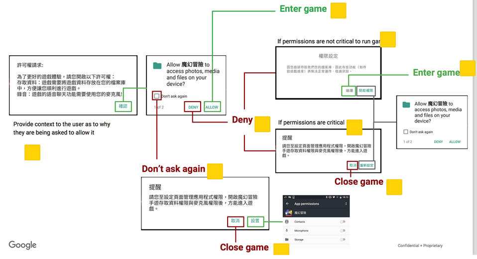

## 权限封装 ##

### 1.需求 ###

&emsp;&emsp;按照 Google 的要求，从 Android 6.0 之后，危险权限需要动态申请才可以获得对应的授权，为此，如果你的应用要上 Google Player 平台，则需按照 Google 推荐的动态申请权限的方式来获取危险权限。

	Google 的推荐方式



### 2.知识点 ###

> 1. 自定义 Dialog

> 2. 动态权限申请

> 3. 跳转到权限设置界面

### 3.资料 ###

&emsp;&emsp;1.<a href="https://github.com/Leezps/personal-summary/blob/master/2019-3-25/2019-3-25(Request%20permission%20process%20of%20Android).md"> Android的请求权限过程 (Leezp's 文档)</a>

&emsp;&emsp;2.<a href="https://blog.csdn.net/xiaxiazaizai01/article/details/53912869">Android 6.0+ 动态权限 一种清爽的封装过程（以及多个权限的处理）</a>

&emsp;&emsp;3.<a href="https://juejin.im/post/5bf4b776518825170d1ab40b">在Android上优雅的申请权限</a>

### 4.样例 ###

	危险权限列表

|Permission Group|Permissions|说明|
|:--:|:--|:--|
|android.permission-group.CALENDAR|▪ android.permission.READ_CALENDAR<br>▪ android.permission.WRITE_CALENDAR|▪ android.permission.READ_CALENDAR：允许应用获取用户日历数据<br>▪ android.permission.WRITE_CALENDAR：允许应用编辑用户日历数据<br>注：日历的读写操作，在日历应用中可以查看对应的日程。<br>典型场景：<br>1. 制定学习计划、旅行日程；<br>2. 火车票预订、旅行预订；<br>3. 生日、会议等重要事件日程提醒。|
|android.permission-group.CAMERA|android.permission.CAMERA|权限定义：允许应用使用摄像头<br>典型场景：<br>1. 美颜拍照；<br>2. 扫描二维码、条形码；<br>3. 录像；<br>4. 人脸识别；<br>5. 智能识图；<br>6. 分享，用于发朋友圈；<br>7. 手电筒，打开相机闪光灯；<br>8. 账户头像拍摄场景。|
|android.permission-group.CONTACTS|▪ android.permission.READ_CONTACTS<br>▪ android.permission.WRITE_CONTACTS<br>▪ android.permission.GET_ACCOUNTS|▪ android.permission.READ_CONTACTS：允许用户获取用户通讯录数据<br>▪ android.permission.WRITE_CONTACTS：允许用户编辑用户通讯录数据<br>典型场景：<br>1. 通过通讯录添加好友；<br>2. 备份克隆联系人；<br>3. 电话本管理；<br>4. 办公软件添加获取联系人。<br>▪ android.permission.GET_ACCOUNTS：允许应用从账户服务中获取应用账户列表：<br>如google账号，微博帐号等列表，不包括微信账号和QQ账号和用户手动输入的电话号码等。|
|android.permission-group.LOCATION|▪ android.permission.ACCESS_FINE_LOCATION<br>▪ android.permission.ACCESS_COARSE_LOCATION|▪ android.permission.ACCESS_FINE_LOCATION：获取精准的 （GPS） 位置<br>▪ android.permission.ACCESS_COARSE_LOCATION：获取 (基于网络的) 大概位置<br>典型场景：<br>1. 步行、骑行、架车、公交等导航场景；<br>2. 跑步、健走等运动健康场景；<br>3. 停车场、美食、加油站、新闻等定位当前位置场景；<br>4. 拍照场景，用于记录照片拍摄位置；<br>5. 社交场景，用于主动分享位置信息；<br>6. 情景智能，用于出行日程提醒；<br>7. O2O上门服务场景，用于定位用户位置；<br>8. 电商购物场景，分区域的商品推荐，自动填写收货地址；<br>9. 影音娱乐、新闻阅读：用于定位城市，进行地域相关的推送。|
|android.permission-group.MICROPHONE|android.permission.RECORD_AUDIO|权限定义：授权应用可以使用麦克风。<br>典型场景：<br>1. 录制音视频；<br>2. 语音助手功能，语音导航，声控；<br>3. 语音通话，聊天；<br>4. 录屏；<br>5. 发音学习；<br>6. 语音录入文字、语音搜索。|
|android.permission-group.PHONE|▪ android.permission.READ_PHONE_STATE<br>▪ android.permission.CALL_PHONE<br>▪ android.permission.READ_CALL_LOG<br>▪ android.permission.WRITE_CALL_LOG<br>▪ com.android.voicemail.permission.ADD_VOICEMAIL<br>▪ android.permission.USE_SIP<br>▪ android.permission.PROCESS_OUTGOING_CALLS|▪ android.permission.READ_PHONE_STATE：授权应用可以获取设备imsi、imei、sn等设备信息。同时也可以通过此权限，获取手机通话状态，例如来电、响铃中、通话中等不推荐使用此权限，请使用Android id或 广告id等替代。<br>▪ android.permission.CALL_PHONE：授权应用可以不经过用户点击授权，直接拨打号码。<br>不建议使用此权限，推荐调起拨号盘，用户手动发起拨号。<br>典型场景：<br>1. 通讯录中直接拨打电话；<br>2. 服务类应用中直接拨打电话，如外卖、电商；<br>3. 联系客服。<br>▪ android.permission.READ_CALL_LOG：授权应用可以读取用户通话记录信息。<br>典型场景：<br>1. 备份；<br>2. 通话记录管理功能；<br>3. 骚扰拦截：一般情况下会删除通话记录。<br>▪ android.permission.WRITE_CALL_LOG：授权应用可以写入用户通话记录信息。<br>典型场景：<br>1. 备份；<br>2. 通话记录管理功能；<br>3. 骚扰拦截：一般情况下会删除通话记录。<br>▪ com.android.voicemail.permission.ADD_VOICEMAIL：授权应用添加语音附件到邮件中。<br>典型场景：<br>在邮件中，添加语音附件。<br>▪ android.permission.USE_SIP：拨打/接听互联网通话。<br>典型场景：<br>拨打SIP协议的互联网通话。<br>▪ android.permission.PROCESS_OUTGOING_CALLS：重新设置呼出的手机号码，可以监听呼出的通话状态<br>典型场景：<br>1. 呼出电话监听场景，通讯录；<br>2. 儿童手表。|
|android.permission-group.SENSORS|android.permission.BODY_SENSORS|权限定义：授权应用访问那些被用于测量用户身体内部状况的传感器数据。一般特指心率传感器数据。<br>典型场景：<br>1. 运动/健康相关，用于显示用户的心率状况；<br>2. 可穿戴设备应用。|
|android.permission-group.SMS|▪ android.permission.SEND_SMS<br>▪ android.permission.RECEIVE_SMS<br>▪ android.permission.READ_SMS<br>▪ android.permission.RECEIVE_WAP_PUSH<br>▪ android.permission.RECEIVE_MMS<br>▪ android.permission.READ_CELL_BROADCASTS|▪ android.permission.SEND_SMS：授权应用发送SMS短信。<br>典型场景：<br>1. 短信管理应用，如中国移动；<br>2. 手机号码注册或登陆时的验证码场景，如AcFun应用，允许通过手机号+接收到的验证码来注册用户；<br>3. 游戏软件中的短信支付场景。<br>▪ android.permission.RECEIVE_SMS：授权应用接收SMS短信。<br>▪ android.permission.READ_SMS：授权应用读取SMS短信。<br>▪ android.permission.RECEIVE_WAP_PUSH：授权应用接收WAP推送信息。<br>典型场景：短信管理类应用，如中国移动，Go短信。<br>▪ android.permission.RECEIVE_MMS：授权应用监听到来的彩信业务，拦截彩信接收信息。<br>▪ android.permission.READ_CELL_BROADCASTS：授权应用读取小区广播短信。|
|android.permission-group.STORAGE|▪ android.permission.READ_EXTERNAL_STORAGE<br>▪ android.permission.WRITE_EXTERNAL_STORAGE|权限定义：授权应用读取\修改或删除SD卡中的内容。<br>典型场景：<br>1. 下载文件场景，如浏览器从网络中下载文件到手机中；<br>2. 阅读器场景，打开本地的文件；<br>3. 游戏场景，需要下载大量资源并存储到SD卡上；<br>4. 拍照场景，需要存储图片或打开照片。|

	特殊权限列表

|Permissions|说明|
|:--|:--|
|android.permission.SYSTEM_ALERT_WINDOW|权限定义：在其他应用上覆盖显示，用户按home键或者back键后，该弹框仍显示在其他界面之上。<br>典型场景：<br>1. 微信视频聊天场景，home键之后，仍在桌面上有小窗体显示视频信息；<br>2. 直播软件或者播放视频等小窗体播放场景；<br>3. 录屏软件，有悬浮按钮，方便操作；<br>4. 音乐软件在桌面上显示歌词。|
|android.permission.WRITE_SETTINGS|权限定义：修改系统设置|

	动态权限 API 说明

|API|说明|
|:--|:--|
|checkSelfPermission()|判断权限是否具有某项权限|
|requestPermissions()|申请权限|
|onRequestPermissionsResult()|申请权限回调方法|
|shouldShowRequestPermissionRationale()|是否要提示用户申请该权限的缘由|

	shouldShowRequestPermissionRationale 说明

|情况|返回值|
|:--|:--|
|第一次打开 App 时|false|
|上次弹出权限点击了禁止(但没有勾选“下次不再询问”)|true|
|上次选择禁止并勾选"下次不再询问"|false|

	权限封装的 java 类

```
public class ZLPermissionUtils {
    private static final String TAG = "ZLPermissionUtils";
    private static final int REQUEST_PERMISSION = 10001;
    private static final int REQUEST_PERMISSION_SETTINGS = 10002;
    public static final String PROMPT_TITLE = "prompt_title";
    public static final String PROMPT_CONTENT = "prompt_content";
    public static final String PROMPT_POSITIVE_TEXT = "prompt_positive_text";
    public static final String QUERY_TITLE = "query_title";
    public static final String QUERY_CONTENT = "query_content";
    public static final String QUERY_NEGATIVE_TEXT = "query_negative_text";
    public static final String QUERY_POSITIVE_TEXT = "query_positive_text";
    public static final String DENY_TITLE = "deny_title";
    public static final String DENY_CONTENT = "deny_content";
    public static final String DENY_NEGATIVE_TEXT = "deny_negative_text";
    public static final String DENY_POSITIVE_TEXT = "deny_positive_text";


    private static WeakReference<Activity> activityWeakReference = null;
    private static PermissionsListener permissionsListener = null;
    private static Map<String, String> permissionsParams = null;
    private static List<String> settingsPermissionList = new ArrayList<>();

    public static void setActivityWeakReference(Activity activity) {
        if (activity != null) {
            activityWeakReference = new WeakReference<>(activity);
        }
    }

    public static void setPermissionsListener(PermissionsListener listener) {
        if (listener != null) {
            permissionsListener = listener;
        }
    }

    public static void setPermissionsParams(HashMap<String, String> params) {
        if (params != null) {
            permissionsParams = params;
        }
    }

    public static void beginRequestPermission(final String[] permissions) {
        if (activityWeakReference == null) {
            Log.e(TAG, "Activity 弱引用为空，请传入正确的实例对象");
            return;
        }
        Activity activity = activityWeakReference.get();
        AlertDialog.Builder builder = new AlertDialog.Builder(activity);
        builder.setTitle(permissionsParams.get(PROMPT_TITLE));
        builder.setMessage(permissionsParams.get(PROMPT_CONTENT));
        builder.setCancelable(true);
        builder.setPositiveButton(permissionsParams.get(PROMPT_POSITIVE_TEXT), new DialogInterface.OnClickListener() {
            @Override
            public void onClick(DialogInterface dialog, int which) {
                if (which == DialogInterface.BUTTON_POSITIVE) {
                    requestPermission(permissions);
                }
                dialog.dismiss();
            }
        });
        AlertDialog dialog = builder.create();
        dialog.show();
    }

    private static void requestPermission(String[] permissions) {
        if (activityWeakReference == null || permissionsListener == null) {
            Log.e(TAG, "Activity 弱引用或权限监听事件为空，请传入正确的实例对象");
            return;
        }
        Activity activity = activityWeakReference.get();
        List<String> permissionLists = new ArrayList<>();
        for (String permission : permissions) {
            if (ActivityCompat.checkSelfPermission(activity, permission) != PackageManager.PERMISSION_GRANTED) {
                permissionLists.add(permission);
            }
        }
        if (permissionLists.size() > 0) {
            ActivityCompat.requestPermissions(activity, permissionLists.toArray(new String[permissionLists.size()]), REQUEST_PERMISSION);
        } else {
            permissionsListener.allPermissionsGranted();
        }
    }

    public static void onRequestPermissionsResult(int requestCode, String[] permissions, int[] grantResults) {
        if (activityWeakReference == null || permissionsListener == null) {
            Log.e(TAG, "Activity 弱引用或权限监听事件为空，请传入正确的实例对象");
            return;
        }
        final Activity activity = activityWeakReference.get();
        if (activity == null) {
            return;
        }
        final List<String> deniedPermissions = new ArrayList<>();
        if (requestCode != REQUEST_PERMISSION) {
            return;
        }
        for (int i = 0; i < grantResults.length; i++) {
            if (grantResults[i] != PackageManager.PERMISSION_GRANTED) {
                deniedPermissions.add(permissions[i]);
            }
        }
        if (deniedPermissions.size() > 0) {
            if (ActivityCompat.shouldShowRequestPermissionRationale(activity, deniedPermissions.get(0))) {
                DialogInterface.OnClickListener dialogListener = new DialogInterface.OnClickListener() {
                    @Override
                    public void onClick(DialogInterface dialog, int which) {
                        if (which == DialogInterface.BUTTON_POSITIVE) {
                            requestPermission(deniedPermissions.toArray(new String[deniedPermissions.size()]));
                        } else if (which == DialogInterface.BUTTON_NEGATIVE) {
                            permissionsListener.somePermissionsDenied(deniedPermissions);
                        }
                        dialog.dismiss();
                    }
                };
                AlertDialog.Builder builder = new AlertDialog.Builder(activity);
                builder.setTitle(permissionsParams.get(DENY_TITLE));
                builder.setMessage(permissionsParams.get(DENY_CONTENT));
                builder.setCancelable(true);
                builder.setPositiveButton(permissionsParams.get(DENY_POSITIVE_TEXT), dialogListener);
                builder.setNegativeButton(permissionsParams.get(DENY_NEGATIVE_TEXT), dialogListener);
                AlertDialog dialog = builder.create();
                dialog.show();
            } else {
                DialogInterface.OnClickListener dialogListener = new DialogInterface.OnClickListener() {
                    @Override
                    public void onClick(DialogInterface dialog, int which) {
                        if (which == DialogInterface.BUTTON_POSITIVE) {
                            if (settingsPermissionList != null && settingsPermissionList.size() > 0) {
                                settingsPermissionList.clear();
                            } else if (settingsPermissionList == null) {
                                settingsPermissionList = new ArrayList<>();
                            }
                            settingsPermissionList.addAll(deniedPermissions);
                            //引导用户到设置中去进行设置
                            Intent intent = new Intent(Settings.ACTION_APPLICATION_DETAILS_SETTINGS);
                            intent.setData(Uri.fromParts("package", activity.getPackageName(), null));
                            activity.startActivityForResult(intent, REQUEST_PERMISSION_SETTINGS);
                        } else if (which == DialogInterface.BUTTON_NEGATIVE) {
                            permissionsListener.somePermissionsDenied(deniedPermissions);
                        }
                        dialog.dismiss();
                    }
                };
                AlertDialog.Builder builder = new AlertDialog.Builder(activity);
                builder.setTitle(permissionsParams.get(QUERY_TITLE));
                builder.setMessage(permissionsParams.get(QUERY_CONTENT));
                builder.setCancelable(true);
                builder.setPositiveButton(permissionsParams.get(QUERY_POSITIVE_TEXT), dialogListener);
                builder.setNegativeButton(permissionsParams.get(QUERY_NEGATIVE_TEXT), dialogListener);
                AlertDialog queryDialog = builder.create();
                queryDialog.show();
            }
        } else {
            permissionsListener.allPermissionsGranted();
        }
    }

    public static void onActivityResult(int requestCode, int resultCode, Intent data) {
        if (requestCode != REQUEST_PERMISSION_SETTINGS) {
            return;
        }
        if (activityWeakReference == null || permissionsListener == null) {
            Log.e(TAG, "Activity 弱引用或权限监听事件为空，请传入正确的实例对象");
            return;
        }
        Activity activity = activityWeakReference.get();
        List<String> deniedPermissions = new ArrayList<>();
        for (String permission : settingsPermissionList) {
            if (ActivityCompat.checkSelfPermission(activity, permission) != PackageManager.PERMISSION_GRANTED) {
                deniedPermissions.add(permission);
            }
        }
        if (deniedPermissions.size() > 0) {
            permissionsListener.somePermissionsDenied(deniedPermissions);
        } else {
            permissionsListener.allPermissionsGranted();
        }
    }

    public interface PermissionsListener {
        void allPermissionsGranted();

        void somePermissionsDenied(List<String> deniedPermissions);
    }
}

```

	权限封装类的调用方式
		1.在主 Activity 中的 onCreate 中

```
ZLPermissionUtils.setActivityWeakReference(this);
ZLPermissionUtils.setPermissionsListener(new ZLPermissionUtils.PermissionsListener() {
    @Override
    public void allPermissionsGranted() {
        doSomething();
    }

    @Override
    public void somePermissionsDenied(List<String> deniedPermissions) {
        Toast.makeText(MainActivity.this, "没有同意权限，无法正确显示", Toast.LENGTH_SHORT).show();
    }
});
HashMap<String, String> params = new HashMap<>();
params.put(ZLPermissionUtils.PROMPT_TITLE, "许可权请求：");
params.put(ZLPermissionUtils.PROMPT_CONTENT, "为了更好的游戏体验，请你开启以下许可权限：\n存放资料：游戏需要将游戏资料存放在你的档案库中，方便让你顺利进行游戏。\n录音：游戏的语音聊天功能需要使用你的麦克风！");
params.put(ZLPermissionUtils.PROMPT_POSITIVE_TEXT, "确认");
params.put(ZLPermissionUtils.QUERY_TITLE, "权限说明");
params.put(ZLPermissionUtils.QUERY_CONTENT, "这些权限是必须权限，否则无法正常启动该功能,因为你已勾选不再询问，所以无法在应用界面授权，需去设置界面授权，是否进入设置界面重新授权？");
params.put(ZLPermissionUtils.QUERY_POSITIVE_TEXT, "是");
params.put(ZLPermissionUtils.QUERY_NEGATIVE_TEXT, "否");
params.put(ZLPermissionUtils.DENY_TITLE, "权限说明");
params.put(ZLPermissionUtils.DENY_CONTENT, "这些权限是必须权限，否则无法正常启动该功能,是否重新申请权限？");
params.put(ZLPermissionUtils.DENY_POSITIVE_TEXT, "重新申请");
params.put(ZLPermissionUtils.DENY_NEGATIVE_TEXT, "取消申请");
ZLPermissionUtils.setPermissionsParams(params);
ZLPermissionUtils.beginRequestPermission(permissions);
```

		2.在主 Activity 中的 onRequestPermissionsResult 中

```
ZLPermissionUtils.onRequestPermissionsResult(requestCode, permissions, grantResults);
```

		3.在主 Activity 中的 onActivityResult 中

```
ZLPermissionUtils.onActivityResult(requestCode, resultCode, data);
```

本样例就是当前文件夹下的 IdentifyCodeImage 工程(文件夹)