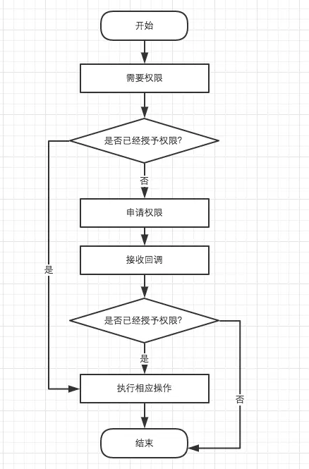
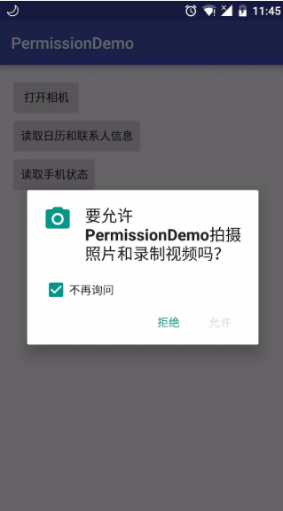

## Android的请求权限过程 ##

### 1、需求 ###

&emsp;&emsp;自从 Android 6.0 以来，Google 为了让 Android 更加安全，将权限的申请由以前的开发人员直接获取到相关权限到现在将权限划分成普通权限、危险权限、特殊权限，普通权限和以前一样，开发人员定义之后可直接获取，危险权限与特殊权限需要手机用户同意之后才能授予相关权限，权限的请求也就成了 Android 开发过程中不可绕过的问题。

&emsp;&emsp;Android 6.0 对应的是 SDK Version 23，如果你的应用的 targetSdkVersion 或 compileSdkVersion 大于23，则需动态申请对应的危险权限或特殊权限

**危险权限(Dangerous Permissions)**

|Permission Group|Permissions|Info|
|:----:|:----:|:----:|
|CALENDAR|READ_CALENDAR、WRITE_CALENDAR|日历|
|CAMERA|CAMERA|照相机|
|CONTACTS|READ_CONTACTS、WRITE_CONTACTS、GET_ACCOUNTS|通讯录|
|LOCATION|ACCESS_FINE_LOCATION、ACCESS_COARSE_LOCATION|定位|
|MICROPHONE|RECORD_AUDIO|麦克风|
|PHONE|READ_PHONE_STATE、CALL_PHONE、READ_CALL_LOG、WRITE_CALL_LOG、ADD_VOICEMAIL、USE_SIP、PROCESS_OUTGOING_CALLS|手机|
|SENSORS|BODY_SENSORS|传感器|
|SMS|SEND_SMS、RECEIVE_SMS、READ_SMS、RECEIVE_WAP_PUSH、RECEIVE_MMS|短信|
|STORAGE|READ_EXTERNAL_STORAGE、WRITE_EXTERNAL_STORAGE|内存|

**特殊权限(Special Permissions)**

|Special Permissions|Info|
|:--:|:--:|
|SYSTEM_ALERT_WINDOW|设置悬浮窗|
|WRITE_SETTINGS|修改系统设置|

### 2、方案 ###

上面方案（图2-1）有一种情况无法解决，就是用户拒绝了我们的权限请求，并点击了不再询问（图2-2），但是他依旧想使用我们的功能，但是拒绝并点击了不再询问之后那怎么办呢？因为点击了不再询问，权限申请的对话框就不会再弹出了

Google 提供了四个关于权限申请的方法

|API|作用|
|:----:|:----|
|checkSelfPermission()|判断权限是否具有某项权限|
|requestPermissions()|申请权限|
|onRequestPermissionsResult()|申请权限回调方法|
|shouldShowRequestPermissionRationale()|是否要提示用户申请该权限的缘由|

平时我们调用前面3个函数就可以实现上面的方案，但是现在我们需要对用户点击了不再询问进行处理，所以我们就需用到第四个函数。

最佳实现方式就是在调用requestPermissions申请权限之后的，我们在onRequestPermissionsResult中调用shouldShowRequestPermissionRationale，如果shouldShowRequestPermissionRationale返回false,则说明用户点击了“不再询问”，我们就需引导用户到设置中打开我们应用的权限才能使用相关功能。

shouldShowRequestPermissionRationale会在两种情况下返回false:
> 1.第一次申请权限
> 2.用户拒绝申请权限，且勾选了“不再询问”

因为我们是在申请权限之后调用的该函数，所以是后一种情况。

### 3、资料 ###

1.<a href="https://juejin.im/entry/58253dfaa22b9d00670c8210#normal_permission_table">Android M 权限最佳实践</a>

### 4、样例 ###

无