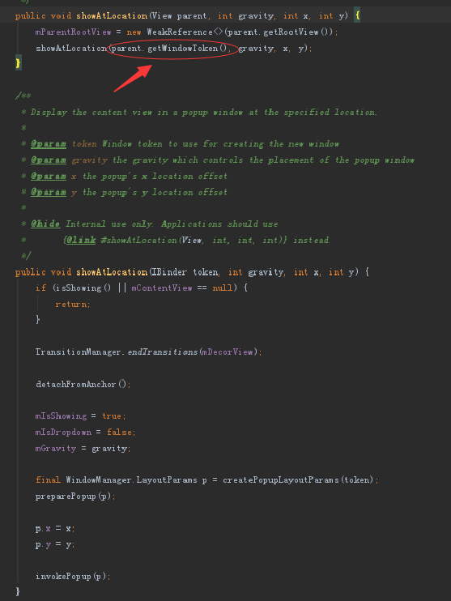
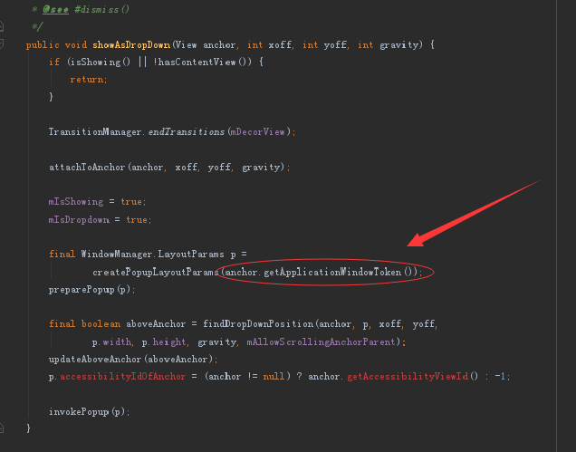
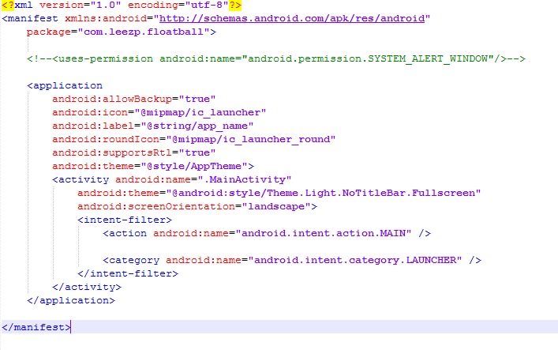
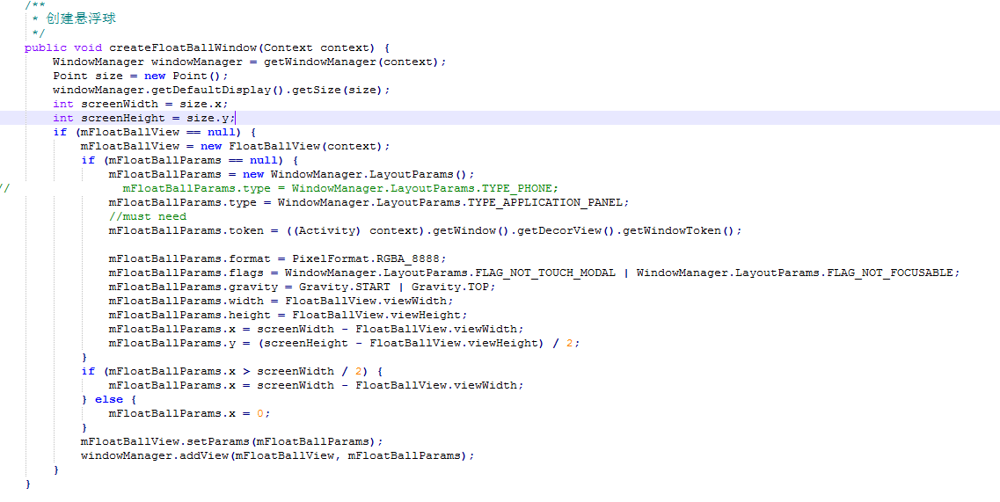
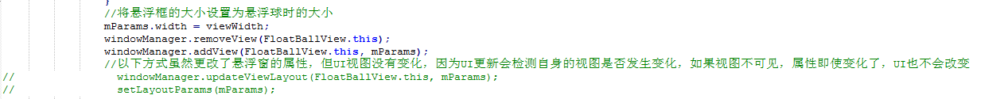

## 悬浮窗项目 ##

### 1、需求 ###

&emsp;&emsp;因为我目前所在的公司是一所游戏公司，游戏公司现在正准备开发自己的SDK，而我分配到的任务就是做一套悬浮球与悬浮菜单窗的任务，具体的工作流程：

> 自定义悬浮球创建->自定义悬浮菜单窗口的创建->悬浮球长时间不点击贴边并变透明->悬浮球与悬浮菜单窗口融合成一个自定义布局

当然整个流程更加复杂，大体上的步骤如此。

### 2、方案 ###

1.使用WindowManager的方式自定义创建悬浮窗（网上大多方式是如此实现）

2.使用PopupWindow自定义实现悬浮球（理论上PopupWindows也是通过WindowManager的方式实现的，不过这是Android官方帮我们实现的悬浮窗，后面我们可以看到它是官方通过WindowManager帮我们实现的）

那以上两种方式哪种最好呢？

> 要明白哪种方式最好，首先我们需要知道Android系统中有几类窗口。
> Android有三类窗口，它们分别是：
> 系统窗口(System Window):系统设计的，不依附于任何应用的窗口，比如说状态栏、导航栏、来电显示窗口等。
> 应用程序窗口(Application Window):应用程序自己创建的窗口，以及在应用起来之前系统负责显示的窗口。
> 子窗口(Sub Window):子窗口必须依附于某个应用的窗口(即窗口的token值)

WindowManager可以实现上面的三类窗口，而PopupWindows是属于子窗口(Sub View)，即PopupWindows一定需要窗口的token值

PopupWindows有两个方法是显示悬浮窗的方法，分别是

	showAtLocation(View parent, int gravity, int x, int y)   //显示popupwindow在特殊的位置

与

	showAsDropDown(View anchor, int xoff, int yoff)   //显示在view anchor左下x偏移以及y偏移的位置

我们点开源码，可以发现它的内部实现如下所示：





最终方法内部都去获取了窗口的token值设置到PopupWindows中，说明PopupWindows是与当前窗口绑定的，如果当前窗口（即Activity）销毁，当前PopupWindows也会被销毁，当然你也可以重新设置它的token值，实现跨窗口的PopupWindows

在这，大家应该都看到了，这两个方法中有如下一段代码：

	final WindowManager.LayoutParams p = createPopupLayoutParams(token);   //当然，token这有点不同，但是都是token，不要钻牛角尖

而这个 WindowManager.LayoutParams p 最终会被传到 invokePopup 函数中，在函数中它会调用 mWindowManager.addView(decorView, p)将当前PopupWindows的布局添加到窗口上，如果有兴趣继续深入下去（自己去查看它的源码），你会发现它和我们后面讲到的WindowManager实现方式基本一致——这里基本已经证明PopupWindows的实现方式依旧是WindowManager的方式实现的。

然后我们来讲讲 WindowManager 来实现悬浮窗

WindowManager的实现方式都大体差不多，只不过其中传入不同的参数都导致不同的问题，因为这些不同的参数就决定了它是那一类窗口

**第一种.TYPE_SYSTEM_ALERT类型**

包含的参数：

> * TYPE_PHONE
* TYPE_PRIORITY_PHONE
* TYPE_SYSTEM_ALERT
* TYPE_SYSTEM_OVERLAY
* TYPE_SYSTEM_ERROR

实现方式：

```
WindowManager windowManager = (WindowManager)context.getSystemService(Context.WINDOW_SERVICE);
WindowManager.LayoutParams layoutParams = new WindowManager.LayoutParams()
layoutParams.type = WindowManager.LayoutParams.TYPE_SYSTEM_ALERT;
windowManager.addView(view, layoutParams);
```

需要权限：

	<uses-permission android:name="android.permission.SYSTEM_ALERT_WINDOW" />

因为有些手机厂商喜欢改操作系统，在Android 6.0出了动态申请权限，国内厂商就把自己的Android 5.0、4.0等系统也加上了自己独特的动态权限申请方式，这…………（给各位国内开发人员带来了巨大的坑）所以国内手机的权限动态申请的版本比Google早一点，所以Android 6.0以前，这个权限还需要对不同手机厂商进行不同的处理，还好Android 6.0以后，大家都不在过于折腾了，动态权限申请那一套保留了Google的风格，但是这个权限是个特殊权限，有些手机厂商直接拒绝弹出该权限的申请框，这就很尴尬了，我们还需要引导用户去自己的手机设置里打开对应的权限，这是一个影响用户体验的行为，并且Google也来插一脚，在Android 8.0之后，上面的参数改为了 TYPE_APPLICATION_OVERLAY 的新窗口类型，我们还要对 SDK 进行区别处理…………，因此有没有更好地处理方式呢？

<a href="https://developer.android.google.cn/about/versions/oreo/android-8.0-changes.html#all-aw">Android 8.0行为变更 提醒窗口</a>

**第二种.TYPE_TOAST类型**

实现方式：

```
WindowManager windowManager = (WindowManager)  applicationContext.getSystemService(Context.WINDOW_SERVICE);
WindowManager.LayoutParams layoutParams = new WindowManager.LayoutParams();
layoutParams.type = WindowManager.LayoutParams.TYPE_TOAST;
windowManager.addView(view, layoutParams);
```

这种方式就不需要申请权限了，也可以同上一样，可以在桌面和其他应用上悬浮显示，但是这种方式并不适配所有机型，小米3无法显示，并没有异常反馈。Nexus6P（Android 8.1）可以显示悬浮窗，但是切换新的Activity 3.5s后浮窗会自动消失，这还不是最坏的，Android 4.4以下是无法接受点击事件的。

所以这个方式也不是最好的，部分机型上不可控，Android新版本也对这种情况做了限制。

**第三种.TYPE_APPLICATION_PANEL类型**

实现方式：

```
WindowManager windowManager = (WindowManager)  applicationContext.getSystemService(Context.WINDOW_SERVICE);
WindowManager.LayoutParams layoutParams = new WindowManager.LayoutParams();
layoutParams.type = WindowManager.LayoutParams.TYPE_APPLICATION_PANEL;
layoutParams.token = activity.getWindow().getDecorView().getWindowToken(); // 必须要
windowManager.addView(view, layoutParams);
```

咦——token，这不是和PopupWindows有点相似吗？也需要对应的token值
其实这就是PopupWindows的实现方式，PopupWindows也是TYPE_APPLICATION_PANEL类型，这种方式也不需要申请权限。并且因为是子窗口，可以兼容所有手机机型（目前没发现不兼容的）

综上所述，最终采用的是第三种，TYPE_APPLICATION_PANEL类型

### 3、资料 ###

1.<a href="https://blog.csdn.net/sn_zzy/article/details/25915777">Android popupwindow以及windowManager总结——实现悬浮效果</a>

2.<a href="https://www.jianshu.com/p/98eb2f70e3a5">Android应用内悬浮窗从入门到放弃/妥协</a>

3.<a href="https://www.liaohuqiu.net/cn/posts/android-windows-manager/">Android 悬浮窗的小结</a>

4.<a href="https://www.jianshu.com/p/167fd5f47d5c">Android无需权限显示悬浮窗, 兼谈逆向分析app</a>

5.<a href="https://www.jianshu.com/p/c5658fa5b974">Android游戏用PopupWindows实现的悬浮球，无视各种操蛋权限</a>

6.<a href="https://blog.csdn.net/guolin_blog/article/details/8714621">Android滑动菜单特效实现，仿人人客户端侧滑效果，史上最简单的侧滑实现</a>

> 这上面这个不涉及悬浮窗，为什么用到了这个知识呢？那是因为悬浮窗有个长时间闲置需要贴边，而这儿就借鉴了上面的贴边思想，使用LayoutParams的leftMargin来实现贴边变半圆的思想。

7.<a href="https://blog.csdn.net/guolin_blog/article/details/8689140">Android桌面悬浮窗效果实现，仿360手机卫士悬浮窗效果</a>

### 4、样例 ###

样例就是本文件夹下的FloatBall文件，因为采用的第三种方式，所以打开AndroidManifest.xml文件可以发现



对应的权限是注释掉了的，即不需要申请

其中View下的FloatBallView.java即为悬浮球的自定义视图，里面涉及一些滑动的动画、点击事件、菜单栏弹出等等

utils中的FloatBallWindowManager.java就是显示悬浮球与释放悬浮球的控制类，其中显示悬浮球的代码如下：



具体的详情还请将文件复制到自己的工程中做对应的处理，就可显示悬浮球的悬浮框了…………

### 5、杂记 ###

> 在编写工程时遇到的其他小问题（对应的处理方式以及借鉴的原因，在何处使用）

1.<a href="https://blog.csdn.net/zhangphil/article/details/80055964">Android获取设备状态栏status bar高度的正确姿势</a>

 > 获取状态栏是因为悬浮窗移动的时候不要将状态栏给覆盖了——utils/Util.java/getStatusBarHeight函数

2.<a href="https://www.jianshu.com/p/d8846ded9ff8">Android 判断页面是否全屏</a>

> 判断应用是否为全屏，因为全屏的话，就不需要获取状态栏的高度了，状态栏高度即为0——utils/Util.java/getStatusBarHeight函数

3.属性动画
&emsp;(1)<a href="https://blog.csdn.net/guolin_blog/article/details/43536355">Android属性动画完全解析(上)，初识属性动画的基本用法</a>
&emsp;(2)<a href="https://blog.csdn.net/guolin_blog/article/details/43816093">Android属性动画完全解析(中)，ValueAnimator和ObjectAnimator的高级用法</a>
&emsp;(3)<a href="https://blog.csdn.net/guolin_blog/article/details/44171115">Android属性动画完全解析(下)，Interpolator和ViewPropertyAnimator的用法</a>
&emsp;(4)<a href="https://juejin.im/post/5b31aa0f6fb9a00e833d5501">Android属性动画总结</a>

> 使用属性动画就是提升用户体验——view/FloatBallView.java类

4.<a href="https://blog.csdn.net/wxx614817/article/details/50921194">Android含资源文件引用的项目打包成jar包</a>

> 因为做的是第三方SDK开发，所以资源文件不能通过R文件的方式直接引用，我们需要通过getResources().getIdentifier("small_icon", "drawable", getPackageName())的方式去获取资源文件——view/FloatBallView.java类

5.<a href="https://blog.csdn.net/xyz_lmn/article/details/14524567">Android抽象布局——include、merge 、ViewStub</a>

> 本来以为会用到，但是后面布局文件这些都改为代码中生成了，所以这个也用不到了，不过这个知识点挺重要的，毕竟可以降低布局嵌套，优化UI

6.<a href="https://blog.csdn.net/johnny901114/article/details/7839512">Android 获取控件的宽和高</a>

> 看到这个，你可能会说，大哥，获取控件的宽高你尽然不会啊！其实这儿获取的宽高是指View还没显示时正确的宽高，打个比方，我们在Activity中的onCreate函数中去获取自定义View设置为wrap_content的真实宽高，你会发现宽高都为0，什么鬼？怎么会这样！因为此时View控件还没显示出来，并没有进行相应的属性计算，所以为0，此时你就需要借鉴上面的方法去计算对应的属性，获取正确的宽高，为什么要获取设置为wrap_content的控件的宽高，那是因为我们需要固定好父布局的大小，从而来设置子控件的左边距来实现菜单界面的显示与隐藏的效果——view/FloatBallView.java类

7.自定义按钮的形式
&emsp;(1)<a href="https://blog.csdn.net/qq_30552993/article/details/73327414">Android Selector的介绍与用法</a>
&emsp;(2)<a href="https://blog.csdn.net/growing_tree/article/details/42291357">Android:shape属性详解（图文并茂）</a>

> 使用该方式是自定义菜单栏的按钮的颜色以及形式——res/drawable/float_ball_menu_button_selector.xml

8.setLayoutParams失效
&emsp;(1)<a href="https://blog.csdn.net/asd54090/article/details/80920689">Android setLayoutparams失效几个原因</a>
&emsp;(2)<a href="https://blog.csdn.net/pzhu_lcx/article/details/52694665">setLayoutParams()不生效问题</a>

> 这个问题是困扰了我一晚上的问题，解决方案如下：



> 移除视图，再添加视图的方式解决了这个setLayoutParama的UI不更新问题。因为不更新，就会导致菜单布局被移除，将悬浮球添加进去之后，父布局才开始变成悬浮球的大小。这样就会发现菜单布局本来就比悬浮球大，然后右边关闭菜单之后，悬浮球添加进去它就出现一个从菜单布局的最左边到屏幕的右边的悬浮球移动动画，这样极影响用户体验，所以我们需要让父布局的大小的UI也需要更新。——view/FloatBallView.java类

9.<a href="https://blog.csdn.net/javazejian/article/details/50839443">Handler内存泄漏详解及其解决方案</a>

> 因为应用中使用到了Handler作定时任务，所以需要防止出现Handler内存泄漏的问题。——view/FloatBallView.java类

### 6、拓展 ###

> 菜单界面的按钮字体的大小、颜色等可以通过配置的方式去设置大小，同理悬浮球也行，这就如“一通则百通”
> 可能需要的知识点：

1.<a href="https://www.jianshu.com/p/ec5a1a30694b">Android 屏幕适配：最全面的解决方案</a>
2.<a href="https://blog.csdn.net/chenweionline/article/details/1612829">Java 中十进制十六进制相互转换</a>
3.<a href="https://blog.csdn.net/u013148839/article/details/76043207">Android 代码中获取颜色 Color</a>