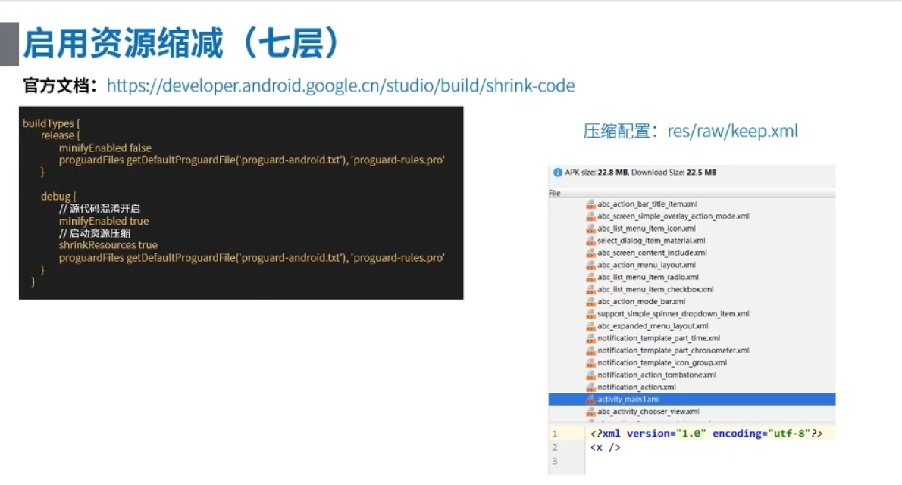

## 九种优化APK的方式 ##

### 1、需求 ###

减小APK包的大小，删除一些APK中一些不必须的资源（目前我是还没用到，所以停下来先画个圈圈，后面说不定会用到）

### 2、方案 ###

> 这里只提出对应的方案，具体的解决方式还需自行Google或百度，因为这些资料网上一抓一大把，所以只提供解决方式，具体实行还是靠自己

**1.SVG**

> SVG主要解决图片不同适配的问题，因为适配不同手机，我们美工需要提供mdpi、hdpi、xhdpi、xxhdpi、xxxhdpi的不同图片，但是有了SVG，美工就只需提供一张SVG图片，就解决了上面不同适配的多张图片问题

> 使用SVG代替png图片

> Android官方地址介绍: https://developer.android.google.cn/studio/write/vector-asset-studio#when


**2.Tint着色器**

> 该方式减少了相同形状不同颜色的图片的张数，比如我们按钮的点击事件，可能会出现变色之类的，但是按钮形状不变，所以着色器解决了相同形状但是不同颜色的多张图片问题


**3.strings.xml资源配置**

> 因为 com.android.support: appcompat-v7: ?? 库的原因，我们打包的应用会支持40多个国家的语言，但是我们发布应用时只需使用其中几门语言就行了，这就导致了我们的包文件大的原因之一

> 下方图片的示例就是一个apk包中的string.xml文件，可以发现有很多国家的语言，所以我们需要在app的 build.gradle 的 defaultConfig 中添加 resConfigs('zh-rCN','ko') 来保留指定的几门语言


**4.so库配置**

> 打包时候只保留市场上主流的arm机型就可以了，其他的so库可以不需要


> 将so库打包到apk内，在 app 的 build.gradle 的 android 中添加如下字段

```
//将so库打包到apk内
sourceSets {
	main {
		jniLibs.srcDirs = ['libs']
	}
}
```

**5.移除无用resource资源(项目版本过多，产生多余资源)**

> 但是这是物理磁盘上的删除，并不建议使用，因为删除之后就找不到了，所以删除前请做好备份(都是些AndroidStudio自带的操作)


**6.源代码混淆（源代码压缩）**

> 名称已经很明显了，就是压缩源代码，而且还提高了apk的安全性


**7.资源压缩(没有keep，所有未用资源一律压缩，不用物理删除)**

> 这种方式就解决了上方物理上删除无用资源的缺陷，因为这样项目中保留了多余资源，但是apk包中没有多余的资源，如果产品想恢复上个版本的资源，我们也能够找到

> Android官方地址介绍： https://developer.android.google.cn/studio/build/shrink-code



> 通过添加个res/raw/keep.xml文件，就可以自定义保存哪些文件与删除哪些文件


**8.webp**

> 有损的压缩图片的一种，它比png大约小35%左右，比jpeg大约小75%左右

> 这是AndroidStudio自带的压缩方式：
> 选中res中的一种图片右键，然后选中Convert to WebP...就可以将图片压缩成webp的图片了，并且Android可以正常引用

**9.资源文件压缩对齐、res资源混淆（apk包）**

> 这种方式没接触过，感觉很高端的样子，所以大家自己Google了。

### 3、资料 ###

无

### 4.样例 ###

无