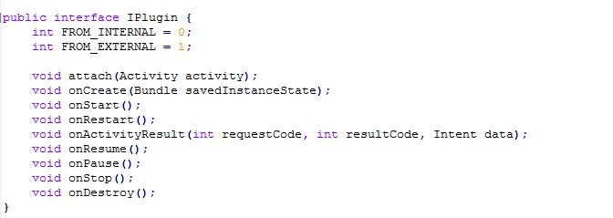

## 动态加载第三方应用——插件化架构详解 ##

### 1、需求 ###

> 当我们需要对一个上线软件添加一个功能时，我们经常使用的方式就是在原工程里添加对应的功能，测试通过之后，然后升级对应的版本号，并将当前版本发布到各大软件商店就 ou 了，但是如果你的软件有几个G大呢？？难道也这样？估计不把用户给气炸……用你的软件，每次更新都是几个G……耗费流量不说（用的wifi），就是更新下载也慢啊…………

> 那有没有一种方式可以解决更新时的问题，我只下载你新增那块功能的代码，不下载其他的，并且下载之后软件能够正常运行新增的功能，那当然有，那就是我们今天要说的插件化……driver……

### 2、方案 ###

**特别声明：**

> 此方案只是作为一个领路人带大家走进插件化的世界，并不能全面概括插件化，并且**工作需求**决定用法，所以大家看了这篇文档只能说你懂了那么一丢丢插件化的操作，具体操作还是需要大家Google、百度，然后才能实现适合自己项目的插件化工程，废话不多说，可以开车了……

**概念：**

> 插件化：它的具体体现是在技术点上，宿主通过**动态加载**来调用组件，宿主不依赖组件，达到**完全解耦**的目的

> （举个栗子：一个已经上线了的App，需要新增一个小功能，我们就开发个这个小功能的App，让上线App去动态加载这个小功能App，怎么加载呢？后文会说，一步一步来）

> 组件化（开发过程，可能你也听说个组件化这个东西，那组件化是什么东西呢？这两个感觉这么相近，是不是有血亲啊？）：组件化就是把APP拆分成不同功能模块，形成独立组件，让宿主调用，这个理念了更强调在应用的开发工程中。

> (举个栗子：一个App在开发时被拆分成多个组件进行开发，组件化更倾向于开发过程，而插件化更倾向于维护过程)

**实现：**

> 相信大家使用过Android的本地数据库SQLite，那本地数据库在Android系统中到底是个什么呢？其实它就是个DB文件（和txt文件差不多），就是一个文件啊，但是我们能通过它保存数据、读取数据。

> 为什么要讲数据库呢？那是因为我们插件的方式和它差不多，我们可以将apk看作一个文件，怎么说呢？相信大家在电脑上存过apk文件，我们手机上就和电脑上的相似，我们不安装它，它就是个文件，不是程序。那我们就可以把它当做文件来处理。——不懂没关系，我们继续走，记住这个概念就行了，插件化中是将插件app当个文件处理，而不是运行的程序

> 那怎样让主App去加载插件App这个文件呢？

> 首先我们要理解Android系统是怎么去加载我们的主App的，然后用这样的思路去让主App加载插件App，这样行吗？

> 我准确的告诉你，是可以的。

> 这张图上的信息告诉我们主App是被 PathClassLoader 和 Resource 加载的，那我们在主App中创建这两个对象，是不是就可以加载插件App了？

> emmmmm……为什么会是这两个东西（类），那是因为Andorid系统赋予的它们的能力，所以你需要去看源码了，这里就不深入了，深入了估计大家脑壳更大……反正现在我们知道了，创建这两个东西就可以去加载插件App了，那怎么加载呢？

> emmmmmmm 上图给了我们实现插件化需要的步骤，就上面3步就OK了

> 有人可能会问——“我的项目以前没有接入过插件化，现在想实现这样的功能，那主项目的代码会不会更改呢？”

> 如果你的项目以前没有接入过插件化，现在接入，那肯定是需要改的，但是改了之后，你后面想新增功能，你的主项目就不需要更改了——所以这就是看得远才走的远，要怪就怪你们以前的架构没有想过插件这一块，所以导致后期改动很麻烦。

### 3、资料 ###

无

### 4、样例 ###

&emsp;&emsp;样例就是本文件夹下的Pluginization工程，Pluginization里面有三个文件，分别是app、pluginapp、pluginlib，从这三个文件的命名方式不难看出app是Pluginization的主工程，pluginapp是一个次工程，pluginlib是一个依赖库，如果依旧不确定，我们可以查看每个文件里分别对应的build.gradle

&emsp;&emsp;然后你会发现 app 与 pluginapp 都依赖了pluginlib，那pluginlib中到底编写了些什么呢？那我们一步一步来分析

&emsp;&emsp;在pluginlib中定义了4个类和1个接口，分别是PluginApp、PluginManager、ProxyActivity、IPlugin、PluginActivity，它们分别起的作用是什么？

> PluginApp：存储的是DexClassLoader、Resources、PackageInfo、AssetManager这些信息，这些东西是用来加载插件Activity的

> PluginManager：是用来管理PluginApp类并初始化PluginApp中的参数

> IPlugin：插件Activity的接口，里面需要定义的有是否来自第三方应用的调用的标识、传入当前上下文的接口、生命周期函数

> PluginActivity：插件Activity，实现插件Activity的接口，如果不是第三方调用的，我们需调用自己的Activity生命周期函数，如果是第三方调用的，我们需要修改setContentView、findViewById、getResource这些关于通过R文件去获取资源的函数，当然这里只实现了setContentView，因为这只是个用例，所以就没完善，具体的还需大家根据自己的项目自行Google、百度处理

> ProxyActivity：代理Activity，因为第三方插件是个文件，所以插件内部的Activity可以看做是一个普通的类，我们只需在代理Activity的生命周期函数中调用插件Activity的生命周期函数，就变相实现了主App加载插件内部的Activity了，这里也只实现了onCreate函数，我们也需在对应的生命周期中调用对应插件Activity的生命周期，并且getResources、getAssets、getClassLoader这些函数需要替换成插件的Resources、AssetManager、DexClassLoader,因为这样才能加载到插件的类

> 当然代理Activity的注册不能忘记

在pluginapp这个次工程中很简单，就是它的Activity继承了我们的pluginlib依赖库中的插件Activity

在app这个主工程，我们需要做的就是加载APK文件，并初始化pluginlib依赖库中的PluginApp、然后跳转就行了

> 在主工程的assets目录里，我们将pluginApp这个次工程打包成apk放入其中

> 然后我们就需在主App中去加载这个插件APK并跳转到插件APK中

到此结束——打完收工，详情的话还需将样例拷贝到自己的工程中去一一实现，看源码才是最好的学习方式，不理解的话可以跟我提，但是求人不如求己，所以Google、百度也不能让它闲着…………你懂没有，反正我是懂了，hhhhhhhhhhh