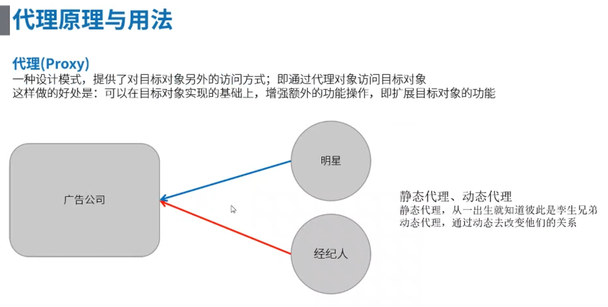

## 揭秘 IoC 注入框架 ##

> 以下部分图片来自网易云课堂，禁止任何牟利方式赚取利润，如果出现版权问题，请官方联系本人，本人会及时删除

### 1、需求 ###

> &emsp;无，这只是一次揭秘篇，只是讲IoC的原理，除非你自己想开发一个IoC框架，才有对应的需求。

> &emsp;但是大家经常为了提高开发效率，可能会使用像EventBus、ButterKnife、Dagger这些IoC注入框架，那这些框架是怎么实现的呢？你是否去尝试着研究过它，你是否尝试着自己去写个关于它的小DEMO——emmmmmmmmm，没有没关系，我们现在一起去实现个小DEMO

> &emsp;如果你是小白，你可能会问为什么要使用EventBus、ButterKnife、Dagger这些IoC注入框架？对呀！为什么呢？


> 上面是传统开发工程中实例化控件所要写的代码，那我们来对比下下面使用IoC框架实例化的控件（当然不止能实例化控件，还能实现其它的）


> 哇！大哥，你就在控件上标记下就可以实例化了？

> 那是，当然其实里面内部的实现还是挺复杂的

**常用框架**


### 2、方案 ###

> 本方案的内容只介绍些概念、技术点，看不懂没关系，直接跳到**样例**模块，直接啃肉，但是你一定要拥有一个技术能力就是Java的反射，否则你连样例都看不懂……

**概念**

> &emsp;概念这东西我就只贴图了，老实说概念这东西看着脑壳晕……，解释起来无从下手，感觉自己已经达到了只可意会不可言传的境界了(啥球不懂)


**技术点**

&emsp;1.Java反射（可参考我先前的一篇文章<a href="https://github.com/Leezps/personal-summary/blob/master/2018-8-6/2018-8-6(Blog%20scan%20summary).md">Java反射机制</a>）


&emsp;2.布局注入原理


&emsp;3.控件注入原理


&emsp;4.事件注入原理


> 事件的三个重要成员，分别是什么？因为我们要实现事件注入，就必定会替换（接触）这三个重要成员


> 因为是点击事件，我们就需要取消掉源代码中按钮的点击事件的回调函数，替换成我们自己的函数，这里我们就需要用到代理的技术（即AOP技术：就是在将要执行某个事件的时候，在它发生前、发生时、发生后这三个时间段执行你的操作，例如你可以在发生前拦截这个事件的发生，也可在发生时执行些其他操作等等……）——曾经我也写过AOP的技术文章，但是在CSDN上，后面感觉CSDN太乱了，看个文档，这里一个广告，那里一个，看着看着就心烦，后面再也没用过CSDN了




### 3、资料 ###

无

### 4、样例 ###

样例就是本文件夹下的 IOC_DEMO 文件，其中有两个文件，分别是app与library，而library就是我们自己编写的IoC框架，而app就是我们的项目，这个工程就是项目调用IoC框架的代码。

首先，我们来看下主工程的启动Activity（从主工程的AndroidManifest.xml文件看）


在代码中找到该Activity


那首先我们先解决继承的BaseActivity


在其中我们发现它调用了library中的一个类，并且是在onCreate函数中，什么东西需要在Activity的onCreate函数中调用呢？

打开library中的InjectManager类


原来是我们自己的写的IoC框架，即自己实现的布局注入、控件注入、事件注入等。

讲到这，大家估计还是不知道IoC框架是个什么玩意？**不急，现在开始了**。

相信大家经常重写过父类的方法时，这个方法前面总是有个@Override这个字段，那你是否试着自己点开这个字段呢？现在我们试着点开这个字段试试


点开之后，你会发现其中有个

```
@Target(ElementType.METHOD)		//表示该注释是作用在方法上（对耶，@Override是写在方法的上面）
@Retention(RetentionPolicy.SOURCE)		//表示该注解只会保留在当前源码的时候（如果你不信，你可打开其编译成的class文件，你会发现这个注解不见了）
```

如果你自己依旧不想自己尝试一下，哎，我就帮帮大家，好人做到底…………（但是这样的习惯是不好的哦）

MainActivity.java 的代码展示：


MainActivity.class 的代码展示：


是不是？果真不见了，但是你发现没有，我们自己IoC注入框架的注解依旧还在（就是那些@ContentView、@InjectView、@OnClick这些），这个又是怎么回事呢？

那是因为我们可以通过修改@Target、@Retention的括号里的值来达到这样的要求


> 只解释几个常用的，其他的自己去Google、百度

|Target|说明|
|:--:|:--:|
|ANNOTATION_TYPE|元注解（形容注解的注解，例如@Target、@Retention）
|FIELD|形容参数的注解，像上面代码里面IoC框架的@InjectView|
|METHOD|形容方法的注解，像刚才介绍的@Override|
|PACKAGE|形容包名的注解|
|TYPE|形容类名的注解，像上面代码里面的IoC框架的@ContentView|


|Retention|说明|
|:--:|:--:|
|CLASS|可以保存到class文件时期（即编译时期），但是程序运行的时候你去获取的话就会发现没有这个注解了|
|RUNTIME|可以保存到运行时期，即程序运行这个注解都还在，我们IoC框架就需要这个|
|SOURCE|上面已经说了，只会保留到代码时期，编译之后注解就不见了|

注解说了这么多，估计也清楚了，那我们怎么去写一个自己的注解呢？

其实和我们创建类一样（在AndroidStudio当中）在我们创建类时，选择其中的Annotation就可以创建注解了


创建完成之后，我们需要在注解里添加@Target与@Retention

如IoC框架中的@ContentView


其中int value();表示需要向其中传入个int的数据，所以我们可以看到在MainActivity中的@ContentView是传入了R.layout.activity_main

好了，通过注解的方式，我们将文件的ID值保存下来了，因为我们的注解会保存到程序运行，所以根本不用担心注解会消失，我们就可以通过反射的原理去获取ID，并将其设置到我们的Activity上

在InjectManager的injectLayout函数中，全过程是通过Java反射的原理，将布局的ID值获取到，然后反射的方式将其设置到activity中（在代码中介绍的挺详细的，所以这里不再累述）


控件的方式与布局的方式基本一致，不再累述……

事件的注入就有点复杂了，不过大家关于IoC的原理应该都懂了，就是**注解**加**Java的反射机制**实现的，后面如果听不懂就多查阅些资料，看些视频，因为我的表达能力不知道能不能达到大道至简的程度不好说…………

注解的分布：


一看大家就应该知道事件注入很复杂，因为需要三个注解才能完成事件注入

因为事件分为点击与长点击，所以我们我们需要OnClick注解与OnLongClick注解

那EventBus里面存的是什么呢？


它存的就是事件的三个重要成员，因为事件注入就只需在方法名前注解下就行了，那三个重要成员就不会出现了，那就需要出现在我们的注解当中，并且它是个元注解，所以它里面的值需要在注解中给它赋值上

那我们来看下OnClick与OnLongClick注解

OnClick注解：


OnLongClick注解：


果真，它们根据自己的三个重要成员分别赋值上了

那具体是怎样通过Java反射来实现的事件注入的？


emmmmmmmmmm，事件注入也讲完了，写文档好球累啊……可不可以发明个脑电波转换器，将自己所学的知识智能分析下，然后形成一个文档保存下来，这样就好多了，多省力啊…………