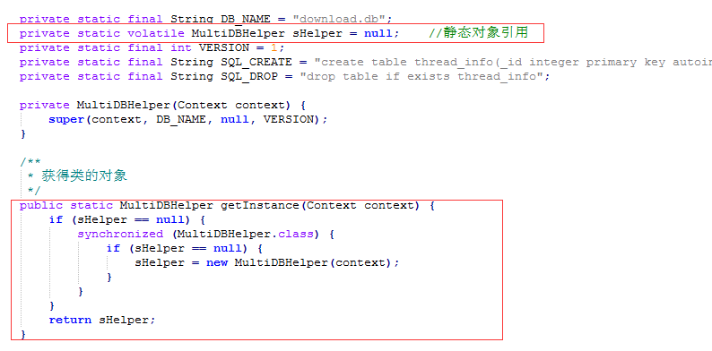

## 下载服务 ##

### 1、需求 ###

下载文件时，可能涉及到的断网续传、多线程同时下载一个文件、通知栏提示下载进度等等…………

### 2、方案 ###

在下载样例中有3个工程，分别是

1).单任务单线程断点续传

2).多线程多任务断点续传

3).通知栏显示进度

详情可查看MultiDownloadTask/project_struct.config中的工程结构介绍

### 3、资料 ###

整个工程是按照mooc网的教学视频对应编写完成
<a href="https://www.imooc.com/u/1395824/courses?sort=publish">mooc课的地址</a>

所参考的其他第三方知识点有：
1). <a href="https://blog.csdn.net/qq496013218/article/details/69397380">RandomAccessFile在断点续传起的作用</a>

> RandomAccessFile可以实现在文件中指定指针位置进行插入或者修改内容，即先定义一段文件的大小，然后就可以在这段已经定义的空间中指定其中一段空间进行修改与插入

2). <a href="https://blog.csdn.net/mad1989/article/details/38421465">多线程文件下载</a>

3). Timer中有cancel与purge两个函数，但是两者的区别在哪？

> Timer启动一个定时任务时，需要传入一个TimerTask，因此一个Timer可以对应多个TimerTask，因为一个Timer可能执行多个定时任务。而Timer的cancel是取消所有的定时任务，并将所有的TimerTask置空释放内存。那purge的作用是什么呢？它是检测Timer中是否有TimerTask被设置为取消状态，有取消状态的TimerTask就将其置空并移除定时任务队列。那怎样将个别的TimerTask设置为取消状态，其实TimerTask自己有自己的cancel函数，调用TimerTask的cancel函数就可以将TimerTask设置为取消状态，但是设置为取消状态，它的内存依旧存在，未将其对象置空，所以此时应调用Timer的purge函数来将其置空释放内存。

4). <a href="https://blog.csdn.net/tanzuai/article/details/48213123">android PendingIntent参数详细解析</a>

> 在调用Notification时，其中涉及到控件的点击事件的设置，PendingIntent就是需要一个类

5). 单例模式问题——为什么要使用volatile来形容对象？

> 首先：
> &emsp;&emsp;synchronized的特性：可见性、原子性、可重入性
> &emsp;&emsp;volatile的特性：可见性
> 从特性上看，感觉synchronized包含了volatile的特性，为什么还要用volatile来形容单例呢？
> &emsp;&emsp;那是因为volatile还有个不可重排序的特性，Java在编译我们的代码时，它会按照单线程的优化思路去优化代码（即单线程去执行这段代码的返回结果不变），但是按照多线程的思路编写的代码就可能会被优化，例如上方的单例模式，就可能将sHelper == null的这两个判断优化成一个，而不是双重判断了，所以需要用volatile来指定该对象所在的代码区域不能被优化。

### 4、样例 ###

即本文件目录下MultiDownloadTask的所有文件