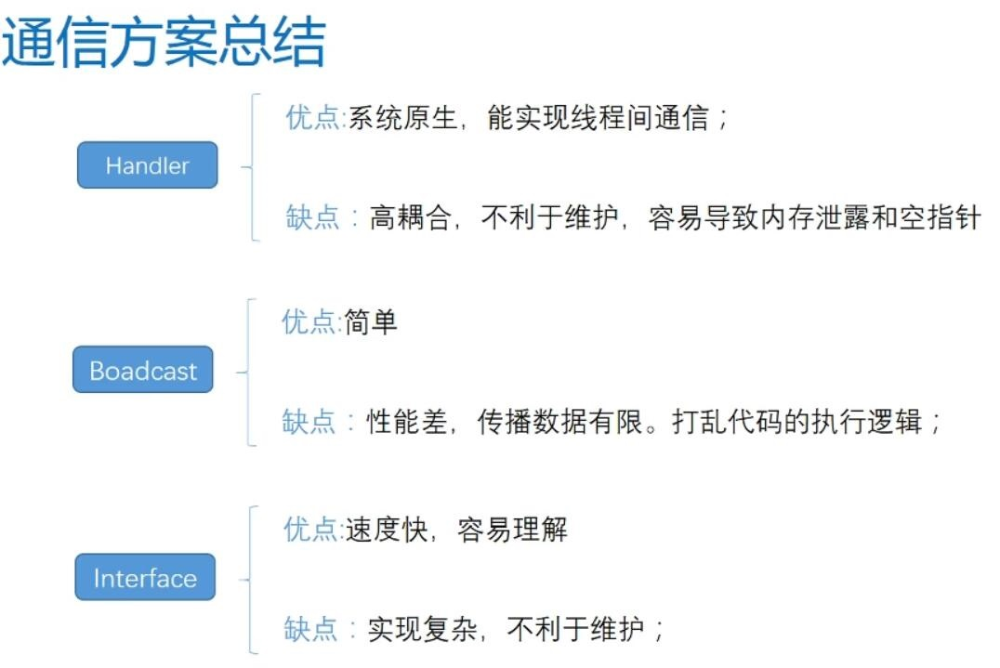
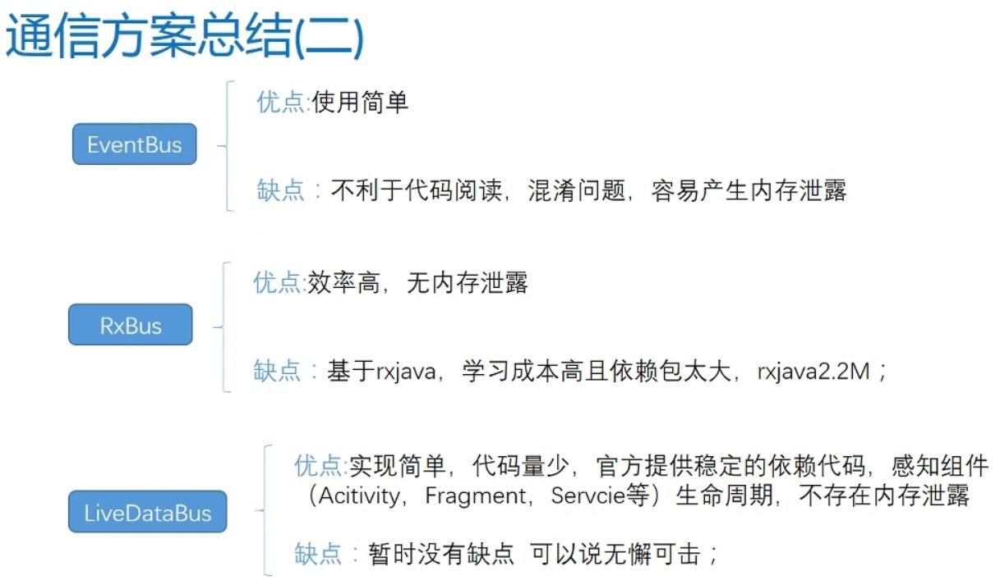
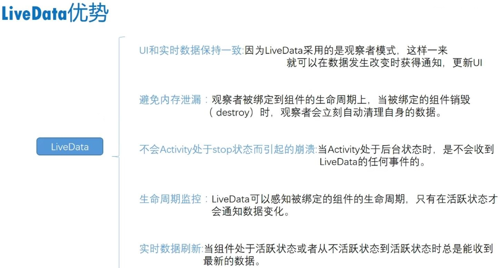
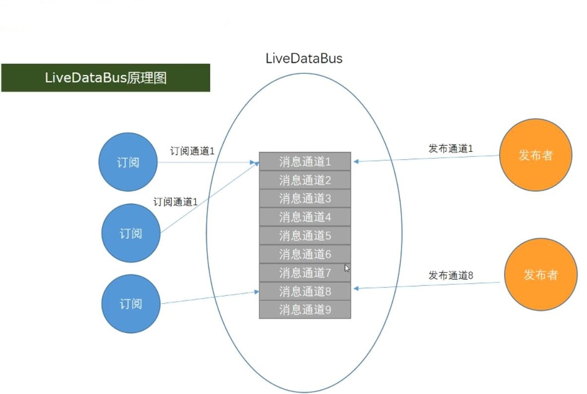

## Android消息总线的演进之路——LiveDataBus详解 ##

### 1、背景 ###

&emsp;在 Android 系统中，线程、组件之间的通信方式有：

&emsp;&emsp;1. Android 原生的通信方式——Handler、Broadcast、Interface

&emsp;&emsp;

&emsp;&emsp;2. 第三方的通信方式——EventBus、RxBus

&emsp;&emsp;3. 官方扩展并支持的通信方式——LiveDataBus

&emsp;&emsp;

&emsp;**LiveData优势**

&emsp;&emsp;

&emsp;**LiveData的定义**

&emsp;&emsp;一个数据持有类，持有数据并且这个数据可以被监听，和观察者模式不一样的地方是，他和Lifecycle是绑定的，在生命周期是有效的，减少内存泄漏。

> LiveDataBus 是基于 LiveData 展开，LiveData 是 Android 官方的数据生命周期组件，LiveDataBus 通常需要开发者自己实现。相对于 Eventbus 和 RXJava 复杂的实现，LiveDataBus 非常简单。

&emsp;**LiveDataBus原理图**

&emsp;&emsp;

### 2、需求 ###

无

> 这里只讲解下最近比较火的Android的LiveDataBus通信方式的原理，自己可以实现一个研究研究……，也让大家知道有个LiveDataBus的方式可以用于通信，并且是Android官方支持的。

### 3、资料 ###

1.<a href="https://juejin.im/post/5baee5205188255c930dea8a">LiveData的工作原理</a>

2.<a href="https://developer.android.google.cn/topic/libraries/architecture/livedata">官方LiveData讲解</a>

3.<a href="https://developer.android.google.cn/reference/android/arch/lifecycle/Lifecycle">官方Lifecycle讲解</a>

4.<a href="https://tech.meituan.com/2018/07/26/android-livedatabus.html">Android消息总线的演进之路：用LiveDataBus替代RxBus、EventBus</a>

### 4、样例 ###

&emsp;&emsp;样例就是当前文件夹下的 LiveDataBus 文件夹，其中 com.leezp.livedatabus.customize 包中是我们实现的 LiveData 的源码，而在这个包以外的 LiveDataBus.java、LiveDataTimerViewModel.java 是使用 android 原生的 LiveData 来实现的 LiveDataBus

&emsp;&emsp;其中通过 Fragment 来控制 LiveData 的生命周期，因为 Fragment 的生命周期是和 Activity 的生命周期一体的，也就是说 Activity 的生命周期函数会传递给 Fragment，LiveData 就可以监控 Fragment 的生命周期实现监控 Activity 的生命周期，因此在 com.leezp.livedatabus.customize.lifecysle 包中有一个 HolderFragment.java 自定义的类，打开类你可以发现每一个 Fragment 生命周期函数都会调用 LifecycleListener
接口将生命周期的信息传递出去。

&emsp;&emsp;其中 Observer.java 是我们自定义的订阅者，LiveData.java是我们自定义实现的LiveData类，具体详情可将代码拷到工程里自己去测试……