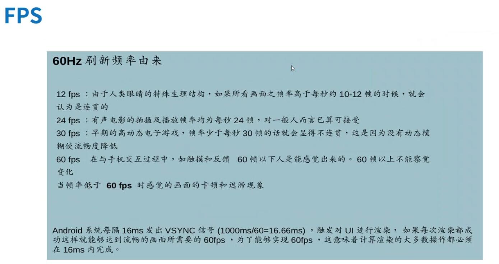

## 布局渲染流程与原理——笔记 ##

### 1、需求 ###

&emsp;&emsp;完成软件需求之后，为了提升软件的用户体验以及响应效率，就会对软件布局进行优化。

### 2、流程与原理 ###

&emsp;**CPU 与 GPU 的区别**

&emsp;&emsp;

&emsp;Android 中布局渲染更新以16毫秒为一个间隔，**为什么会以16ms为间隔呢？**

&emsp;&emsp;

&emsp;因此手机应用卡顿的原理是：

&emsp;&emsp;

&emsp;通过卡顿原理分析得出：

&emsp;&emsp;

&emsp;**如何解决卡顿？**

&emsp;&emsp;

&emsp;**GPU的过度绘制**

&emsp;&emsp;

&emsp;**如何查看应用是否过度绘制？**

&emsp;&emsp;