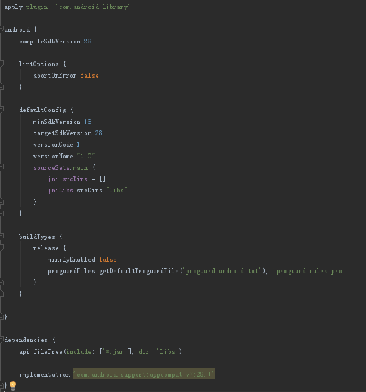
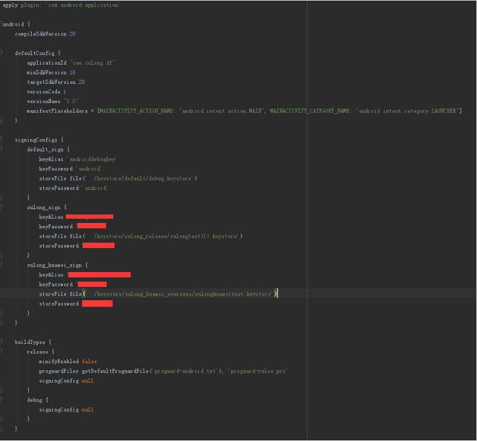
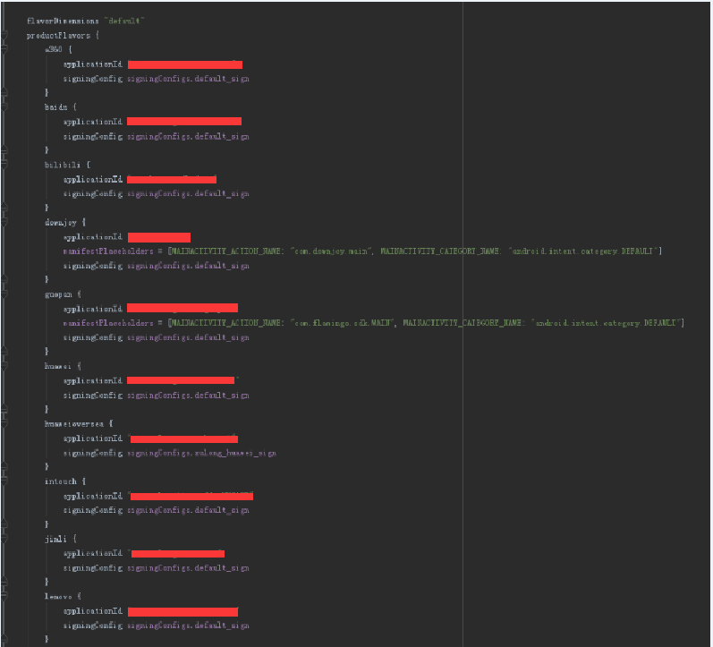
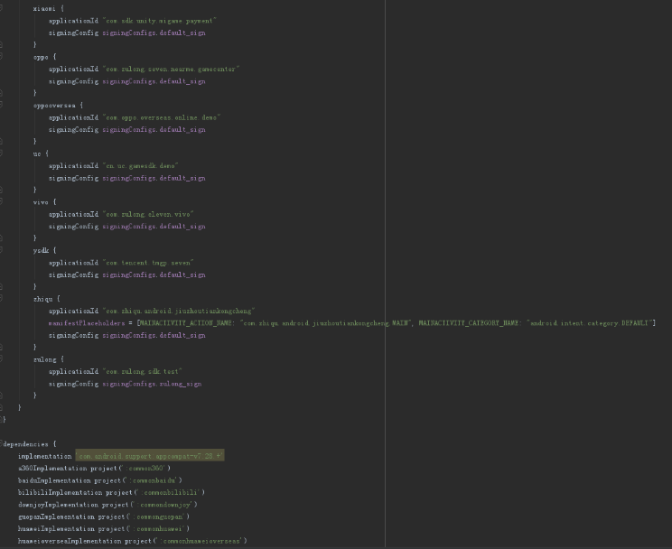
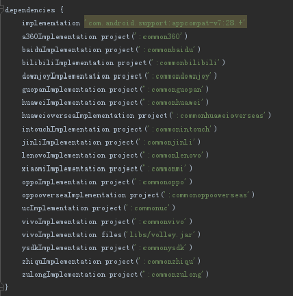

## 在AndroidStudio 3.1.2上的gradle配置问题 ##

### 1、需求 ###

目前当前文档的gradle设置只涉及到**产品渠道**、**签名**、**依赖库之间的依赖**、**修改AndroidManifest.xml**、**so文件报错**、**AndroidManifest申请权限为只为系统应用才能拥有的权限**的配置问题，还未涉足通过gradle设置工程的编译优化、定制输出apk的apk名称等问题，如果你与当前文档的需求不一致，请移驾到Google，自行搜索解决……当你的公司里的产品要分为多个渠道时，可能会遇到的问题……因为最近我就在做将以前Eclipse的工程转移到AndroidStudio中，所以停下来先画个圈圈做下标记^。^，本来这篇文章不想写，因为没有个技术点，并且AndroidStudio的更新迟早会让这个东西改变的，但是做个笔记吧……

### 2、方案 ###

先来看几张关于Gradle配置的图片

> **library的gradle配置**



```
lintOptions {
	abortOnError false
}
```
> 以上配置用于解决 AndroidManifest.xml 中申请了系统应用才能拥有的权限的报错问题

```
sourceSets.main {
	jni.srcDirs = []
	jniLibs.srcDirs "libs"
}
```
> 以上配置用于解决 AndroidStudio像 Eclipse 一样，将so文件直接放到libs中的问题，如果你不加上面那段，AndroidStudio编译时虽然不会直接报错，但是运行程序时你会发现找不多某个so文件而程序崩溃

```
api fileTree(include: ['*.jar'], dir: 'libs')	//这里是将implementation改为了api
```
> 以上配置用于解决在 application 工程中引用不到 module 工程中的 libs 中的 jar 文件

---------------------

> **application的gradle配置**



```
defaultConfig {
	……
	manifestPlaceholders = [MAINACTIVITY_ACTION_NAME: "android.intent.action.MAIN", MAINACTIVITY_CATEGORY_NAME: "android.intent.category.LAUNCHER"]
}
```
> 以上配置是设置默认配置，通过 defaultConfig 可以看出，后面我们可以根据不同的产品渠道做出不同的修改，而 manifestPlaceholders 是给 AndroidManifest.xml 文件中的变量 MAINACTIVITY_ACTION_NAME 和 MAINACTIVITY_GATEGORY_NAME 赋值

```
signingConfigs {
	default_sign {
		……
	}
	zulong_sign {
		……
	}
	zulong_huawei_sign {
		……
	}
}
```
> 配置签名文件信息，后面将说如何使用它们……这里只是将签名文件的信息配置上




```
flavorDimensions "default"
```
> 这是Google新出的产品风格，例如产品渠道可能分为收费与不收费，这里就可以定义两个 paid 与 free，然后在产品中指定它是 paid 还是 free，具体详情可查阅后文资料中的 Android 官方文档

> productFlavors就是产品渠道，里面具体的申明你所拥有的渠道





> 上图讲的是不同产品渠道的依赖方式……

> 这里不做细讲了，因为这种文章网上真的一抓一大把，做个记录而已，而且相比我这篇文章优秀的也一抓一大把，时间宝贵……跳过

### 3、资料 ###

自己感觉还不错的文章：

1.<a href="https://blog.xujiaji.com/post/android-project-one-for-more">一个项目如何编译多个不同签名、包名、资源等，的apk？</a>

> 这个还不错，估计就是自己买的域名，那天他不交了钱续了，这个文章估计也消失了，所以大家可以保留网页内容，但是也说不定这个技术在后面升级的AndroidStudio给抛弃了，不用这种技术了，所以…………

2.官方的东东
(1)<a href="https://developer.android.google.cn/studio/build/dependencies">添加构建依赖项</a>
(2)<a href="https://developer.android.google.cn/studio/build/build-variants">配置构建变体</a>

3.<a href="https://juejin.im/entry/59a53740518825242670ca42">Gradle实战：Android多渠道打包方案汇总</a>

4.<a href="https://www.jianshu.com/p/12f6237ae959">Android依赖导入全攻略</a>

5.杂记
(1)<a href="https://blog.csdn.net/qq77485042/article/details/82220301">Android studio给项目工程配置指定的签名文件</a>
(2)<a href="https://blog.csdn.net/qq_32452623/article/details/52949865">AndroidStudio-Gradle定制多签名多渠道打包</a>
(3)<a href="https://blog.csdn.net/zhangphil/article/details/83302184">Android配置build.gradle的productFlavors多渠道打包</a>
(4)<a href="https://blog.csdn.net/ziyoutiankoong/article/details/79700879">Android Studio 3.0 SO文件的引用</a>
(5)<a href="https://blog.csdn.net/mo_feng_/article/details/81019514">androidStudio无法引用library中的jar包 implementation</a>

### 4、样例 ###

无