## 阿里sophix热修复起源之路  — 虚拟机层方法表替换 ##

### 1、需求 ###

> sophix热修复的原理以及实现方式

> 热修复——我的理解就是将错误的代码块修改成正确的代码块，并且是**实时更新**的。

> 举个栗子：我们发布一款应用之前，怎么测试都没有出问题，但是发布到网上之后，因为用的人很多，有些地方可能在公司这个有限的人力资源里没有测试到该问题，然而在网上大家一起用，人一多，问题就可能出现了，这个问题极有可能就是我们自己写的Android客户端代码！那怎么办呢？重新修改代码，然后重新上传这个应用——emmmmmmm，可以，但是有些用户可能就不干了，修复个bug，你让我重新下载你的应用，我的流量不要钱啊…………那怎样可以提高用户体验并修改掉这个Bug呢？那就是热修复，在用户不知情下修复该Bug并且不用重新下载apk，减少流量消耗……一举多得…………

> 首先声明——热修复Google不建议使用，苹果更是直接拒绝上线有热修复的软件，因为大家懂得，远程随时都可以修改你的手机里应用的代码，那它想获取手机里的什么东西不是想想就可以得到了吗？？——所以总结“隐私”别放手机里，还是放到脑袋里比较好…………

> 我从网上截了个图，关于目前热修复的框架优势对比，因为我也没用过这么多的热修复框架，所以别人说什么就是什么了……来，看图

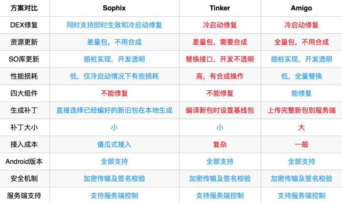

> 这三个框架是当下（2019-4-9）比较流行的热修复框架

> 从对比上，我们可以发现Sophix很占优势，但是需求决定框架，所以别看它比其他框架优势多，但是需求才决定你该用什么框架，Sophix是要收费的，并且阿里并没有对它开源，当你发现你的问题它解决不掉的时候，你根本无法修改它的源码来实现你的想法……所以——看需求

> Sophix不是开源的，那你怎么知道它是怎么实现的啊？？因为Sophix有个父亲叫Andfix，Andfix是开源的，它是阿里早期的热修复框架，Sophix是基于Andfix的基础上诞生的。

> 那它们热修复的原理是怎样的？继续看图

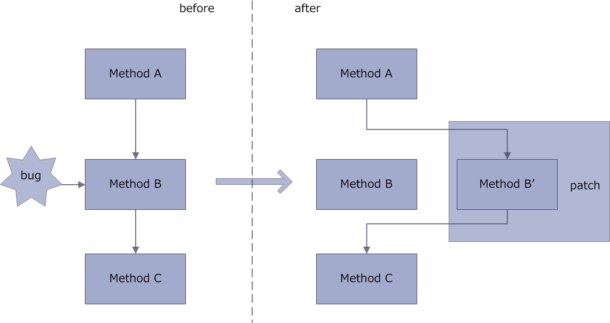

> 它们的原理就是替换掉有Bug的方法，如图所示，Method B里面有Bug，那我们将该Method B替换掉，如何替换呢？继续看图

> 看图前你需要了解下Java虚拟机的工作机制，这里简单给你普及下，详情老规矩，自己Google、百度，Java虚拟机分为五大区，分别是堆、方法区、虚拟机栈、PC寄存器、本地方法栈，PC寄存器与本地方法栈介绍下它们的功能就行了，PC寄存器就是如果当前执行的方法是JVM中的方法，就保存当前执行指令的地址，如果是Native方法，则置为空。它是保存**当前执行**指令地址的，所以不用管。本地方法栈就是Native方法执行的地方，这里也不涉及，因为我们替换的Java的方法，所以也可以不管。

> 如果你说你想替换native方法，emmmmmm，Sophix没开源，Andfix它不能替换native方法，所以需要你自己下去仔细研究了，但是原理应该差不多，都是替换的方法，只不过它的实现方式不同，可能它就在当前native层将其替换掉，也有可能是在汇编代码层将其替换掉…………办法总是人想出来，只是你对Android系统中的虚拟机不熟悉而已，如果你熟悉，你想怎么玩，就怎么玩…………

> 回来，我们继续——
> 堆：存放对象和数组的地方
> 方法区：存放类的信息、常量池、方法数据（方法表）、方法代码等的地方
> 虚拟机栈：执行JVM方法的地方，每个方法执行的时候都会从方法区中获取出方法代码压成“栈帧”，放到这个虚拟机栈中去执行，每个栈帧存放的是局部变量表（基本数据类型和对象引用）、操作数栈、方法出口等信息

> 我们知道，每个Java程序都有一个程序入口，那就是main函数，那Android也是Java程序，那它的入口在哪里？？
> 其实在ActivityThread.java中，这是被Google封装了的类，没有给我们显示观看，也就是说Google隐藏了入口，这样做的好处是什么？这样做的好处就是我们就只需关注Google提供的四个组件就行了，这样让开发更简单了

> 进入main函数之后，虚拟机就会按照main函数里面出现的对象以及类在对应的工作区去实例化数据，要想在方法区实例化占据一块空间，那必须是通过**new**、**反射**、**反序列化**、**native反射**的方式去实例化对象才行，如果你实例化对象代码是 A a = null;这样只能说你在堆区有个对象地址空间（即a），但是方法区并没有存储A类的相关信息。如果你实例化对象代码是 A a = new A();这样代表你在堆区有个对象地址空间（即a），并且方法区有A类的类信息、方法表（存放的是方法名以及方法对应地址）、方法代码等信息。

> 从中我们知道了三个点：
> 1.虚拟机是个懒加载机制，你只有真正实例化了，才会去方法区里申请空间并存储类的相关信息
> 2.只需将方法表中的方法地址修改成正确方法的地址就可以实现动态修改具体的Bug了
> 3.知道了实例化一个对象，它前后进入虚拟机工作区的顺序：**堆->方法区->虚拟机栈（PC寄存器）**

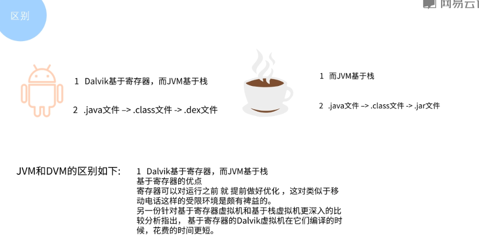

> Android分为 art虚拟机 与 Dalivk虚拟机，所以不同虚拟机你需要不同的处理（后面你会发现不同版本的Android的art虚拟机也需要不同的处理，这里不考虑，后面说）

<a href="https://blog.csdn.net/lixpjita39/article/details/73058020">Dalvik虚拟机和ART的区别</a>

**Art虚拟机**

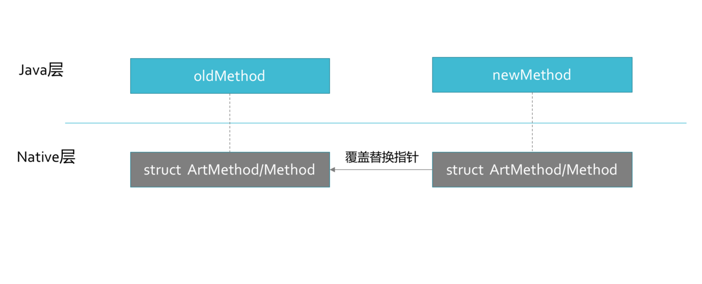

**Dalivk虚拟机**

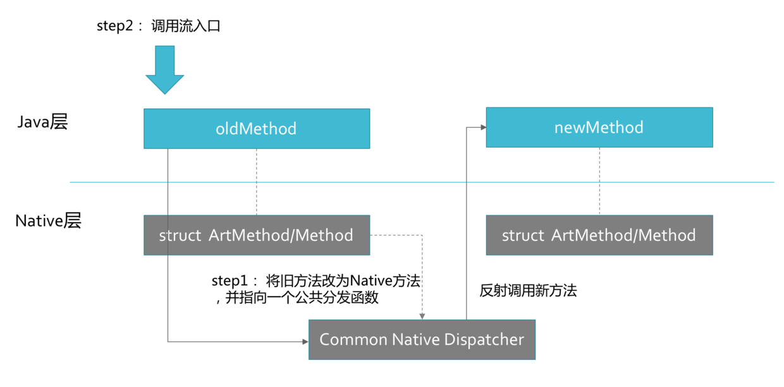

> 从上面两种虚拟机的实现方式可以看出，两种虚拟机都通过修改native层的代码来实现的，只不过Art虚拟机是直接用正确方法的地址覆盖了错误方法的地址，而Dalivk虚拟机是将错误方法的地址指向一个公共的分发函数，然后通过这个函数去反射调用正确的方法。

> 这里只讲Art虚拟机的原理，Dalivk就不讲了，因为Dalivk虚拟机马上就要消失了，因为它对应的Android版本是5.0以前，5.0及5.0以后Art彻底代替了Dalivk虚拟机

### 2、方案 ###

> 上面一不小心，就把原理讲的差不多了……emmmmmmm，最后还讲一个，我们就进入样例讲解环节。

> Java层的与Native层的对应关系：
> Class--------------klass
> Method-------------ArtMethod

> 为什么要讲这个？这是因为后面我们需要在Native层获取ArtMethod，其实它就是Java层的Method（方法），以防你看不懂，先打预防针……

方案步骤：

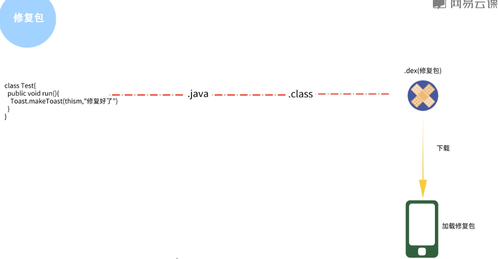

### 3、样例 ###

本文件夹下的Sophix文件夹就是本工程的样例，此样例只针对Android 5.0的手机，因为其他版本的ART虚拟机的方法相关参数不同，需要替换的参数也不同，所以这里只是取了个代表，后面我会发Andfix源码地址，你们可以根据自己的需求自己去实现自己的手机热修复样例

首先我们需要我们自己的AndroidStudio支持NDK编程，如下图所示，你需要下载下方红框圈中的SDK Tools，我的AndroidStudio版本是3.1.2，如果你的是3.0以前的AndroidStudio，你需要自行Google或百度搜索需要下载的SDK Tools

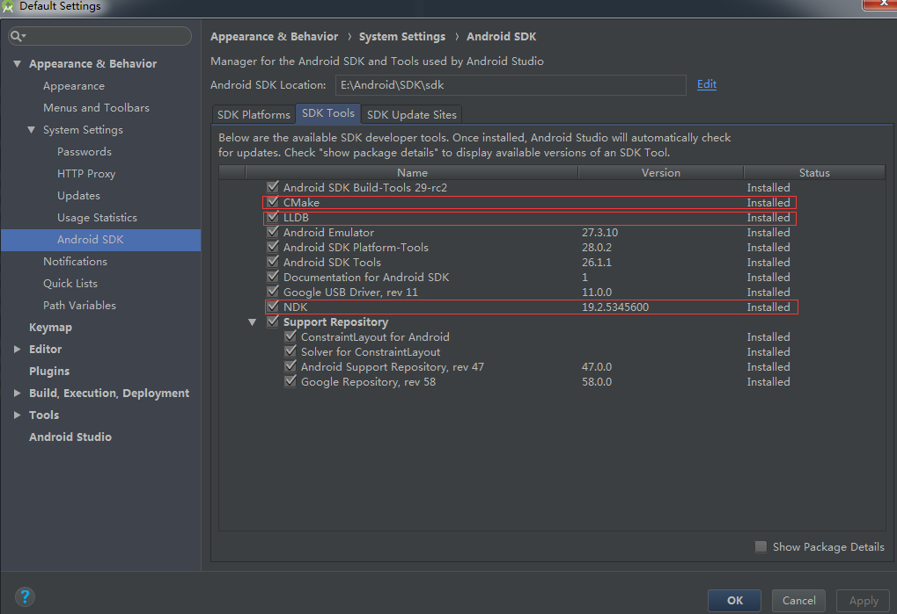

然后创建个支持C/C++的Android工程

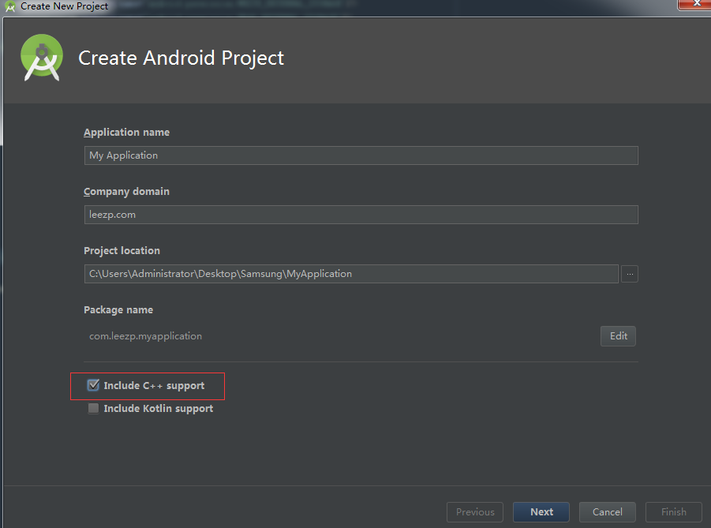

其中Include C++ support一定要勾上，一路默认next、finish等点击下去，这样就创建了一个支持NDK开发的Android工程


如果你的工程创建完成之后，出现编译错误，无法通过，你可以在如下图所示里面去看是什么错误导致了编译失败！

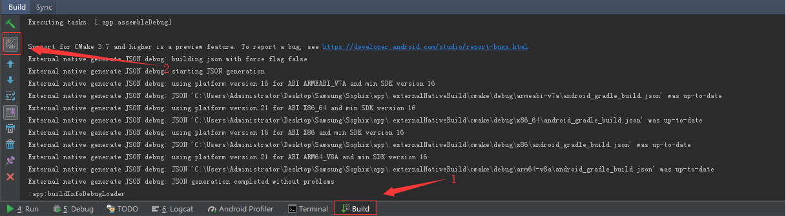

如果出现的错误是

```
Cmake error: Cmake was unable to find a build program corresponding to ninja. CMAKE_MAKE_PROGRAM is not set. You probably need to select a different build tool
```

该错误就是没有安装ninja,因为Cmake的编译需要ninja的参加

先通过git将ninja从网上获取下来，下面是git中的命令


当然也可以不通过git,你自己去github网站上去下载它的zip包，解压就行了，网络地址是： https://github.com/ninja-build/ninja

然后去 https://github.com/ninja-build/ninja/releases 下载对应的启动器，我用的是windows，所以下载的是

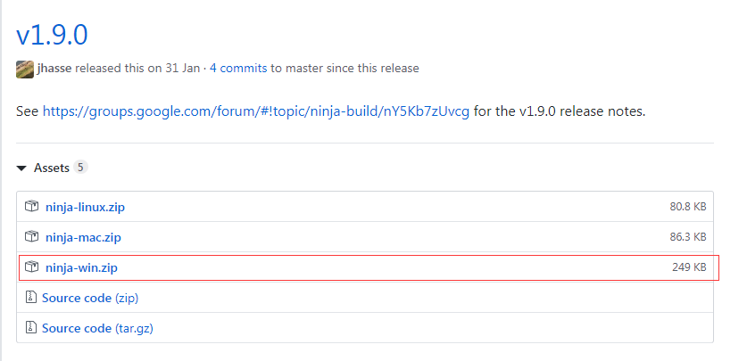

然后将这个启动器的zip包解压，ninja-win.zip包解压之后里面是一个ninja.exe文件，将 ninja.exe 放到git获取下来的ninja文件夹的根目录下，然后在ninja根目录的窗口下打开cmd命令窗口，在其中输入ninja --version，如果出现1.9.0的字样，说明你的ninja配置成功

最后只需将环境变量配置上就可以了（将ninja的根目录的路径添加到Path环境变量中，这样在windows的每个路径下输入ninja --version都可以识别到了）

这样重新编译下NDK工程，你应该发现上面的错误不见了

然后在工程里添加如下几个文件

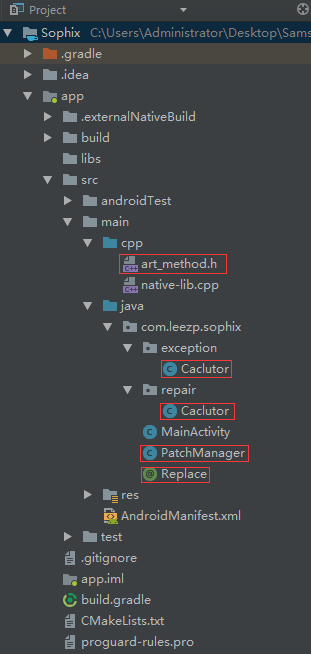

分别修改其中的代码数据

AndroidManifest.xml中做如下修改：

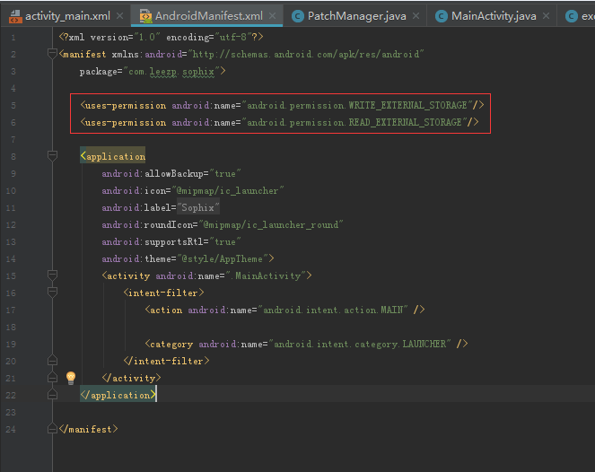

activity_main.xml中做如下修改：

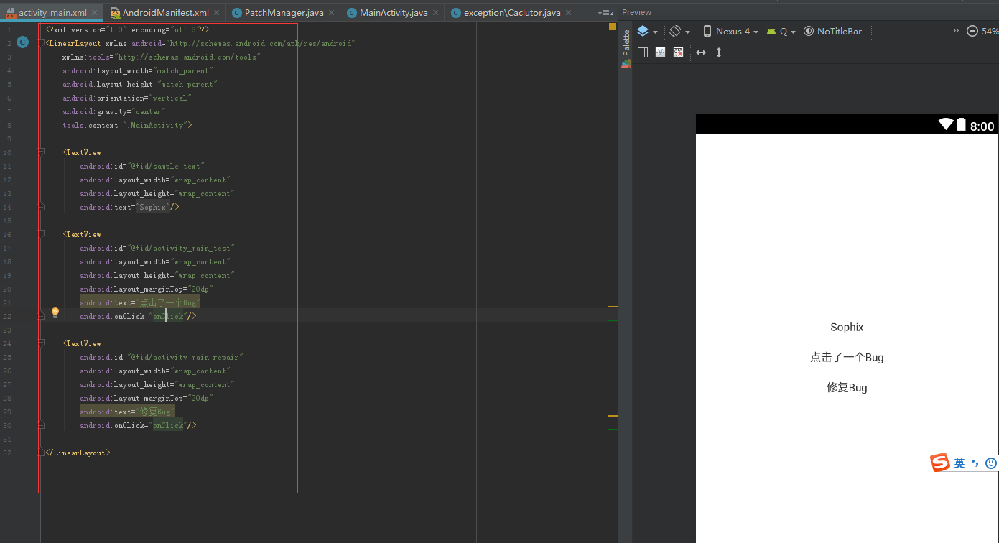

MainActivity.java中做如下修改（其中的Caclutor是exception中的Caclutor.java）：

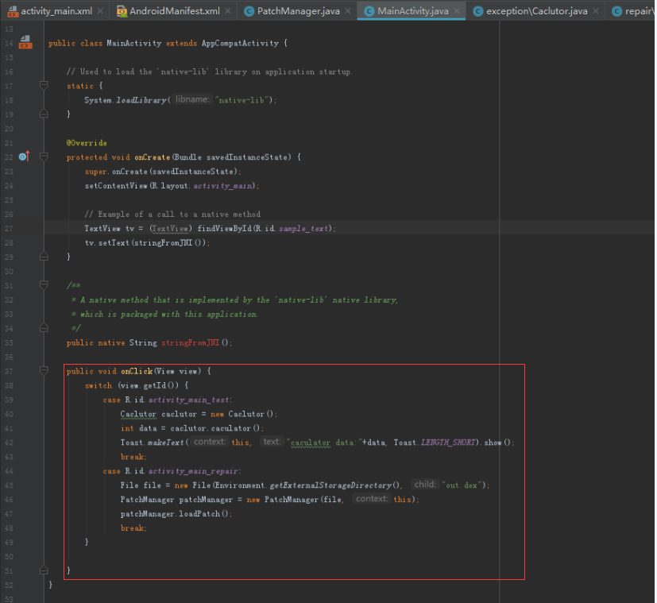

exception/Caclutor.java中添加如下代码：

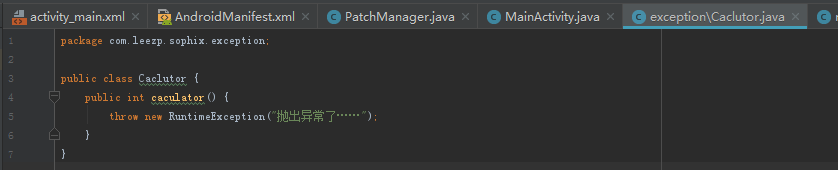

PatchManager.java中添加如下代码：

```
public class PatchManager {
    private File file;
    private Context context;

    public PatchManager(File file, Context context) {
        this.file = file;
        this.context = context;
    }

    public void loadPatch() {
        File optFile = new File(context.getFilesDir(), this.file.getName());
        if (optFile.exists()) {
            optFile.delete();
        }
        try {
            final DexFile dexFile = DexFile.loadDex(file.getAbsolutePath(), optFile.getAbsolutePath(), Context.MODE_PRIVATE);
            ClassLoader classLoader = new ClassLoader() {
                @Override
                protected Class<?> findClass(String name) throws ClassNotFoundException {
                    Class clazz = dexFile.loadClass(name, this);
                    if (clazz == null) {
                        clazz = Class.forName(name);
                    }
                    return clazz;
                }
            };
            Enumeration<String> entry = dexFile.entries();
            while (entry.hasMoreElements()) {
                String key = entry.nextElement();
                Log.i("Leezp", "---------找到类" + key);
                Class realClazz = dexFile.loadClass(key, classLoader);
                if (realClazz != null) {
                    findMethod(realClazz);
                }
            }
        } catch (Exception e) {
            e.printStackTrace();
        }
    }

    private void findMethod(Class realClazz) {
        Method[] methods = realClazz.getMethods();
        for (Method rightMethod : methods) {
            Replace methodReplace = rightMethod.getAnnotation(Replace.class);
            if (methodReplace == null) {
                continue;
            }
            //rightMethod --> ArtMethod对象
            //wrongMethod --> ArtMethod对象
            Log.i("Leezp", "找到替换的方法 " + methodReplace.toString() + " clazz对象 " + realClazz.toString());
            String wrongClazz = methodReplace.clazz();
            String methodName = methodReplace.method();
            try {
                Class<?> wrongClass = Class.forName(wrongClazz);
                Method wrongMethod = wrongClass.getDeclaredMethod(methodName, rightMethod.getParameterTypes());
                replace(wrongMethod, rightMethod);
            } catch (Exception e) {
                e.printStackTrace();
            }
        }
    }

    public static native void replace(Method wrongMethod, Method rightMethod);
}
```

art_method.h中添加如下代码(art_method中保存的字段是需要修改的字段，因为修改这些字段，ArtMethod的地址才会发生正确的改变)：

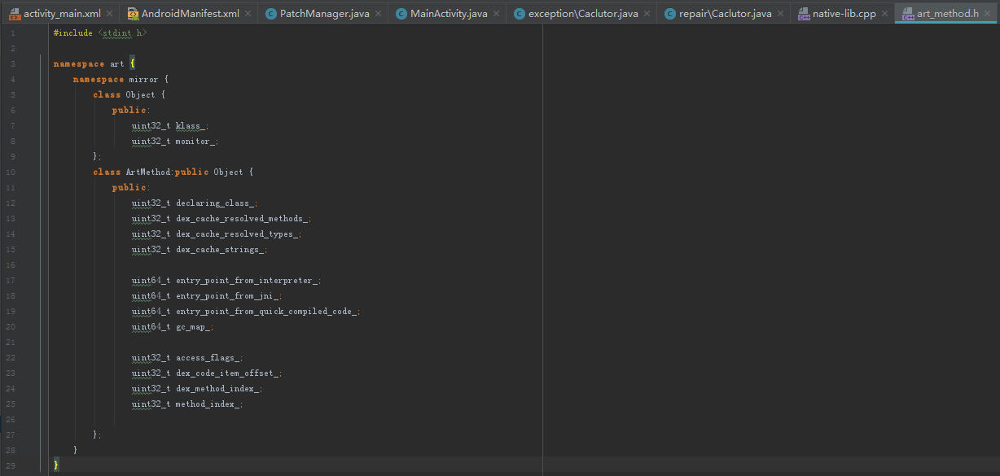

native-lib.cpp中做如下修改：

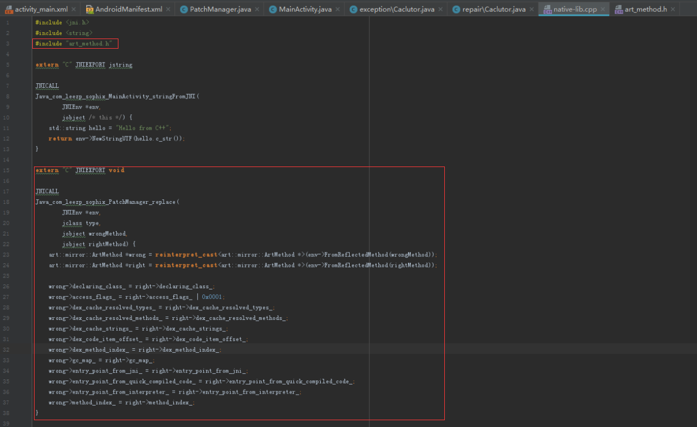

Replace.java中添加如下代码：

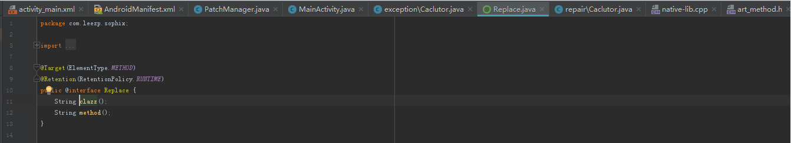

repair/Caclutor.java中添加如下代码：

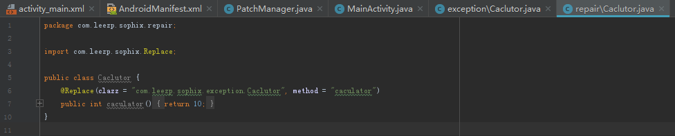

然后运行程序，直接点击“点击了一个Bug”，你会发现程序直接崩了……，报如下异常

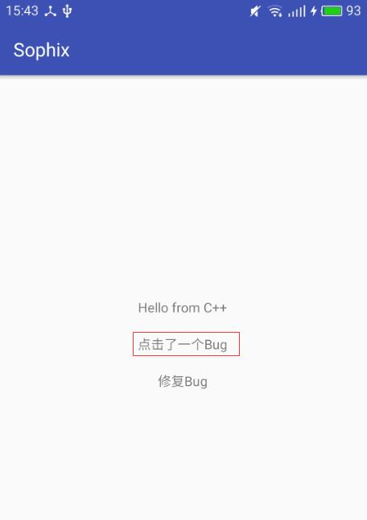

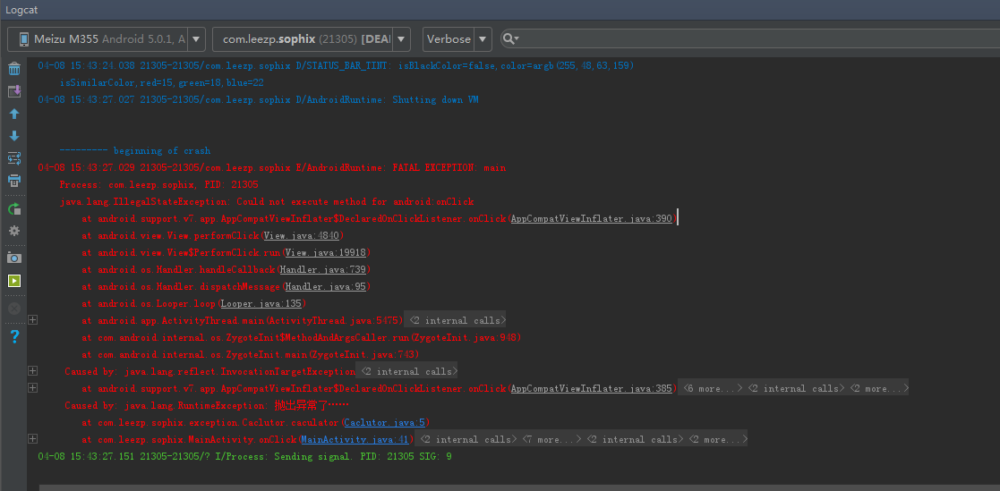

这个异常就是我们在exception/Caclutor中抛出的异常

然后我们将修改的repair/Caclutor.java打包成dex文件，放到手机的根目录下

打dex包方式：

在AndroidStudio的build文件夹中找到repair/Caclutor.class文件，用class来打包成dex文件

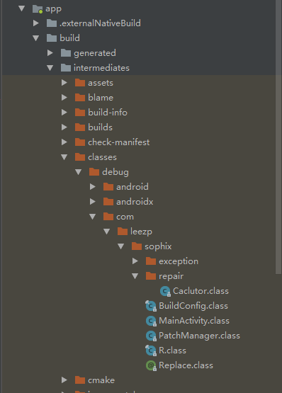

然后将repair/Caclutor.class提取出来放到新建的dex文件夹下（删除其他的class文件以及包）

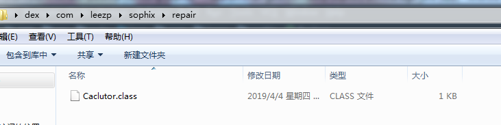

然后将dex这个文件夹放到sdk/build-tools/xx.x.x中（x代表你随便选一个）

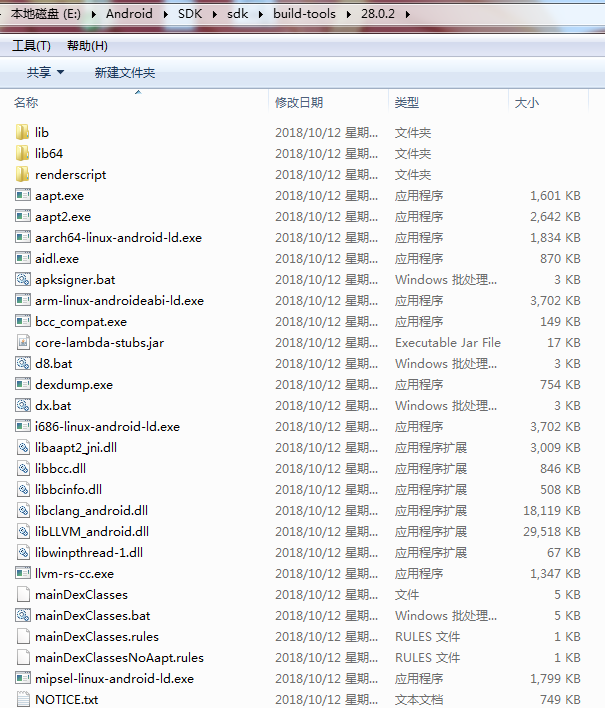

然后在此打开cmd命令窗口，输入

```
dx --dex --output 要输出的文件的文件路径 要打包的文件夹的路径
```

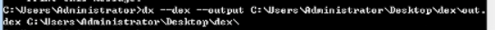

你再打开dex文件夹，你会发现多了个out.dex文件，这就是我们需要的补丁包

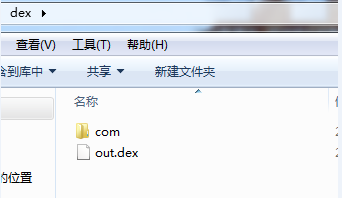

将这个out.dex文件放到手机的根目录下

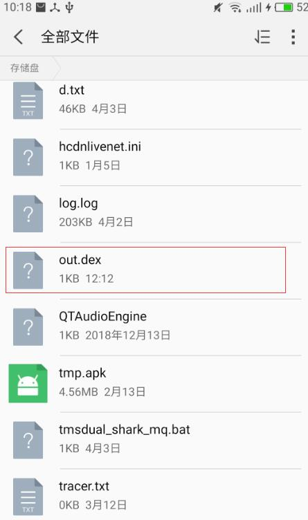

先点击"修复Bug"，我们看关于修复Bug的两个日志也在Log中输出了

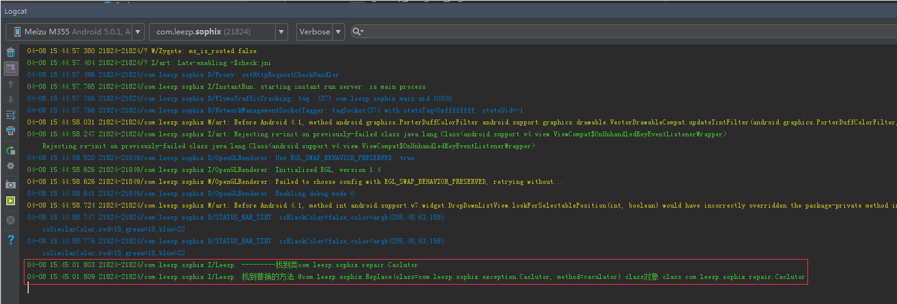

再点击“点击了一个Bug”

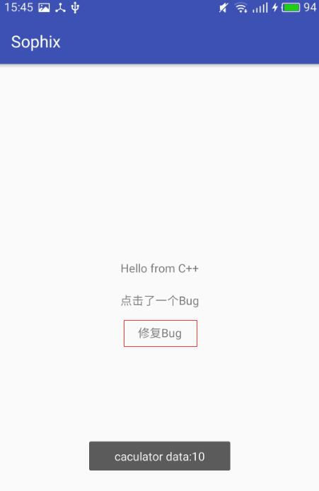

弹出了我们修改之后的代码了……厉害啊！完成了

需要打包成dex的文件我也复制到当前文件夹下的dex文件中去了，想省去打包dex步骤的可直接使用其中的out.dex文件

### 4、资料 ###

1.<a href="https://github.com/alibaba/AndFix/blob/master/jni/art/art_method_replace_5_0.cpp">AndFix关于Art&Android 5.0的方法替换代码（源码）</a>

> 你在“……替换代码（源码）”返回上一层，，你会发现里面还有Android 4.4/5.0/5.1/6.0/7.0的方法替换代码

2.<a href="https://blog.csdn.net/qq_22393017/article/details/82807505">阿里 Andfix 介绍及原理解析</a>

3.<a href="https://cloud.tencent.com/developer/article/1086722">几种主流热修复方案分析</a>

4.<a href="https://www.jianshu.com/p/0a31d145cad2">阿里最新热修复Sophix与QQ超级补丁和Tinker的实现与总结</a>

5.<a href="https://www.jianshu.com/p/12462c70050d">分享自己在项目中如何更好的使用阿里SopHix进行热修复</a>
