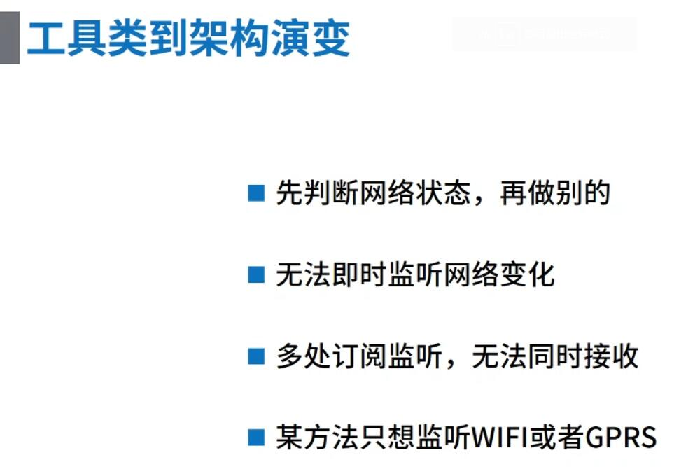
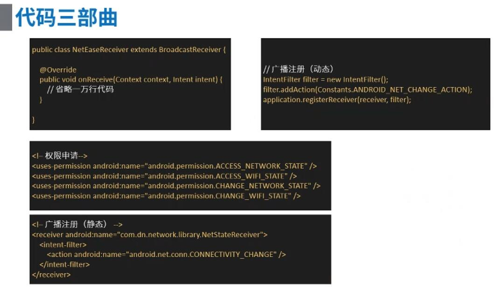
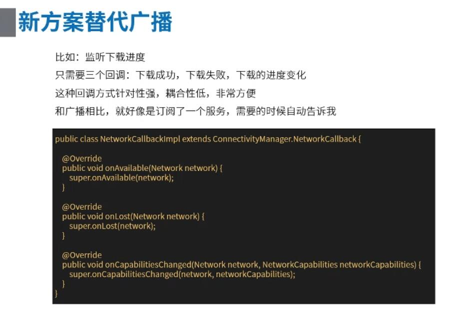
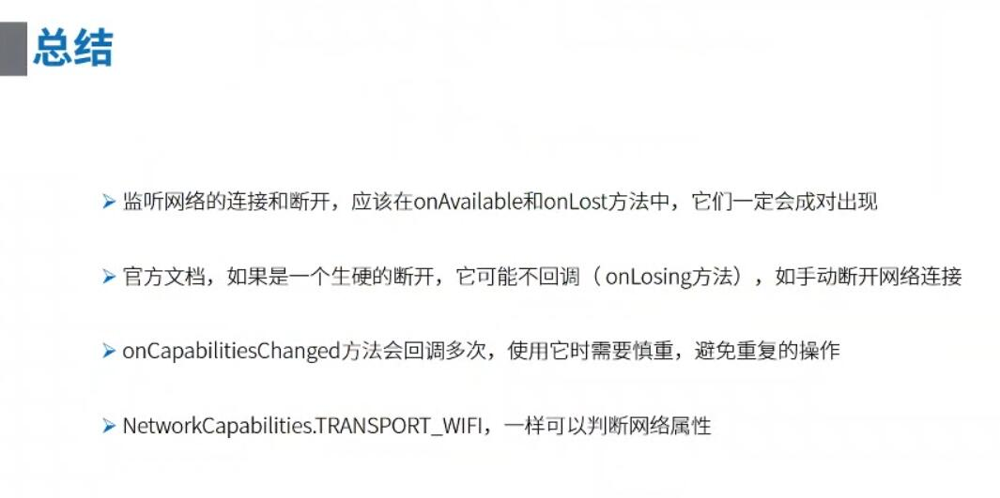
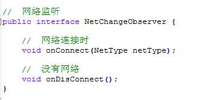
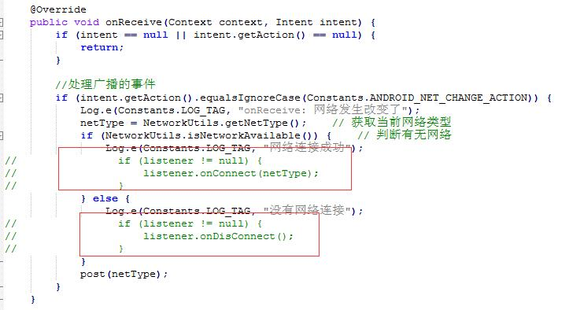
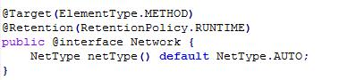
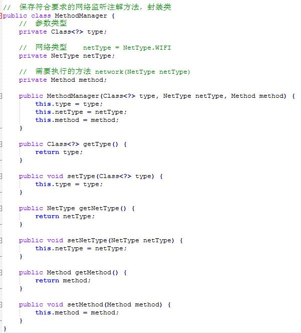
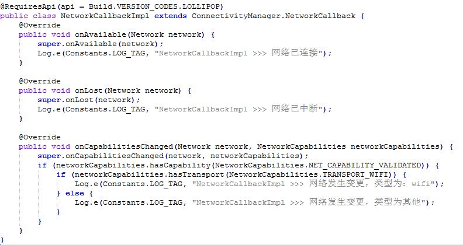
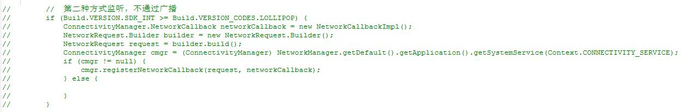

## 即时网络监听架构 ##

### 1、需求 ###

> &emsp;&emsp;当网络发生变化时，如网络断开、切换成wifi、切换成手机流量等，我们的应用需提示用户当前网络状态发生变化，并将对应的网络变化信息弹出到界面

### 2、原理 ###

> 为什么网络监听要编写成架构，不直接写个工具类就行了吗？

**工具类的缺点有如下：**

&emsp;

> 通过 Android 官网可知，网络发生变化时，会发送广播，我们可以通过注册广播的方式来监听网络变化，在广播中反馈给界面，让界面做出对应的提示

> 网络发生变化，系统发送广播的行为是：android.net.conn.CONNECTIVITY_ACTION，注册广播只需监听这个行为就可以监听网络变化了。

**广播注册：**

&emsp;

> 然而在 Android 7.0，Google 删除了三项隐式广播（也就是你注册了，依旧收不到广播信号）他们分别是

```
1. CONNECTIVITY_ACTION	//网络变化广播
2. ACTION_NEW_PICTURE	//拍照广播
3. ACTION_NEW_VIDEO		//录视频广播
```

> 其中 Google 对网络变化广播稍微友好一点，你动态注册收得到广播信号，但是静态注册你就收不到广播信号，给你一定的转换框架的时间吧（毕竟网络变化广播很多应用都用到过，所以给点缓冲时间）……

**新方案代替广播**

&emsp;

**新方案的总结**

&emsp;

### 3、资料 ###

> only one

<a href="https://blog.csdn.net/u012810020/article/details/52585287">Android 7.0 新特性---删除三项广播</a>

### 4、样例 ###

> 本样例就是当前文件目录下的 NetworkArchitecture 工程，NetworkArchitecture 中拥有两个 Module，分别是 app 与 library。
> 
> app —— 主工程代码，其中调用网络架构的接口
> library —— 网络架构工程代码，其中就是网络架构的原理代码
> 
> 在其中有三个关于网络监听架构的方案
> &emsp;1. 注册广播使用接口反馈给界面
> &emsp;2. 注册广播使用注解方式反馈给界面
> &emsp;3. 即新方案替代广播反馈给界面

> 这里主要讲思路
> 
> 第一种方案比较简单，思路主要是先定义一个接口，例如本用例中的 NetChangObserver 接口，然后界面实现 NetChangObserver 接口，并将接口传递到广播中，广播监听到网络有变，就调用接口传递给界面。

**NetChangObserver 接口**（listener/NetChangeObserver.java）

&emsp;

**广播监听到网络有变，就调用接口传递给界面**(NetStateReceiver.java)

&emsp;

> 第二种方案，思路是先定义一个注解，例如本样例中的 annotation 中的 Network，然后界面监听网络有变的方法需要用该注解标识，定义一个管理类，管理类中需存储该注解标明的方法，然后广播监听到网络有变，就从管理类中调用存储的方法（使用Java反射的方式），然后就将网络有变的信息通知到了界面。

**定义的Network注解**（annotation/Network.java）

&emsp;

**形容方法的类（因为监听网络有变的方法需存储起来）**(bean/MethodManager.java)

&emsp;

**NetStateReceiver.java 中就是这些方法的存储、监听到网络变化的调用**

```
public class NetStateReceiver extends BroadcastReceiver {

    private NetType netType;    // 网络类型
    //    private NetChangeObserver listener;     // 网络监听
    private Map<Object, List<MethodManager>> networkList;

    public NetStateReceiver() {
        //  初始化网络
        netType = NetType.NONE;
        networkList = new HashMap<>();
    }

//    public void setListener(NetChangeObserver listener) {
//        this.listener = listener;
//    }

    @Override
    public void onReceive(Context context, Intent intent) {
        if (intent == null || intent.getAction() == null) {
            return;
        }

        //处理广播的事件
        if (intent.getAction().equalsIgnoreCase(Constants.ANDROID_NET_CHANGE_ACTION)) {
            Log.e(Constants.LOG_TAG, "onReceive: 网络发生改变了");
            netType = NetworkUtils.getNetType();    // 获取当前网络类型
            if (NetworkUtils.isNetworkAvailable()) {    // 判断有无网络
                Log.e(Constants.LOG_TAG, "网络连接成功");
//                if (listener != null) {
//                    listener.onConnect(netType);
//                }
            } else {
                Log.e(Constants.LOG_TAG, "没有网络连接");
//                if (listener != null) {
//                    listener.onDisConnect();
//                }
            }
            post(netType);
        }
    }

    // 消息分发到所有的Activity
    private void post(NetType netType) {
        //  获取所有的Activity
        Set<Object> set = networkList.keySet();
        // 循环所有的Activity
        for (Object getter : set) {
            List<MethodManager> methodList = networkList.get(getter);
            if (methodList != null) {
                // 循环每个方法，发送网络变更消息
                for (MethodManager method : methodList) {
                    if (method.getType().isAssignableFrom(netType.getClass())) {
                        switch (method.getNetType()) {
                            case AUTO:
                                invoke(method, getter, netType);
                                break;
                            case WIFI:
                                if (netType == NetType.WIFI || netType == NetType.NONE) {
                                    invoke(method, getter, netType);
                                }
                                break;
                            case CMWAP:
                                if (netType == NetType.CMWAP || netType == NetType.NONE) {
                                    invoke(method, getter, netType);
                                }
                                break;
                            case CMNET:
                                if (netType == NetType.CMNET || netType == NetType.NONE) {
                                    invoke(method, getter, netType);
                                }
                                break;
                        }
                    }
                }
            }
        }
    }

    private void invoke(MethodManager method, Object getter, NetType netType) {
        Method execute = method.getMethod();
        try {
            execute.invoke(getter, netType);
        } catch (Exception e) {
            e.printStackTrace();
        }
    }

    //  注册
    public void registerObserver(Object register) {
        // 将MainActivity中所有网络注解的监听方法加入集合
        List<MethodManager> methodList = networkList.get(register);
        if (methodList == null) {
            //  开始添加
            methodList = findAnnotationMethod(register);
            networkList.put(register, methodList);
        }
    }

    private List<MethodManager> findAnnotationMethod(Object register) {
        List<MethodManager> methodList = new ArrayList<>();

        Class<?> clazz = register.getClass();
        //  获取register中的所有方法
        Method[] methods = clazz.getMethods();
        for (Method method : methods) {
            // 获取方法的注解
            Network network = method.getAnnotation(Network.class);
            if (network == null) {
                continue;
            }
            // 注解方法的校验
            Type returnType = method.getGenericReturnType();
            if (!"void".equalsIgnoreCase(returnType.toString())) {
                Log.e(Constants.LOG_TAG, method.getName() + "方法返回不是void");
                // 抛异常
                throw new RuntimeException(register.getClass().getSimpleName() + "中的" + method.getName() + "方法返回不是void");
            }
            Class<?>[] parameterTypes = method.getParameterTypes();
            if (parameterTypes.length != 1) {
                throw new RuntimeException(register.getClass().getSimpleName() + "中的" + method.getName() + "方法有且只有一个参数");
            }
            //  过滤掉不需要的方法，找到了开始添加到集合
            MethodManager manager = new MethodManager(parameterTypes[0], network.netType(), method);
            methodList.add(manager);
        }
        return methodList;
    }

    public void unRegisterObserver(Object register) {
        if (!networkList.isEmpty()) {
            networkList.remove(register);
        }
        Log.e(Constants.LOG_TAG, register.getClass().getName() + "注销成功");
    }

    //  移除所有
    public void unRegisterAllObserver() {
        if (!networkList.isEmpty()) {
            networkList.clear();
        }
        // 注销广播
        NetworkManager.getDefault().getApplication().unregisterReceiver(this);
        networkList = null;
        Log.e(Constants.LOG_TAG, "注销所有监听成功");
    }
}

```


> 第三种方案，重写 ConnectivityManager.NetworkCallback 类，然后使用 ConnectivityManager 将重写的实例对象传递进入，如下所示：

**重写 ConnectivityManager.NetworkCallback**（core/NetworkCallbackImpl.java）

&emsp;

**使用 ConnectivityManager 将重写的实例对象传递进入**（NetworkManager.java）
&emsp;

OK，这就是整个监听架构……