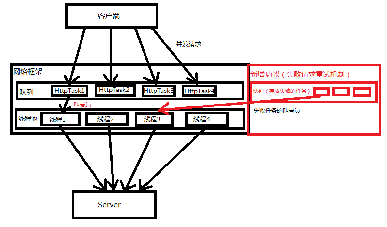
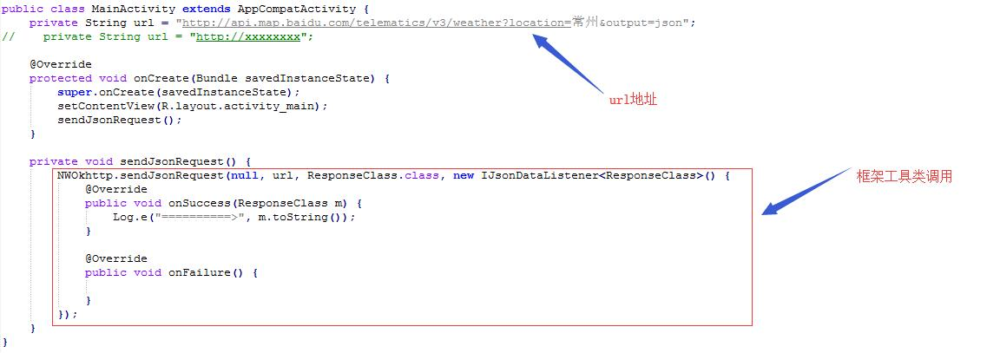
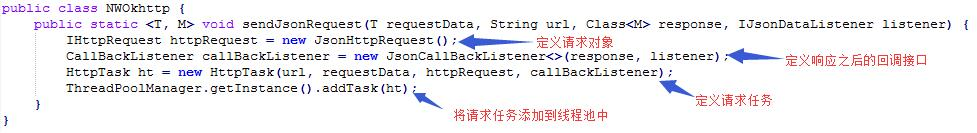
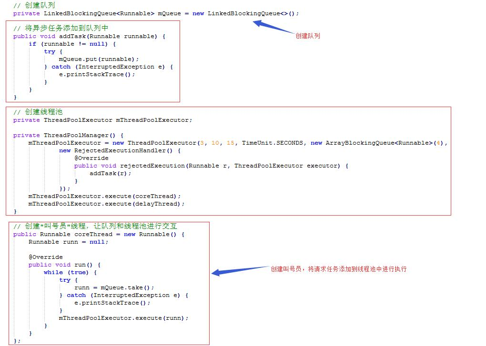
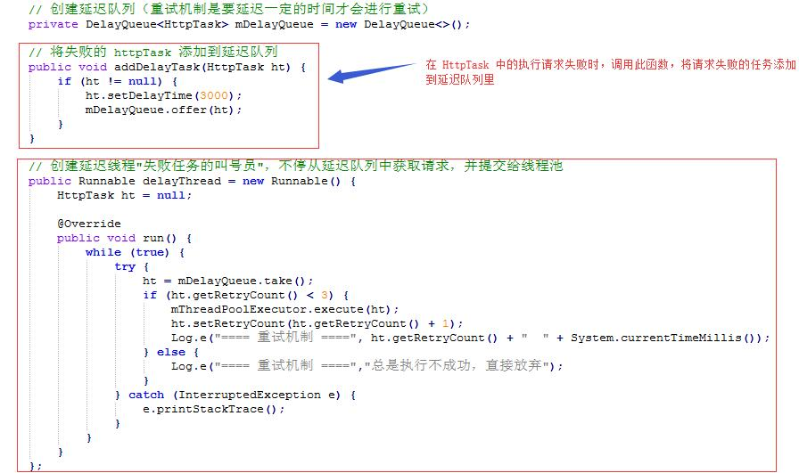
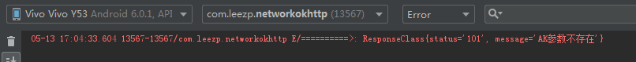
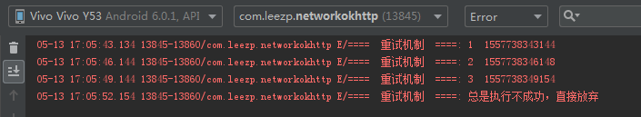

## 网络访问框架封装 ##

### 1、需求 ###

> &emsp;&emsp;当你的应用会使用到网络时，就需要用到网络访问，所以这是一个非常常用的东西，通常有以下几种方式来进行网络访问：
> 
> 1. Android 原生自带的 HttpURLConnection
> 
> 2. 第三方——OkHttp、Volley、Retrofit、xUtils框架，Google官方建议使用OkHttp
> 
> 框架的好处：它处理数据请求的各种问题并对请求以及相应的数据进行了封装等，例如：
> 
> 1. 数据缓存，将请求的数据缓存到内存中，第二次请求就不需要从网上重新下载
> 
> 2. 数据请求失败，重试机制，当我们从一个有网的状态突然进入无网的状态，数据请求就需要重试，而不能直接因为下载不了文件就直接否定，不再请求
> ……等等

### 2、原理 ###

> 本网络访问封装讲解主要在两个方面，分别是

> 从这两个方面，总结出如下框架的结构图

> 从图中可以看到，框架中有两个队列和一个线程池，队列分别用于存储客户端的请求任务和请求失败重试的任务，线程池直接运行传递进来的任务
> 
> 因此，网络框架管理类的组成由以下几部分组成：

> 其中**队列**就是存储客户端的请求任务的队列，**“核心”线程**就是循环检测队列中是否有任务，有则将其添加到线程池中执行，**延迟队列**就是存放失败的请求任务，**“延迟”线程**就是循环检测延迟队列中是否有任务，有则将其添加到线程池中执行

> 其中重试机制需要满足以下内容

> 从中我们可以提取出如下信息：
> 
> 1. 重试机制有次数限制，在用例中使用的是3次
> 
> 2. 重试机制有一定的延迟时间限制，在用例中使用的是3秒
> 
> 好了，到这就原理就讲的差不多了，总结出整个框架应该由以下部分组成

### 3、资料 ###

> 无

### 4、样例 ###

> 该样例就是本文件夹下的 NetworkOkHttp 工程，其中的 java 文件按框架的部分进行划分：
> 
> &emsp;1. 创建线程池管理类（队列，线程池）—— okhttp/ThreadPoolManager.java
> 
> &emsp;2. 封装请求 —— okhttp/listener/IHttpRequest.java、okhttp/listener/impl/JsonHttpRequest.java
> 
> &emsp;3. 封装响应（回调接口） —— okhttp/listener/CallBackListener.java、okhttp/listener/impl/JsonCallBackListener.java、okhttp/listener/IJsonDataListener.java
> 
> &emsp;4. 封装请求任务 —— okhttp/HttpTask.java
> 
> &emsp;5. 封装“使用工具” —— okhttp/utils/NWOkhttp.java

> 我们一起来看下在 MainActivity.java 中使用工具类来调用封装好的网络框架

> 从中我们可以看到我们需要传入4个参数，分别是请求参数、url地址、响应封装类、回调接口，请求参数因为直接填在了url地址里，所以这里直接传的null，响应封装类就是按照fastjson将json数据转换成对象的方式定义的一个响应类
> 
> 在工具类中，实现如下：

> 到这，步骤已经很清晰了，具体的实现就需自己将代码copy下来重新敲一遍就OK了

**并发接收多个请求**

> 并发接收多个请求的详情如下（在ThreadPoolManager.java中）：

**失败任务的重试机制**

> 失败任务的重试机制的详情如下（在ThreadPoolManager.java中）：

> 其中 setDelayoutTime 是设置当前请求任务延迟 3 秒后添加到线程池中执行
> 
> if(ht.getRetryCount() < 3)就是次数限制为 3 次，超过三次就取出之后不再添加到线程池中执行，并输出执行不成功，直接放弃

> 以下就是运行成功与运行请求失败的结果展示：

**成功结果**

**失败结果**

> It's over!