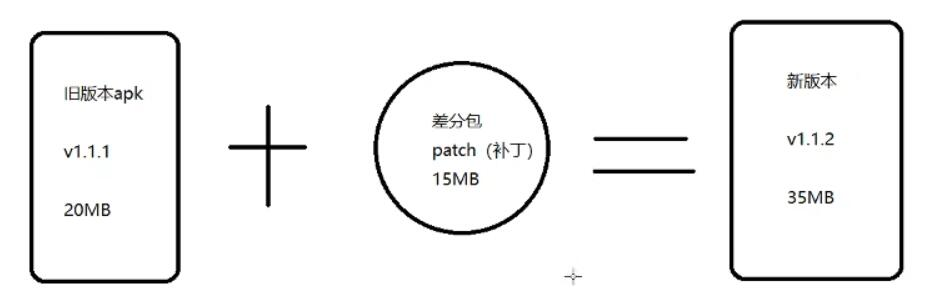
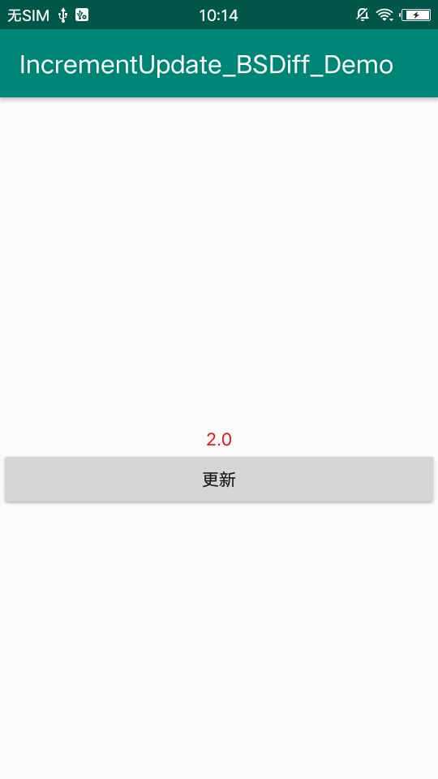

## 使用 BSDiff 实现增量更新 ##

### 1、概念 ###

> &emsp;&emsp;增量更新是什么东西？——这是我的第一感受，通过强大的互联网支持，我明白那么一丢丢……，要明白增量更新，首先我们要搞懂**热更新**、**插件化**、**增量更新**、**全量更新**的区别
> 
> 热更新：强调修改线上应用的 BUG，用技术实现不更新整个 apk 的条件下，修复该 BUG。

> 先前我写过关于热更新的日志<a href="https://github.com/Leezps/personal-summary/blob/master/2019-4-9/2019-4-9(Ali%20Sophix%20heat%20repair%20origin%20path%20-%20virtual%20machine%20layer%20method%20table%20replacement).md">2019-4-9	阿里sophix热修复起源之路 — 虚拟机层方法表替换</a>

> 插件化：通过 hook、动态代理等方式，应用启动另一个未安装 apk 的activity 以及使用未安装 apk 的资源，既强调应用新增的是功能模块，并且新增的功能模块以 apk 的方式存在，而且应用不需要重新安装更新，只需将新增功能模块的 apk 下载到本地，然后应用通过 hook、动态代理的方式去加载 apk 就可以了。

> 先前我也写过关于插件化的日志<a href="https://github.com/Leezps/personal-summary/blob/master/2019-3-28/2019-3-28(Dynamic%20loading%20of%20third-party%20applications%20-%20detailed%20pluginization%20architecture).md">2019-3-28	动态加载第三方应用——插件化架构详解</a>

> 增量更新：就是两步，分别是差分包和合并包，首先差分包将 old 包与 current 包进行对比，将公共拥有的部分提取出，然后将剩余的打包成差分包，应用下载的时候就只需下载差分包，手机上将下载下来差分包和当前应用合并，就诞生了合并包，而合并包就是 current 包，启动应用的安装界面，将合并包安装到手机上，覆盖到原来的 old 包，这样就实现了增量更新，增量更新与前两者最大区别就是应用会启动安装界面，并且增量更新一般涉及修改量比较大的时候，一次更新就好几百兆
> 
> 差分包：

&emsp;

> 合并包:

&emsp;

> 全量更新：当然就是将新版本的包全部下载下来，然后安装新包（为了提高用户体验，可以监听wifi广播，然后下载对应的安装包）

### 2、使用场景 ###

> 热更新：出现 BUG 时不影响用户体验的情况下后台默默的下载并修复 BUG

> 插件化：新增功能模块，但是版本无需升级，在不影响用户体验的情况下后台默默的下载并新增功能

> 增量更新：比较大的版本改动，例如应用的整个架构发生改变，需要重新安装该应用

> 全量更新：也使用在大版本的改动，一般不会使用全量更新，只有增量更新的差异包比安装包还大时，就会使用到全量更新

### 3、增量更新 ###

> 那如何差分能提取出差分包，并且后面使用合并能合成新版本的安装包？这就不需要我们考虑了，因为有很多框架能实现这两步，有如下框架：

&emsp;

> 而我们要讲的 BSDiff/BSPatch 是最菜的一种，但是我们先要学会最菜的，才能往上提高标准，对不对？？
> 
> BSDiff：用于差分包
> 
> BSPatch：用于合并包
> 
> BSDiff/BSPatch 的概念

&emsp;

> 官网：http://www.daemonology.net/bsdiff/
> 
> 依赖bzip2库：https://nchc.dl.sourceforge.net/project/gnuwin32/bzip2/1.0.5/bzip2-1.0.5-src.zip
> 
> 最新版本的bzip2库：https://sourceforge.net/projects/bzip2/
> 
> windows上可以执行的BSDiff/BSPatch：https://github.com/cnSchwarzer/bsdiff-win

**服务器环境**

> 首先我们先介绍Linux环境下（服务器环境下如何使用BSDiff来差分包）
> Linux环境下的主要命令：

&emsp;

> 在上传文件之后，我们需要解压 bsdiff-4.3.tar.gz，解压展示：

&emsp;

> 解压之后，make 命令展示：

&emsp;

> 从上方展示可以发现 Makefile 文件的第13行出现错误，打开文件，并编辑它
> 编辑前：

&emsp;

> 编辑后：

&emsp;

> 再次运行 make 命令

&emsp;

> 然后上传 old 包和 current 包，这里是 old.apk 和 app-2.apk，最后执行 ./bsdiff old.apk app-2.apk patch，如下所示：

&emsp;

**windows环境**

> windows 环境下按以下步骤执行 BSDiff 命令进行差分包

&emsp;

**Linux（服务器）和 windows 进行差分、合并的所需的资源，在当前文件目录下的 bsdiff 文件夹有所提供，但是有可能不再是最新版本**

> windows 环境下解压 bsdiff-v4.3-win-x64.zip，并将 old 包和 current 包放入该文件夹下

&emsp;

> 执行上方windows中需执行的完整命令

&emsp;

> 这样两种环境下都得到了自己的差分包，即patch
> 
> 然后让差分包和旧版本的应用合并生成新版本的安装包

&emsp;

> 这合成怎么合成呢？？这就需要我们到自己的应用中将 BSPatch 嵌入进去，然后通过 BSPatch 来合成新版本的安装包

### 4、合成样例 ###

> 样例就是本文件夹下的 IncrementUpdate_BSDiff_Demo 工程，这是一个 NDK 工程，使用的是 Android Studio 3.3.2，本工程只保留了要修改的文件，其他文件直接删除了，所以你需重新创建一个 NDK 工程，并用 IncrementUpdate_BSDiff_Demo 工程的文件替换掉你的 NDK 工程中的文件，这样就能运行了

> 因为需要读取应用外部存储，所以声明对应的权限以及 FileProvider

&emsp;

> res/drawable 中的图片文件是区分新版本和旧版本包的关键，因为旧版本中没有这些图片，新版本中才有这些文件，因为这是个用例，只是简单的进行模拟

> res/layout/activity_main.xml 中有两个控件，分别是 TextView 和 Button，TextView 用于展示当前应用版本号，Button 用于点击之后合并包，并安装最新版本的安装包

&emsp;

> Mainactivity.java 中的代码如下：

```
public class MainActivity extends AppCompatActivity {
    private Activity mActivity;

    // 用于在应用程序启动时，加载“本地Lib”库
    static {
        System.loadLibrary("native-lib");
    }

    @Override
    protected void onCreate(Bundle savedInstanceState) {
        super.onCreate(savedInstanceState);
        setContentView(R.layout.activity_main);
        mActivity = this;

        TextView tv = findViewById(R.id.version);
        tv.setText(BuildConfig.VERSION_NAME);

        // 运行时权限申请
        if (Build.VERSION.SDK_INT >= Build.VERSION_CODES.M) {
            String[] perms = {Manifest.permission.WRITE_EXTERNAL_STORAGE};
            if (checkSelfPermission(perms[0]) == PackageManager.PERMISSION_DENIED) {
                requestPermissions(perms, 200);
            }
        }
    }

    /**
     * 合成安装包
     *
     * @param oldApk 旧版本安装包，如1.1.1版本的路径
     * @param patch  差分包，patch 文件
     * @param output 合成之后的新文件，新版本apk的输出/保存路径
     */
    public native void bsPatch(String oldApk, String patch, String output);

    // 点击
    public void update(View view) {
        // 服务器下载patch文件(不模拟网络下载了)，反正最终要到手机里边
        new AsyncTask<Void, Void, File>() {

            // 异步任务，耗时操作在后台执行，直到完成了，才调用onPostExecute()
            @Override
            protected File doInBackground(Void... voids) {
                // 合成新版本 APK
                String oldApk = getApplicationInfo().sourceDir;
                // 模拟已经下载到了 SDCard 中
                String patch = new File(Environment.getExternalStorageDirectory(), "patch").getAbsolutePath();
                // 我想把新文件也放在 SDCard,出于测试
                String output = createNewApk().getAbsolutePath();
                bsPatch(oldApk, patch, output);
                return new File(output);
            }

            @Override
            protected void onPostExecute(File file) {
                super.onPostExecute(file);
                // 已经得到新版本 APK, 开始安装新版本
                UriParseUtils.installApk(mActivity, file);
            }
        }.execute();    //千万别忘了
    }

    // 创建合成后的新版本apk文件（占坑）
    private File createNewApk() {
        File newApk = new File(Environment.getExternalStorageDirectory(), "bsdiff.apk");
        if (!newApk.exists()) {
            try {
                // 创建了一个占位的空文件
                newApk.createNewFile();
            } catch (IOException e) {
                e.printStackTrace();
            }
        }
        return newApk;
    }
}
```

> 明白一点 NDK 的人一看都懂，其中 bsPatch 这个函数是用来做什么？？里面的实现方式，我们一起去看看

&emsp;

> 它调用了 b_main 函数，那 b_main 函数哪来的？？
> 
> 其实它是我们嵌入的 BSPatch 的入口函数，我们只需将 old 包、需要输出的新版本包、差分包的地址发送给它，它就会合并包，将合并包输出到指定位置，但是我们没有嵌入 BSPatch 啊？？怎么会调用到那个 b_main 函数呢？？
> 
> 如果你按照我先前讲的替换的方式替换掉工程文件，其实你已经嵌入了 BSPatch 了，其实 BSPatch 就是一堆 C 文件，如下所示：

&emsp;

> 这两个文件都是来自 bsdiff/Linux 所提供的资源的资源包中，不信你可以解压 Linux 资源提供的两个压缩包，然后将这些文件去找，一一比对，绝对都找得到

> 就这样，我们合并了包，并输出了新版本的包，然后我们需要安装，在 MainActivity.java 的 AsyncTask 线程中的 onPostExecute 函数里，我们会调用 UriParseUtils.installApk(mActivity, file); 来安装新包，那 UriParseUtils 中的代码如下：

```
public class UriParseUtils {
    /**
     * 创建一个文件输出路径的Uri(FileProvider)
     *
     * @param context 下上文
     * @param file    文件
     * @return 转换后的Scheme为FileProvider的Uri
     */
    private static Uri getUriForFile(Context context, File file) {
        return FileProvider.getUriForFile(context, getFileProvider(context), file);
    }

    /**
     * 获取FileProvider路径，适配6.0+
     *
     * @param context 上下文
     * @return FileProvider路径
     */
    private static String getFileProvider(Context context) {
        return context.getApplicationInfo().packageName + ".fileprovider";
    }

    /**
     * 安装APK
     */
    public static void installApk(Activity activity, File apkfile) {
        if (!apkfile.exists()) return;
        Intent intent = new Intent(Intent.ACTION_VIEW);
        intent.setFlags(Intent.FLAG_ACTIVITY_NEW_TASK);
        intent.addFlags(Intent.FLAG_GRANT_READ_URI_PERMISSION);

        if (Build.VERSION.SDK_INT >= Build.VERSION_CODES.M) {
            Uri fileUri = getUriForFile(activity, apkfile);
            intent.setDataAndType(fileUri, "application/vnd.android.package-archive");
        } else {
            intent.setDataAndType(Uri.fromFile(apkfile), "application/vnd.android.package-archive");
        }
        activity.startActivity(intent);
    }
}
```

> 其中就是安装应用的函数调用逻辑，但是这并不对所有手机都有用，因为有些手机对安装这块做了检测，所以无法实现安装，你需要不同厂商的手机做不同的处理。

> 然后分别打两个包，一个是 old 包，在 old 中的 app/build.gradle 的

```
versionCode 1
versionName "1.0"
```

> 并且 res/drawable 中没有图片，打包出 apk

> 一个是 current 包，在 current 中的 app/build.gradle 的

```
versionCode 2
versionName "2.0"
```

> 并且 res/drawable 中有图片，打包出 apk

> 这两个 apk 都有提供，在当前文件目录下的 apk 文件夹里

> 然后运行结果截图如下：

&emsp;

> 安装 old.apk 文件

&emsp;

> 点击更新

&emsp;

> 可以发现，合并包（新版本的包）bsdiff.apk 出现了，然后安装这个包（因为我是用的vivo手机，它就限制了应用启动安装）
> 
> 我们手动安装，打开应用

&emsp;

> 可以发现，我们的应用升级成功了，这就实现了增量更新

> It's over !