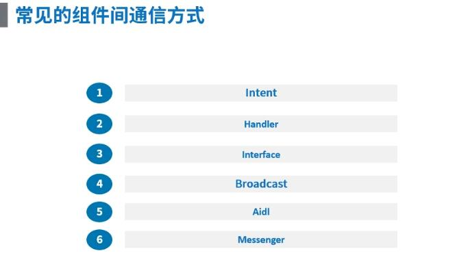
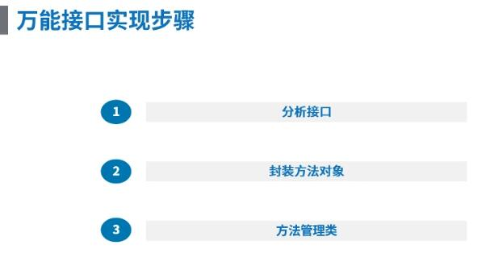

## 使用封装接口实现组件通信 ##

### 1、概念 ###

> 组件间通信的方式有以下几种方式

&emsp;

> 今天我们主要讲使用接口进行组件之间的通信
> 
> 我们经常使用接口通信的方式就是定义一个接口，在接口中定义一个方法，让 Activity 实现这个接口，并实现这个方法，将接口传递到另一个 Activity 中，然后另一个 Activity 调用这个接口的方法，这就实现了组件之间的通信，但是这样有个缺点，就是接口让两个 Activity 的耦合度变高了，因为我们删除其中一个 Activity，另一个 Activity 的代码也会发生改变
> 
> 那怎样使用接口实现组件通信并且组件之间的耦合度变低？？？
> 
> 实现的步骤如下：

&emsp;

> **1. 分析接口**
> 
> 其实接口通信最核心的就是那个方法，就是我们要在一个组件中实现接口中的这个方法，而另一个组件要调用这个方法，这样我们就清晰多了，根据 Java 中万物皆对象的准则，我们可不可以将这个方法进行封装？？？

> **2. 封装方法对象**
> 
> 方法分为4种，分别是无参数无返回值的方法、有参数无返回值的方法、无参数有返回值的方法、有参数有返回值的方法

&emsp;

> **3. 方法管理类**
> 
> 定义一个方法管理类，管理这些方法对象

> 好了，我们试着去创建这些对象…………

### 2、样例 ###

> 样例就是本文件夹下的 UniversalInterface 工程，工程是一个 Android app 工程，其中只保留了需要的修改文件，因此你需创建个 Android app 工程，然后将本工程对应的文件复制到创建的工程中，如遇重复文件，请直接替换……

> interfaces/functions 中是对方法的封装，其中 Function.java 是所有方法的公共部分，四种方法的类都需实现 Function.java，Function.java 的代码如下：

```
/**
 * 所有方法接口公共部分的封装
 */
public class Function {
    // 方法名
    public String functionName;

    public Function(String functionName) {
        this.functionName = functionName;
    }
}
```

> 无参数无返回值的方法封装代码如下（FunctionNoParamNoResult.java）:

```
/**
 * 无参数、无返回值的方法封装
 */
public abstract class FunctionNoParamNoResult extends Function {

    public FunctionNoParamNoResult(String functionName) {
        super(functionName);
    }

    public abstract void function();
}
```

> 无参数有返回值的方法封装代码如下（FunctionNoParamHasResult.java）:

```
/**
 * 无参数、有返回值的方法封装
 *
 * @param <T> 返回值
 */
public abstract class FunctionNoParamHasResult<T> extends Function {

    public FunctionNoParamHasResult(String functionName) {
        super(functionName);
    }

    public abstract T function();
}

```

> 有参数无返回值的方法封装代码如下（FunctionHasParamNoResult.java）:

```
/**
 * 有参数、无返回值的方法封装
 *
 * @param <P>   参数
 */
public abstract class FunctionHasParamNoResult<P> extends Function {

    public FunctionHasParamNoResult(String functionName) {
        super(functionName);
    }

    public abstract void function(P p);
}
```

> 有参数有返回值的方法封装代码如下

```
/**
 * 有参数、有返回值的方法封装
 *
 * @param <T>   返回值
 * @param <P>   参数
 */
public abstract class FunctionHasParamHasResult<T,P> extends Function {

    public FunctionHasParamHasResult(String functionName) {
        super(functionName);
    }

    public abstract T function(P p);
}

```

> 然后就是封装方法管理类（FunctionManager.java）

```
/**
 * 所有方法的管理类，外部只需和此类交互，就可实现方法的执行
 */
public class FunctionManager {
    private static FunctionManager instance = new FunctionManager();
    private Map<String, FunctionNoParamNoResult> mNoParamNoResultMap;
    private Map<String, FunctionNoParamHasResult> mNoParamHasResultMap;
    private Map<String, FunctionHasParamNoResult> mHasParamNoResultMap;
    private Map<String, FunctionHasParamHasResult> mHasParamHasResultMap;

    public FunctionManager() {
        mNoParamNoResultMap = new HashMap<>();
        mNoParamHasResultMap = new HashMap<>();
        mHasParamNoResultMap = new HashMap<>();
        mHasParamHasResultMap = new HashMap<>();
    }

    public static FunctionManager getInstance() {
        return instance;
    }

    // 将需要储存的方法进行添加
    // 添加没有返回值 也没有参数的方法
    public void addFunction(FunctionNoParamNoResult function) {
        mNoParamNoResultMap.put(function.functionName, function);
    }

    // 执行没有返回值也没有参数的方法
    public void invokeFunction(String functionName) {
        if (TextUtils.isEmpty(functionName)) {
            return;
        }
        if (mNoParamNoResultMap != null) {
            FunctionNoParamNoResult f = mNoParamNoResultMap.get(functionName);
            if (f != null) {
                f.function();
            } else {
                Log.e("FunctionManager", "没有找到该方法");
            }
        }
    }

    // 添加有返回值，没有参数的方法
    public void addFunction(FunctionNoParamHasResult function) {
        mNoParamHasResultMap.put(function.functionName, function);
    }

    // 执行有返回值，没有参数的方法
    public <T> T invokeFunction(String functionName, Class<T> t) {
        if (TextUtils.isEmpty(functionName)) {
            return null;
        }
        if (mNoParamHasResultMap != null) {
            FunctionNoParamHasResult f = mNoParamHasResultMap.get(functionName);
            if (f != null) {
                if (t != null) {
                    return t.cast(f.function());
                }
            } else {
                Log.e("FunctionManager", "没有找到该方法");
            }
        }
        return null;
    }

    // 添加没有返回值，有参数的方法
    public void addFunction(FunctionHasParamNoResult function) {
        mHasParamNoResultMap.put(function.functionName, function);
    }

    // 执行没有返回值，有参数的方法
    public <P> void invokeFunction(String functionName, P p) {
        if (TextUtils.isEmpty(functionName)) {
            return;
        }
        if (mHasParamNoResultMap != null) {
            FunctionHasParamNoResult f = mHasParamNoResultMap.get(functionName);
            if (f != null) {
                f.function(p);
            } else {
                Log.e("FunctionManager", "没有找到该方法");
            }
        }
    }

    // 添加有返回值，有参数的方法
    public void addFunction(FunctionHasParamHasResult function) {
        mHasParamHasResultMap.put(function.functionName, function);
    }

    // 执行有返回值，有参数的方法
    public <T, P> T invokeFunction(String functionName, P p, Class<T> t) {
        if (TextUtils.isEmpty(functionName)) {
            return null;
        }
        if (mHasParamHasResultMap != null) {
            FunctionHasParamHasResult f = mHasParamHasResultMap.get(functionName);
            if (f != null) {
                if (t != null) {
                    return t.cast(f.function(p));
                }
            } else {
                Log.e("FunctionManager", "没有找到该方法");
            }
        }
        return null;
    }

    /**
     * 为什么要使用此方法，因为其实添加进来的方法对于组件（Activity）来说，
     * 这些方法都是匿名内部类，他们都持有组件（Activity）的引用，
     * 所以组件（Activity）释放的时候，我们需在这将方法释放掉，组件（Activity）的内存才能释放，反之，则会造成内存泄漏
     *
     * @param functionName  方法名
     */
    public void removeFunction(String functionName) {
        if (mNoParamNoResultMap.containsKey(functionName)) {
            mNoParamNoResultMap.remove(functionName);
        } else if (mNoParamHasResultMap.containsKey(functionName)) {
            mNoParamHasResultMap.remove(functionName);
        } else if (mHasParamNoResultMap.containsKey(functionName)) {
            mHasParamNoResultMap.remove(functionName);
        } else if (mHasParamHasResultMap.containsKey(functionName)) {
            mHasParamHasResultMap.remove(functionName);
        } else {
            Log.e("FunctionManager", "不存在该方法");
        }
    }

    /**
     * 双重保险，释放掉内存,此方法应该在 Application 的 onStop 中调用
     */
    public void dispose() {
        if (mNoParamNoResultMap != null) {
            mNoParamNoResultMap.clear();
            mNoParamNoResultMap = null;
        }
        if (mNoParamHasResultMap != null) {
            mNoParamHasResultMap.clear();
            mNoParamHasResultMap = null;
        }
        if (mHasParamNoResultMap != null) {
            mHasParamNoResultMap.clear();
            mHasParamNoResultMap = null;
        }
        if (mHasParamHasResultMap != null) {
            mHasParamHasResultMap.clear();
            mHasParamHasResultMap = null;
        }
    }
}
```

> 外部如何实现方法传递进来，并且外部如何调用？？？
> 
> 在 MainActivity 中将方法传递进行保存

```
public class MainActivity extends AppCompatActivity {

    @Override
    protected void onCreate(Bundle savedInstanceState) {
        super.onCreate(savedInstanceState);
        setContentView(R.layout.activity_main);
        FunctionManager.getInstance().addFunction(new FunctionNoParamNoResult("MainActivity_NoParamNoResult") {
            @Override
            public void function() {
                Log.e("MainActivity", "Hello from second Activity");
                // 不能在此处执行耗时操作
            }
        });

        FunctionManager.getInstance().addFunction(new FunctionNoParamHasResult<UserBean>("MainActivity_NoParamHasResult") {
            @Override
            public UserBean function() {
                return new UserBean("王老二", "123456");
            }
        });

        FunctionManager.getInstance().addFunction(new FunctionHasParamNoResult<UserBean>("MainActivity_HasParamNoResult") {
            @Override
            public void function(UserBean userBean) {
                Log.e("MainActivity", "Hello from Second Activity—" + userBean.getmUserName() + "  " + userBean.getmPassWord());
            }
        });

        FunctionManager.getInstance().addFunction(new FunctionHasParamHasResult<UserBean, UserBean>("MainActivity_HasParamHasResult") {
            @Override
            public UserBean function(UserBean userBean) {
                Log.e("MainActivity", "Hello from Second Activity—" + userBean.getmUserName() + "  " + userBean.getmPassWord());
                return new UserBean("秋香", "456321");
            }
        });

        Intent intent = new Intent();
        intent.setClass(this, SecondActivity.class);
        startActivity(intent);
    }

    @Override
    protected void onStop() {
        super.onStop();
        FunctionManager.getInstance().removeFunction("MainActivity_NoParamNoResult");
        FunctionManager.getInstance().removeFunction("MainActivity_NoParamHasResult");
        FunctionManager.getInstance().removeFunction("MainActivity_HasParamNoResult");
        FunctionManager.getInstance().removeFunction("MainActivity_HasParamHasResult");

        //理论上 dispose 这个函数应该在 Application 中的 onStop 的函数中调用
        FunctionManager.getInstance().dispose();
    }
}
```

> 在 SecondActivity.java 中调用方法并执行

```
public class SecondActivity extends AppCompatActivity {

    @Override
    protected void onCreate(Bundle savedInstanceState) {
        super.onCreate(savedInstanceState);
        setContentView(R.layout.activity_second);

        findViewById(R.id.send_message).setOnClickListener(new View.OnClickListener() {
            @Override
            public void onClick(View v) {
//                FunctionManager.getInstance().invokeFunction("MainActivity_NoParamNoResult");

//                UserBean user = FunctionManager.getInstance().invokeFunction("MainActivity_NoParamHasResult", UserBean.class);
//                Log.e("SecondActivity","user object from MainActivity—"+user.getmUserName()+"  "+user.getmPassWord());

//                FunctionManager.getInstance().invokeFunction("MainActivity_HasParamNoResult",new UserBean("柳下惠","789123"));

                UserBean userBean = FunctionManager.getInstance().invokeFunction("MainActivity_HasParamHasResult", new UserBean("唐伯虎", "123654"), UserBean.class);
                Log.e("SecondActivity","user object from MainActivity—"+userBean.getmUserName()+"  "+userBean.getmPassWord());
            }
        });
    }
}
```

> It's over!