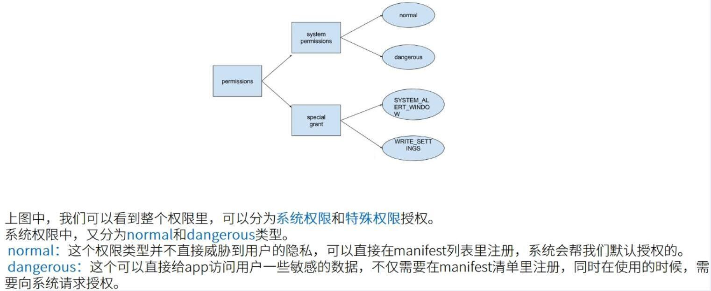
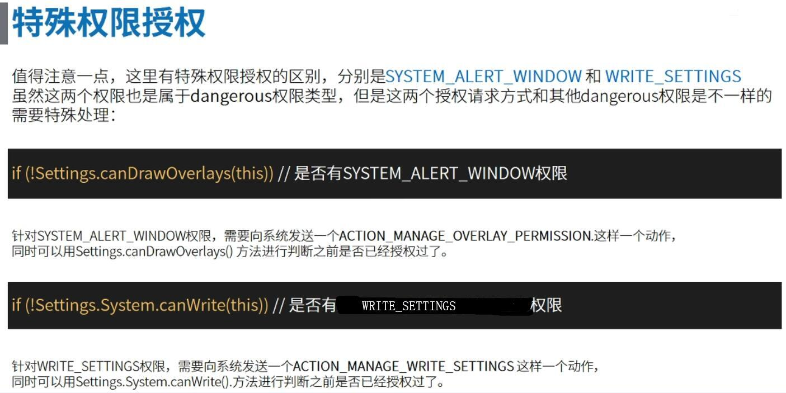
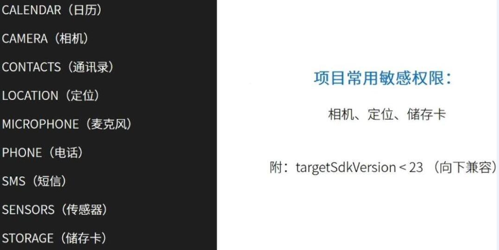
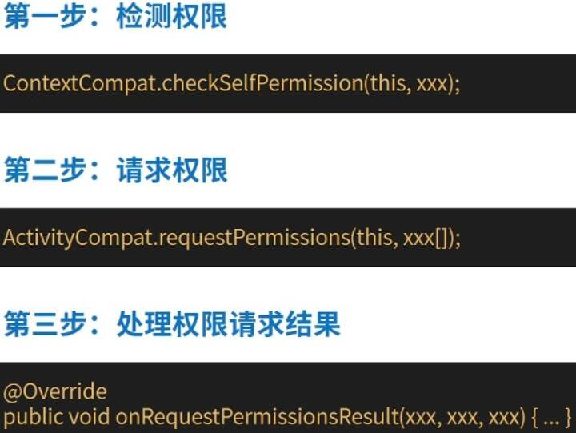
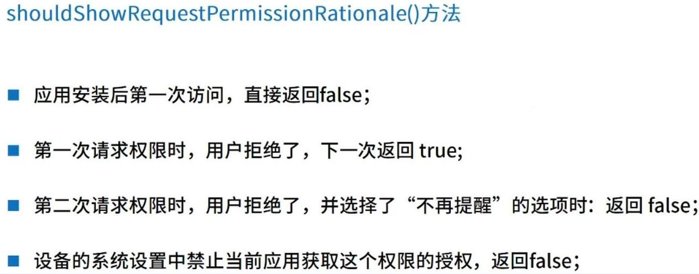
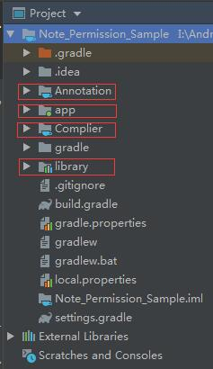
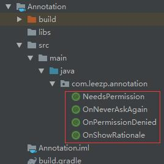
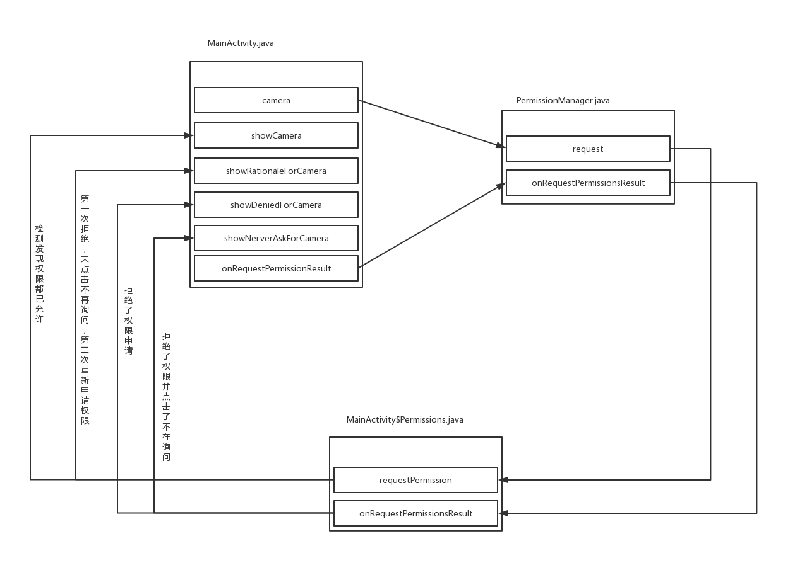

## 完美封装动态申请权限+APT技术实现一行代码搞定权限申请 ##

### 1、需求 ###

> Android 6.0 之后，Google 加入了动态权限申请，为的就是提高用户对自己手机的掌握权，因此动态权限申请这块就成为了开发者不可绕过的一个“坎”。
> 
> 为什么说是坎？因为权限的动态申请直接影响用户是否能继续下一步操作，如果你在第一次打开应用时，一次申请完所有权限，对用户来说不是很友好，如果用户第一次执行操作拒绝了权限申请，第二次你直接按照用户上次的操作直接拒绝权限申请，根本不弹什么权限申请框或说明对话框之类的，用户无法执行下一步操作，那用户的体验感估计可以用——“十万只那个马从心里奔过”——来形容，作为开发者的我们，也作为用户的我们，我们应该完善好动态权限申请这一块，提高用户的体验……

### 2、概念 ###

> 先前，我简单讲了一篇关于权限总结的日志，里面涉及权限的分类以及权限动态申请涉及的方法，大家可以简单的“阅”过

&emsp;<a href="https://github.com/Leezps/personal-summary/blob/master/2019-3-25/2019-3-25(Request%20permission%20process%20of%20Android).md">Android的请求权限过程</a>

> 权限分为三种，分别是：普通权限、危险权限、特殊权限，如下图所示：

&emsp;

&emsp;

> 危险权限主要有以下类型：

&emsp;

> 权限动态申请的步骤：

&emsp;

> 其中还有个特殊的权限动态申请API，将此接口接入，能更加完善我们的权限申请模块，此方法就是：

&emsp;

> 最后就是我们需要用到的 APT 技术，APT(Annotation Processing Tool)即**注解处理器**，JVM会在编译期就运行APT去扫描处理代码中的注解然后输出java文件（后面有例子，例子来讲）

&emsp;

### 3、资料 ###

1.<a href="https://juejin.im/post/5bcdb901f265da0ac8496fed">Android APT快速教程</a>

2.<a href="https://www.jianshu.com/p/9616f4a462bd">Android模块开发之APT技术</a>

3.<a href="https://www.jianshu.com/p/deeb39ccdc53">Android模块开发之SPI(APT中的API技术)</a>

### 4、样例 ###

> 样例就是本文件夹下的 Note_Permission_Sample 工程，其中只保留了新建和需修改的文件，其他一律不变的文件直接删除了，因此你需要新建个工程，将当前文件复制到新的工程中

> 第一步，肯定是创建工程，我这创建的是 Note_Permission_Sample 工程，然后在工程中创建 3 个Module，分别是两个 Java Library 和一个 Android Library，Java Library 的工程名字分别叫 Annotation 和 Complier，Android Library 的工程名字叫 Library，工程结构如下：

&emsp;

> 第二步，总结权限的情况，分别有：权限允许、权限拒绝、点击不再询问，未点击不再询问的权限说明。
> 
> 总共四种情况，因此我们需定义四种注解，在 Annotation 工程中创建四个注解，分别是NeedsPermission（权限允许）、OnNeverAskAgain（点击不再询问）、OnPermissionDenied（权限拒绝）、OnShowRationale（未点击不再询问的权限说明），如下所示：

&emsp;

> 展示其中一个注解的代码，因为其他的注解都一样的，只是注解名不一样而已。

```
import java.lang.annotation.ElementType;
import java.lang.annotation.Retention;
import java.lang.annotation.RetentionPolicy;
import java.lang.annotation.Target;

@Target(ElementType.METHOD) // 该注解作用在方法之上
@Retention(RetentionPolicy.CLASS)   // 在源码和class文件中都存在，编译期注解方式
public @interface NeedsPermission {
}
```

> 第三步，实现 APT Complier，在 Complier 文件中创建 PermissionProcessor.java 文件，然后在工程中的 build.gralde 文件引入 Annotation 的依赖，如下所示：

```
dependencies {
    // 引入注解
    implementation project(path: ':Annotation')
}
```

> PermissionProcessor.java 文件中的代码如下：

```
public class PermissionProcessor extends AbstractProcessor {

    private Messager messager;  // 用来报告错误，警告，提示
    private Elements elementsUtils; // 包含了很多的操作Elements的工具方法
    private Filer filer;    // 用来创建新的源文件，Class文件(造币技术)
    private Types typeUtils;    // 包含用于操作TypeMirror工具方法

    //获取支持注解的类型
    @Override
    public Set<String> getSupportedAnnotationTypes() {
        Set<String> types = new LinkedHashSet<>();
        types.add(NeedsPermission.class.getCanonicalName());
        types.add(OnNeverAskAgain.class.getCanonicalName());
        types.add(OnPermissionDenied.class.getCanonicalName());
        types.add(OnShowRationale.class.getCanonicalName());
        return types;
    }

    @Override
    public SourceVersion getSupportedSourceVersion() {
        // 返回注解支持的最新源版本，JDK
        // 也可使用@SupportedSourceVersion(SourceVersion.RELEASE_8)此种方式表达
        return SourceVersion.latestSupported();
    }

    // 初始化工作
    @Override
    public synchronized void init(ProcessingEnvironment processingEnvironment) {
        super.init(processingEnvironment);
        typeUtils = processingEnvironment.getTypeUtils();
        elementsUtils = processingEnvironment.getElementUtils();
        filer = processingEnvironment.getFiler();
        messager = processingEnvironment.getMessager();
    }

    // 注解处理器的核心方法，处理具体的注解时限，生成 java 代码
    @Override
    public boolean process(Set<? extends TypeElement> set, RoundEnvironment roundEnvironment) {
        // 获取MainActivity中所有带NeedsPermission注解的方法
        Set<? extends Element> needsPermissionSet = roundEnvironment.getElementsAnnotatedWith(NeedsPermission.class);
        // 保存起来，键值对：Key com.xxx.MainActivity value所有带NeedsPermission注解的方法
        Map<String, List<ExecutableElement>> needsPermissionMap = new HashMap<>();
        // 遍历所有的NeedsPermission注解的方法
        for (Element element : needsPermissionSet) {
            // 转换成方法元素（结构体元素）
            ExecutableElement executableElement = (ExecutableElement) element;
            // 通过方法元素获取它所属的MainActivity类名，如：com.leezp.note_permission_sample.MainActivity
            String activityName = getActivityName(executableElement);
            // 从缓存集合中获取MainActivity所有带NeedsPermission注解的方法集合
            List<ExecutableElement> list = needsPermissionMap.get(activityName);
            if (list == null) {
                list = new ArrayList<>();
                // 先加入map集合，引用变量list可以动态改变值
                needsPermissionMap.put(activityName, list);
            }
            // 将MainActivity所有带NeedsPermission注解的方法加入到list集合
            list.add(executableElement);
        }

        // 获取MainActivity中所有带OnNeverAskAgain注解的方法
        Set<? extends Element> onNeverAskAgainSet = roundEnvironment.getElementsAnnotatedWith(OnNeverAskAgain.class);
        Map<String, List<ExecutableElement>> onNeverAskAgainMap = new HashMap<>();
        for (Element element : onNeverAskAgainSet) {
            ExecutableElement executableElement = (ExecutableElement) element;
            String activityName = getActivityName(executableElement);
            List<ExecutableElement> list = onNeverAskAgainMap.get(activityName);
            if (list == null) {
                list = new ArrayList<>();
                onNeverAskAgainMap.put(activityName, list);
            }
            list.add(executableElement);
        }

        // 获取MainActivity中所有带OnPermissionDenied注解的方法
        Set<? extends Element> onPermissionDeniedSet = roundEnvironment.getElementsAnnotatedWith(OnPermissionDenied.class);
        Map<String, List<ExecutableElement>> onPermissionDeniedMap = new HashMap<>();
        for (Element element : onPermissionDeniedSet) {
            ExecutableElement executableElement = (ExecutableElement) element;
            String activityName = getActivityName(executableElement);
            List<ExecutableElement> list = onPermissionDeniedMap.get(activityName);
            if (list == null) {
                list = new ArrayList<>();
                onPermissionDeniedMap.put(activityName, list);
            }
            list.add(executableElement);
        }

        // 获取MainActivity中所有带OnShowRationale注解的方法
        Set<? extends Element> onShowRationaleSet = roundEnvironment.getElementsAnnotatedWith(OnShowRationale.class);
        Map<String, List<ExecutableElement>> onShowRationaleMap = new HashMap<>();
        for (Element element : onShowRationaleSet) {
            ExecutableElement executableElement = (ExecutableElement) element;
            String activityName = getActivityName(executableElement);
            List<ExecutableElement> list = onShowRationaleMap.get(activityName);
            if (list == null) {
                list = new ArrayList<>();
                onShowRationaleMap.put(activityName, list);
            }
            list.add(executableElement);
        }

        // -------------------------- 造人民币了 --------------------------
        // 获取Activity完整的字符串类名（包名 + 类名）
        for (String activityName : needsPermissionMap.keySet()) {
            // 获取“com.leezp.note_permission_sample.MainActivity”中所有控件方法的集合
            List<ExecutableElement> needPermissionElements = needsPermissionMap.get(activityName);
            List<ExecutableElement> onNeverAskAgainElements = onNeverAskAgainMap.get(activityName);
            List<ExecutableElement> onPermissionDeniedElements = onPermissionDeniedMap.get(activityName);
            List<ExecutableElement> onShowRationaleElements = onShowRationaleMap.get(activityName);

            final String CLASS_SUFFIX = "$Permissions";
            Filer filer = processingEnv.getFiler();
            try {
                // 创建一个新的源文件class，并返回一个对象数组以允许写入它(MainActivity$Permission)
                JavaFileObject javaFileObject = filer.createSourceFile(activityName + CLASS_SUFFIX);
                // 通过方法标签获取包名标签（任意一个属性标签的父节点都是同一个包名）
                String packageName = getPackageName(needPermissionElements.get(0));

                // 定义Writer对象，开启造币过程
                Writer writer = javaFileObject.openWriter();

                // 类名：MainActivity$Permissions，不是com.leezp.note_permission_sample.MainActivity$Permissions
                // 通过属性元素获取它所属的MainActivity类名，再拼接后结果为：MainActivity$Permissions
                String activitySimpleName = needPermissionElements.get(0).getEnclosingElement().getSimpleName().toString() + CLASS_SUFFIX;

                // 生成包
                writer.write("package " + packageName + ";\n");
                // 生成要导入的接口类（必须手动导入）
                writer.write("import com.leezp.library.listener.RequestPermission;\n");
                writer.write("import com.leezp.library.listener.PermissionRequest;\n");
                writer.write("import com.leezp.library.utils.PermissionUtils;\n");
                writer.write("import android.support.v7.app.AppCompatActivity;\n");
                writer.write("import android.support.v4.app.ActivityCompat;\n");
                writer.write("import android.support.annotation.NonNull;\n");
                writer.write("import java.lang.ref.WeakReference;\n");

                // 生成类
                writer.write("public class " + activitySimpleName + " implements RequestPermission<" + activityName + "> {\n");

                // 生成常量属性
                writer.write("private static final int REQUEST_SHOWCAMERA = 666;\n");
                writer.write("private static String[] PERMISSION_SHOWCAMERA;\n");

                // 生成requestPermission 方法
                writer.write("public void requestPermission(" + activityName + " target, String[] permissions) {\n");
                writer.write("PERMISSION_SHOWCAMERA = permissions;\n");
                writer.write("if (PermissionUtils.hasSelfPermissions(target, PERMISSION_SHOWCAMERA)) {\n");
                // 循环生成MainActivity每个权限申请方法
                for (ExecutableElement executableElement : needPermissionElements) {
                    // 获取方法名
                    String methodName = executableElement.getSimpleName().toString();
                    // 调用申请权限方法
                    writer.write("target." + methodName + "();\n");
                }
                writer.write("} else if(PermissionUtils.shouldShowRequestPermissionRationale(target, PERMISSION_SHOWCAMERA)) {\n");
                // 循环生成 MainActivity 每个提示用户为何要开启权限方法
                if (onShowRationaleElements != null && !onShowRationaleElements.isEmpty()) {
                    for (ExecutableElement executableElement : onShowRationaleElements) {
                        // 获取方法名
                        String methodName = executableElement.getSimpleName().toString();
                        // 调用提示用户为何要开启权限方法
                        writer.write("target." + methodName + "(new PermissionRequestImpl(target));\n");
                    }
                }
                writer.write("} else {\n");
                writer.write("ActivityCompat.requestPermissions(target, PERMISSION_SHOWCAMERA, REQUEST_SHOWCAMERA);\n}\n}\n");

                // 生成onRequestPermissionResult方法
                writer.write("public void onRequestPermissionsResult(" + activityName + " target, int requestCode, @NonNull int[] grantResults) {\n");
                writer.write("switch(requestCode) {\n");
                writer.write("case REQUEST_SHOWCAMERA:\n");
                writer.write("if (PermissionUtils.verifyPermissions(grantResults)) {\n");
                // 循环生成MainActivity 每个权限申请方法
                for (ExecutableElement executableElement : needPermissionElements) {
                    // 获取方法名
                    String methodName = executableElement.getSimpleName().toString();
                    // 调用申请权限方法
                    writer.write("target." + methodName + "();\n");
                }
                writer.write("} else if(!PermissionUtils.shouldShowRequestPermissionRationale(target, PERMISSION_SHOWCAMERA)) {\n");
                //循环生成MainActivity每个不再询问后的提示
                if (onNeverAskAgainElements != null && !onNeverAskAgainElements.isEmpty()) {
                    for (ExecutableElement executableElement : onNeverAskAgainElements) {
                        // 获取方法名
                        String methodName = executableElement.getSimpleName().toString();
                        // 调用不再询问后的提示
                        writer.write("target." + methodName + "();\n");
                    }
                }
                writer.write("} else {\n");
                // 循环生成MainActivity每个拒绝时的提示方法
                if (onPermissionDeniedElements != null && !onPermissionDeniedElements.isEmpty()) {
                    for (ExecutableElement executableElement : onPermissionDeniedElements) {
                        // 获取方法名
                        String methodName = executableElement.getSimpleName().toString();
                        // 调用拒绝时的提示方法
                        writer.write("target." + methodName + "();\n");
                    }
                }
                writer.write("}\nbreak;\ndefault:\nbreak;\n}\n}\n");

                //生成接口实现类：PermissionRequestImpl implements PermissionRequest
                writer.write("private static final class PermissionRequestImpl implements PermissionRequest {\n");
                writer.write("private final WeakReference<" + activityName + "> weakTarget;\n");
                writer.write("private PermissionRequestImpl("+activityName+" target) {\n");
                writer.write("this.weakTarget = new WeakReference(target);\n}\n");
                writer.write("public void proceed() {\n");
                writer.write(activityName+" target = ("+activityName+")this.weakTarget.get();\n");
                writer.write("if(target != null) {\n");
                writer.write("ActivityCompat.requestPermissions(target, PERMISSION_SHOWCAMERA, REQUEST_SHOWCAMERA);\n}\n}\n}\n");

                // 最后结束标签，造币完成
                writer.write("\n}");
                writer.flush();
                writer.close();
            } catch (IOException e) {
                e.printStackTrace();
            }
        }
        return false;
    }

    private String getActivityName(ExecutableElement executableElement) {
        // 获取方法标签获取类名标签，再获取类名称获取包名标签
        String packageName = getPackageName(executableElement);
        // 通过方法标签获取类名标签
        TypeElement typeElement = (TypeElement) executableElement.getEnclosingElement();
        // 完整字符串拼接：com.leezp.note_permission_sample+"."+MainActivity
        return packageName + "." + typeElement.getSimpleName().toString();
    }

    private String getPackageName(ExecutableElement executableElement) {
        // 通过方法标签获取类名标签
        TypeElement typeElement = (TypeElement) executableElement.getEnclosingElement();
        // 通过类名标签获取包名标签
        String packageName = processingEnv.getElementUtils().getPackageOf(typeElement).getQualifiedName().toString();
        System.out.println("packageName >>> " + packageName);
        return packageName;
    }
}
```

> 这个类有点长，我们一句一句道破他的玄机……
> 
> 我们实现的 PermissionProcessor 类需要继承 AbstractProcessor，AbstractProcessor 是 APT 技术中的核心类，我们需要重写 AbstractProcessor 中的四个方法，分别是：

- synchronized void init(ProcessingEnvironment processingEnvironment)

- Set<String> getSupportedAnnotationTypes()

- SourceVersion getSupportedSourceVersion()

- boolean process(Set<? extends TypeElement> set, RoundEnvironment roundEnvironment)

> init(ProcessingEnvironment processingEnvironment) 的代码如下：

```
@Override
public synchronized void init(ProcessingEnvironment processingEnvironment) {
    super.init(processingEnvironment);
    typeUtils = processingEnvironment.getTypeUtils();
    elementsUtils = processingEnvironment.getElementUtils();
    filer = processingEnvironment.getFiler();
    messager = processingEnvironment.getMessager();
}
```

> messager;  // 用来报告错误，警告，提示，此类中没有使用
> 
> elementsUtils; // 包含了很多的操作Elements的工具方法，获取节点的工具，，此类使用了，但是使用的是局部变量，类变量没有使用
> 
> filer;    // 用来创建新的源文件，Class文件(造币技术)，同上，使用了局部变量，没使用类变量
> 
> typeUtils;    // 包含用于操作TypeMirror工具方法，此类中没有使用

> getSupportedAnnotationTypes() 的代码如下：

```
@Override
public Set<String> getSupportedAnnotationTypes() {
    Set<String> types = new LinkedHashSet<>();
    types.add(NeedsPermission.class.getCanonicalName());
    types.add(OnNeverAskAgain.class.getCanonicalName());
    types.add(OnPermissionDenied.class.getCanonicalName());
    types.add(OnShowRationale.class.getCanonicalName());
    return types;
}
```

> 获取需要将注解转换成 java 代码的类型，说明这些注解都需转换成 java 代码，因此四个注解都添加了进入

> getSupportedSourceVersion() 的代码如下：

```
@Override
public SourceVersion getSupportedSourceVersion() {
    // 返回注解支持的最新源版本，JDK
    // 也可使用@SupportedSourceVersion(SourceVersion.RELEASE_8)此种方式表达
    return SourceVersion.latestSupported();
}
```

> 返回当前 Java 的版本号

> process(Set<? extends TypeElement> set, RoundEnvironment roundEnvironment) 的代码就不贴了，上方已经贴了，比较长，将我所提供的工程文件打开，一边讲一边对照……

> 其中以 // -------------------------- 造人民币了 -------------------------- 这行为分界线，这行以上部分是获取整个工程中以这四种注解标明的所有方法并进行分类管理。这行以下部分是动态生成代码，生的代码是内部类，如本例中的动态生成的代码如下：

```
package com.leezp.note_permission_sample;

import com.leezp.library.listener.RequestPermission;
import com.leezp.library.listener.PermissionRequest;
import com.leezp.library.utils.PermissionUtils;

import android.support.v7.app.AppCompatActivity;
import android.support.v4.app.ActivityCompat;
import android.support.annotation.NonNull;

import java.lang.ref.WeakReference;

public class MainActivity$Permissions implements RequestPermission<com.leezp.note_permission_sample.MainActivity> {
    private static final int REQUEST_SHOWCAMERA = 666;
    private static String[] PERMISSION_SHOWCAMERA;

    public void requestPermission(com.leezp.note_permission_sample.MainActivity target, String[] permissions) {
        PERMISSION_SHOWCAMERA = permissions;
        if (PermissionUtils.hasSelfPermissions(target, PERMISSION_SHOWCAMERA)) {
            target.showCamera();
        } else if (PermissionUtils.shouldShowRequestPermissionRationale(target, PERMISSION_SHOWCAMERA)) {
            target.showRationaleForCamera(new PermissionRequestImpl(target));
        } else {
            ActivityCompat.requestPermissions(target, PERMISSION_SHOWCAMERA, REQUEST_SHOWCAMERA);
        }
    }

    public void onRequestPermissionsResult(com.leezp.note_permission_sample.MainActivity target, int requestCode, @NonNull int[] grantResults) {
        switch (requestCode) {
            case REQUEST_SHOWCAMERA:
                if (PermissionUtils.verifyPermissions(grantResults)) {
                    target.showCamera();
                } else if (!PermissionUtils.shouldShowRequestPermissionRationale(target, PERMISSION_SHOWCAMERA)) {
                    target.showNeverAskForCamera();
                } else {
                    target.showDeniedForCamera();
                }
                break;
            default:
                break;
        }
    }

    private static final class PermissionRequestImpl implements PermissionRequest {
        private final WeakReference<com.leezp.note_permission_sample.MainActivity> weakTarget;

        private PermissionRequestImpl(com.leezp.note_permission_sample.MainActivity target) {
            this.weakTarget = new WeakReference(target);
        }

        public void proceed() {
            com.leezp.note_permission_sample.MainActivity target = (com.leezp.note_permission_sample.MainActivity) this.weakTarget.get();
            if (target != null) {
                ActivityCompat.requestPermissions(target, PERMISSION_SHOWCAMERA, REQUEST_SHOWCAMERA);
            }
        }
    }

}
```

> 第四步，实现 Library 工程，其中定义了两个接口和一个权限动态申请分装好的类、一个外部调用的工具类，两个接口分别是 PermissionRequest.java 和 RequestPermission.java，其中 PermissionRequest.java 的代码如下：

```
public interface PermissionRequest {
    // 继续请求接口，用户拒绝一次后，给出Dialog提示后
    void proceed();
}
```

> 这个接口在我们动态生成的代码中有使用，它的作用就是当我们第一次拒绝权限之后，第二次打开重新申请权限时，会弹出权限的说明，而这个说明 Dialog 是在 Activity 中弹出的，所以我们需要定义一个接口，让用户查看了说明 Dialog 之后在 Activity 中可以调用接口动态申请权限

> RequestPermission.java 的代码：

```
public interface RequestPermission<T> {
    // 请求权限组
    void requestPermission(T target, String[] permissions);

    // 授权结果返回
    void onRequestPermissionsResult(T target, int requestCode, @NonNull int[] grantResults);
}
```

> 这个接口是规范我们动态生成的代码的类，因为我们可以发现动态生成的代码继承了这个接口，并且实现了这两个方法，这两个方法分别是请求权限和请求权限之后的回调处理

> PermissionUtils.java 的代码:

```
public final class PermissionUtils {
    private PermissionUtils() {
    }

    /**
     * 检查所有权限是否已允许
     *
     * @param grantResults 授权结果
     * @return 如果所有权限已允许，则返回true
     */
    public static boolean verifyPermissions(int... grantResults) {
        if (grantResults.length == 0) {
            return false;
        }
        for (int result : grantResults) {
            if (result != PackageManager.PERMISSION_GRANTED) {
                return false;
            }
        }
        return true;
    }

    /**
     * 用户申请权限组
     *
     * @param context     上下文
     * @param permissions 权限集合
     * @return 如果所有权限已允许，则返回true
     */
    public static boolean hasSelfPermissions(Context context, String... permissions) {
        for (String permission : permissions) {
            if (!hasSelfPermission(context, permission)) {
                return false;
            }
        }
        return true;
    }

    /**
     * 用户申请权限
     *
     * @param context    上下文
     * @param permission 权限
     * @return 有权限返回true（6.0以下直接返回true）
     * @see #hasSelfPermissions(Context, String...)
     */
    private static boolean hasSelfPermission(Context context, String permission) {
        // 如果低于6.0版本无需做运行时权限判断
        if (Build.VERSION.SDK_INT < Build.VERSION_CODES.M) return true;
        try {
            return ContextCompat.checkSelfPermission(context, permission) == PackageManager.PERMISSION_GRANTED;
        } catch (RuntimeException t) {
            return false;
        }
    }

    /**
     * 检查被拒绝的权限组中，是否有点击了“不再询问”的权限
     * <p>
     *     第一次打开App时    false
     *     上次弹出权限请求点击了拒绝，但没有勾选“不再询问”    true
     *     上次弹出权限请求点击了拒绝，并且勾选了“不再询问”    false
     *
     * @param permissions   被拒绝的权限组
     * @return  如果有任一“不再询问”的权限返回true，反之false
     */
    public static boolean shouldShowRequestPermissionRationale(Activity activity, String... permissions) {
        for (String permission : permissions) {
            if (ActivityCompat.shouldShowRequestPermissionRationale(activity, permission)) {
                return true;
            }
        }
        return false;
    }
}
```

> 然后就是 PermissionManager 的代码：

```
public class PermissionManager {
    public static void request(Activity activity, String[] permissions) {
        String className = activity.getClass().getName() + "$Permissions";
        try {
            Class<?> clazz = Class.forName(className);
            RequestPermission rPermission = (RequestPermission) clazz.newInstance();
            rPermission.requestPermission(activity, permissions);
        } catch (Exception e) {
            e.printStackTrace();
        }
    }

    public static void onRequestPermissionsResult(Activity activity, int requestCode, int[] grantResults) {
        String className = activity.getClass().getName() + "$Permissions";

        try {
            Class<?> clazz = Class.forName(className);
            RequestPermission rPermission = (RequestPermission) clazz.newInstance();
            rPermission.onRequestPermissionsResult(activity, requestCode, grantResults);
        } catch (Exception e) {
            e.printStackTrace();
        }
    }
}
```

> 大体的流程如下：

&emsp;

> 其中 PermissionUtils.java 扮演着判断权限是否允许的角色，也就是在 MainActivity$Permissions.java 中它会调用 PermissionUtils.java 中的函数，通过调用的函数来判断权限是否允许等关系

> It's over!