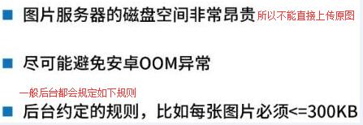
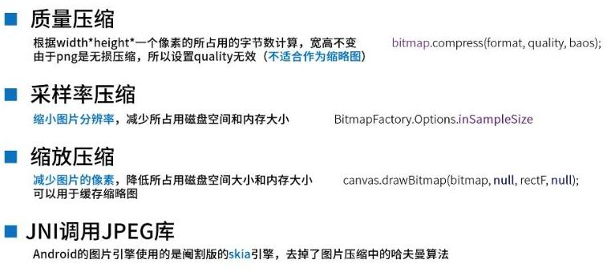

## 照片、图片压缩方案详解 ##

### 1、需求 ###

> &emsp;&emsp;很多 App 都涉及图片，然而当一个应用的图片过多或者一张图片过大，都会影响用户的体验，怎样提高用户体验，让这些图片不影响到用户……
> 
> &emsp;&emsp;当前案例只针对图片过大，对图片进行压缩，可以减少图片占用存储空间的大小以及防止图片加载到应用中出现 OutOfMemory 异常

### 2、概述 ###

> 压缩图片能带来以下好处（当然并不是所有应用的图片都需要压缩，例如：医疗、军工等等）：

&emsp;

> 图片压缩的方式有如下几种：

&emsp;

> **质量压缩**只能实现减少所占磁盘空间，无法实现减少内存大小，因为它是通过改变图片的位深和透明度实现的压缩，所以 quality 的值是 0-100，当为 0 时，图片就无法压缩了，即位深和透明度已经压缩到极致了，当为 100 时，表示不压缩。这儿的压缩是针对图片本身，我们手机屏幕上显示图片是通过 Bitmap 来显示的，每一个像素都在 Bitmap 中对应一段固定的 bit，然而质量压缩只会压缩位深和透明度，不会改变图片本身的像素以及分辨率，所以就出现了如下情况，图片本身的一个像素是00FFFFFF，经过质量压缩变成 FFFFFF，只保留了RGB，没有保留像素 RGB 前面的透明度，然而图片像素未变以及 Bitmap 中一个像素依旧对应一段固定的 bit，就只好将 FFFFFF 拿去填充那段 bit，无法补齐的就自动填充 0，这样你就会发现质量压缩的的图片，加载到屏幕上，你输出对应的 Bitmap 的大小，大小没变，但是你去看磁盘空间的图片大小，它就变小了，这就是质量压缩只能减少磁盘空间大小，无法减少内存大小的原因。

> 网上也有许多比较成熟的图片压缩框架，如下：

**Luban**

> github地址: https://github.com/Curzibn/Luban

**Compressor**

> github地址: https://github.com/zetbaitsu/Compressor

### 3、资料 ###

> 因为网上有很多这方面的资料，我就不细说了，主要推荐两篇关于图片压缩的文章，看了之后你就懂了如何进行图片压缩(IT技术更新很快，少做别人重复的动作，懂它并自己实现过它就行)

> 1.<a href="https://www.jianshu.com/p/0b4854aae105">Android中图片压缩方案详解</a>
> 
> 2.<a href="https://blog.csdn.net/HarryWeasley/article/details/51955467">bitmap的六种压缩方式，Android图片压缩</a>

> 再加之本用例中用到了获取相册中的照片，相册中的照片获取只能获取到 Uri 对象，我们需将 Uri 对象转换成文件的绝对地址，转换方式阅读下面两个文章：

> 1.<a href="https://blog.csdn.net/huangxiaoguo1/article/details/79062341">android打开手机相册获取真正的图片路径</a>
> 
> 2.<a href="https://blog.csdn.net/smileiam/article/details/79753745">Android根据图片Uri获取图片path绝对路径</a>

> 好了，铺垫也做好了，现在我们一起去看看栗子……

### 4、样例 ###

> 样例就是本文件夹下的 Image_Compress_Sample 工程，其中删除了未作修改的文件，只保留了新增以及需要修改的文件，所以请你重新创建一个工程，将本工程下的文件替换掉

> 只介绍些核心类：
> &emsp;app/……/utils/CompressUtils1.java：本用例中未用到，这只是个参考类，直接从网上 Copy 下来的，其中有些图片压缩原理，可以借鉴借鉴。
> &emsp;app/……/utils/CompressUtils2.java：同上
> &emsp;app/……/utils/UriParseUtils.java:前三个方法是将相机拍照的照片存放地址指定，并返回 Uri，让外部可以将 Uri 直接设置到相机中。其他方法是将相册获取到的照片返回的 Uri 解析成绝对地址，让外部可以根据绝对地址可以去获取对应的文件。 
> &emsp;library/……/core/CompressImageUtil.java:这是一个最核心的类，其中涉及到图片的压缩(样例中只是用了采样率压缩和质量压缩)：

```
public void compress(String originalPath, CompressResultListener listener) {
    if (config.isEnablePixelCompress()) {
        try {
            compressImageByPixel(originalPath, listener);
        } catch (FileNotFoundException e) {
            listener.onCompressFailed(originalPath, String.format("图片压缩失败，%s", e.toString()));
            e.printStackTrace();
        }
    } else {
        compressImageByQuality(BitmapFactory.decodeFile(originalPath), originalPath, listener);
    }
}
```

> 压缩图片时，先判断是否允许采样率压缩，如果采用，则进入 compressImageByPixel 函数，否则进入 compressImageByQuality 函数。

```
// 采样率压缩
private void compressImageByPixel(String originalPath, CompressResultListener listener) throws FileNotFoundException {
    File file = new File(originalPath);
    if (!file.exists()) throw new FileNotFoundException("原始文件不存在");
    BitmapFactory.Options options = new BitmapFactory.Options();
    options.inJustDecodeBounds = true;
    BitmapFactory.decodeFile(originalPath, options);
    options.inJustDecodeBounds = false;
    int longest = options.outWidth > options.outHeight ? options.outWidth : options.outHeight;
    if (longest > config.getMaxPixel()) {
        int be = 1;
        while (true) {
            ++be;
            if (longest / be <= config.getMaxPixel()) {
                options.inSampleSize = be;
                break;
            }
        }
    } else {
        options.inSampleSize = 1;
    }
    Bitmap bitmap = BitmapFactory.decodeFile(originalPath, options);
    if (config.isEnableQualityCompress()) {
        compressImageByQuality(bitmap, originalPath, listener);
    } else {
        ByteArrayOutputStream baos = new ByteArrayOutputStream();
        bitmap.compress(Bitmap.CompressFormat.JPEG, 100, baos);
        int result = saveBitmapFile(baos.toByteArray(), originalPath, listener);
        if (result == 0) listener.onCompressSuccess(originalPath);
    }
}
```

> 从中我们可以清楚看到设置 options.inSampleSize 的大小来改变图片的分辨率大小

```
/**
 * 多线程执行质量压缩
 *
 * @param bitmap   图片/照片对象
 * @param listener 回调接口
 */
private void compressImageByQuality(final Bitmap bitmap, final String filePath, final CompressResultListener listener) {
    if (config.isEnableQualityCompress()) {
        new Thread() {
            @Override
            public void run() {
                ByteArrayOutputStream baos = new ByteArrayOutputStream();
                bitmap.compress(Bitmap.CompressFormat.JPEG, 100, baos);// 质量压缩方法，这里100表示不压缩，把压缩后的数据存放到baos中
                int options = 100;
                while (baos.toByteArray().length > config.getMaxSize() && options >= 0) {// 循环判断如果压缩后图片是否大于100kb,大于继续压缩
                    baos.reset();// 重置baos即清空baos
                    bitmap.compress(Bitmap.CompressFormat.JPEG, options, baos);// 这里压缩options,把压缩后的数据存放到baos中
                    options -= 10;// 每次都减少10
                }
                int result = saveBitmapFile(baos.toByteArray(), filePath, listener);
                if (result == 0) listener.onCompressSuccess(filePath);
            }
        }.start();
    }
}
```

> 从中我们可以清楚看到 bitmap.compress(Bitmap.CompressFormat.JPEG, options, baos); 对图片进行质量压缩
> 
> 最后调用了 saveBitmapFile 函数

```
/**
 * Bitmap 对象保存成图片文件
 *
 * @param bitmapBytes 位图的字节流
 */
public int saveBitmapFile(byte[] bitmapBytes, String filePath, CompressResultListener listener) {
    String savePath = Constants.BASE_CACHE_PATH + context.getPackageName() + "/cache/" + Constants.COMPRESS_CACHE;
    File folder = new File(savePath); // 将要保存图片的路径
    if (!folder.exists()) {
        folder.mkdirs();
    }
    File file = new File(savePath + filePath.substring(filePath.lastIndexOf("/")));
    if (file.exists()) {
        file.delete();
    }
    try {
        BufferedOutputStream bos = new BufferedOutputStream(new FileOutputStream(file));
        bos.write(bitmapBytes);
        bos.flush();
        bos.close();
    } catch (FileNotFoundException e) {
        listener.onCompressFailed(filePath, "无法创建保存的压缩文件");
        e.printStackTrace();
        return -1;
    } catch (IOException e) {
        listener.onCompressFailed(filePath, "无法向压缩文件里输入数据流");
        e.printStackTrace();
        return -2;
    }
    return 0;
}
```

> 以上是将图片保存到指定的缓存目录中，具体的结果如下所示：

<iframe 
    height=600 
    width=250 
    src="http://media.w3.org/2010/05/sintel/trailer.mp4" 
    frameborder=0 
    allowfullscreen>
</iframe>

> 从中我们可以看到 Pictures 中先没有照片，然后去看压缩文件夹里看有一张照片，我们将其删除了，后面使用应用拍照并压缩，发现 Pictures 中的照片 1.32 MB，压缩之后的照片大小为 66.80 KB，缩小了近10倍，从视觉上查看不出两张图片的区别，所以一些不需要图片很精准的应用就可以压缩图片，减少图片占用用户的磁盘以及内存的大小。

> It's over!