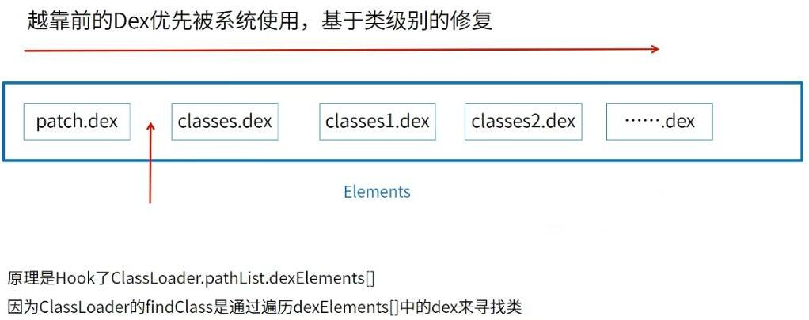
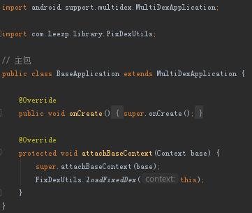
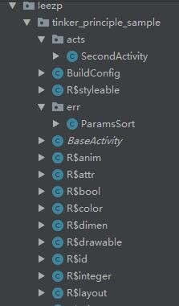

## Tinker 热修复原理 ##

### 1、需求 ###

> &emsp;&emsp;发布应用之后，检测出应用存在Bug，此时不想通过更新应用商店里的 App 来修复 Bug，只想将出现 Bug 的地方，打包成一个文件，让 App 去下载这个文件之后动态加载修复 Bug，这就是热更新技术的功能。

### 2、原理 ###

> 首先，我们先来看下市场上有哪些成熟的热更新技术？

&emsp;

> emmmmmmmmmmmm，很多，那这些热更新技术采用的原理都是一样吗？？其实是不一样的，大体分类如下：

&emsp;

> 可以发现，主要分为 Native 层面的热更新技术和 Java 层面实现的热更新技术，其中 Native 层面的热更新技术我在前面的文章有所讲解，就是 Sophix 热更新讲解，即<a href="https://github.com/Leezps/personal-summary/blob/master/2019-4-9/2019-4-9(Ali%20Sophix%20heat%20repair%20origin%20path%20-%20virtual%20machine%20layer%20method%20table%20replacement).md">阿里sophix热修复起源之路 — 虚拟机层方法表替换</a>，实现原理就是在 Native 层面替换掉方法、属性的地址来实现，那 Java 层面的热更新技术是怎么实现的？？
> 
> 我们应该知道，Android 一个dex包的最大方法数量是 65536，超过这个数就会报

```
com.android.dex.DexIndexOverflowException:method ID not in [0, 0xffff]: 65536
```

> 异常，因此随着 Android 的发展，我们的 App 也越来越大，避免不了的就是分包问题，那分包之后 Android 的加载机制是怎样的呢？？  
> 其实 Java 层的热更新就利用了这个加载机制，实现了热更新，原理如下图所示：

&emsp;

> 从中我们看到 dex 包是按照一个集合存储下来的，虚拟机是按照这个集合的顺序去查找，当在集合前面的 dex 的包中查找到对应的 class 类时，就不会查询后面的 dex 包了，因此，我们只需将修改的类的 dex 包放在这个集合的前面，当虚拟机去调用时，先调用到我们修改的类，就不会去调用错误的类，这就实现了热更新。
> 
> 图中的 patch.dex 包就是修复包，因此就需将 patch.dex 这个包放在集合的前方，如上图所示
> 
> “具体”的修复思路如下图所示：

&emsp;

> 一个应用的 dexElements 应该如下所示：

&emsp;

> 当进行过 Java 层面插桩方式热修复之后，dexElements 如下所示：

&emsp;

> 从中可以看到我们的修复包 classes2.dex 放入到 dexElements 中并且在集合的第一个位置

### 3、资料 ###

> 5555555555

### 4、样例 ###

> 本样例就是当前文件夹目录下的 Tinker_Principle_Sample 工程，工程只保留了修改和新增的文件，所以你需重新创建一个工程，将当前文件复制或替换掉创建工程里的文件。
> 
> 在 Tinker_Principle_Sample 工程中，里面有两个 Module，分别是 app 与 library，app 主要是业务以及调用 library 中的代码，而 library 中的代码主要是 Tinker 热修复的核心代码
> 
> 首先，我们先来看下 app 中的 build.gradle 文件：

```
apply plugin: 'com.android.application'

android {
    compileSdkVersion 28
    defaultConfig {
        applicationId "com.leezp.tinker_principle_sample"
        minSdkVersion 16
        targetSdkVersion 28
        versionCode 1
        versionName "1.0"
        // 开启分包
        multiDexEnabled true
        // 设置分包配置
        multiDexKeepFile file('multidex-config.txt')
    }
    buildTypes {
        debug {
            minifyEnabled false
            proguardFiles getDefaultProguardFile('proguard-android-optimize.txt'), 'proguard-rules.pro'
        }

        release {
            minifyEnabled false
            proguardFiles getDefaultProguardFile('proguard-android-optimize.txt'), 'proguard-rules.pro'
        }

        dexOptions {
            javaMaxHeapSize "4g"
            preDexLibraries = false
            additionalParameters = [ // 配置 multidex 参数
                                    '--multi-dex', // 多dex分包
                                    '--set-max-idx-number=50000', // 每个包内方法数上限
                                    '--main-dex-list='+ '/multidex-config.txt', // 打包到主classes.dex的文件列表
                                    '--minimal-main-dex'
            ]
        }
    }
}

dependencies {
    implementation fileTree(dir: 'libs', include: ['*.jar'])
    implementation 'com.android.support:appcompat-v7:28.0.0'
    implementation 'com.android.support.constraint:constraint-layout:1.1.3'
    // multidex 支持依赖
    implementation 'com.android.support:multidex:1.0.3'
    implementation project(path: ':library')
}
```

> 从中可以看到，我们项目中加入了 multidex 依赖，它是用于分包的依赖库，其中有两句如下：

```
// 设置分包配置
multiDexKeepFile file('multidex-config.txt')
……
additionalParameters = [ // 配置 multidex 参数
	……
	'--main-dex-list='+ '/multidex-config.txt', // 打包到主classes.dex的文件列表
	……
]
```

> 这是指明主包中的类应该由配置文件 multidex-config.txt 所决定，所以在 app 的 build.gradle 文件的同级目录下，有一个 multidex-config.txt 文件，文件里的内容如下：

```
com/leezp/tinker_principle_sample/MainActivity.class
com/leezp/tinker_principle_sample/BaseActivity.class
com/leezp/tinker_principle_sample/BaseApplication.class
```

> 指明以上三个类都需要打包进主包中
> 
> 然后，我们需要创建一个 BaseApplication 来继承 multidex 库中的 MultiDexApplication 类，如下：

&emsp;

> 其中 FixDexUtils 类是 library 中的类，在这里调用的作用是，每次打开应用，会将修改包加载到应用的 dexElements 的集合前面，饿汉加载的方式，一来就消除掉应用中的 Bug。
> 
> 在应用的 AndroidManifest.xml 文件中需加入如下权限以及声明(更多请参考工程中的 AndroidManifest.xml 文件)：

```
<uses-permission android:name="android.permission.WRITE_EXTERNAL_STORAGE" />

<application
    android:name=".BaseApplication"
	……>
</application>
```

> MainActivity 就不介绍了，因为这个 Activity 的存在是防止 SecondActivity 出现 Bug 时，直接闪退出程序，我们直接看 SecondActivity，先看下它的布局文件，其中有段核心的，如下：

&emsp;

> 分别对应点击事件的是 show 函数与 fix 函数，我们在 SecondActivity 中找到两个函数，函数的代码如下：

&emsp;

> 我们先来看 show 函数，在 show 函数中，我们有个 ParamSort 对象，我们来看看 ParamSort 这个类

```
public class ParamsSort {
    public void math(Context context) {
        int a = 10;
        int b = 0;
        Toast.makeText(context, "math >>> " + a / b, Toast.LENGTH_SHORT).show();
    }
}
```

> 可以发现它是个会报错的类，因为 b 是除数，然而它的值为 0，所以就会抛异常，这就是我们模拟的 Bug，我们需要通过热修复修复掉该 Bug。
> 
> 然后我们再看看 fix 函数，正式进入 library 库的讲解环节，下面的类都在 library 库中，在看 fix 函数时，我们先解决一些小障碍，先看一下我们的常量类：

&emsp;

> 然后再看下 FileUtils 类，这个类的作用主要是将我们的修复包拷贝到应用的私有目录文件夹下，这样即使用户删除了 SDCard 的修复包，私有目录因为用户无法看到，所以无法删除私有目录中的文件，所以应用私有目录下，修复包依旧存在，这样每次打开应用时，应用去加载私有目录下的修复包，Bug 依旧能被修正。

&emsp;

> 在 fix 函数中的执行操作如下：  
> &emsp;1. 去 SDCard 的根目录下获取修复包，这里没有模拟网络下载环节，我们直接将修复包放到 SDCard 的根目录下。  
> &emsp;2. 确定私有目录文件的路径，并查看文件是否已经存在，如果存在，则删除旧的修复包，如果不存在，则直接进行下一步。  
> &emsp;3. 使用 FileUtils 类将 SDCard 中的修复包拷贝到私有目录中。  
> &emsp;4. 调用 FixDexUtils 类来加载修复包，将其放于 dexElements 集合的前列（在 BaseApplication 中，也调用了 FixDexUtils 类）
> 
> FixDexUtils 的代码如下：

```
public class FixDexUtils {

    // classes2.dex 和 classes3.dex 同时修复
    private static HashSet<File> loadedDex = new HashSet<>();

    static {
        // 修复之前清理集合
        loadedDex.clear();
    }

    // 加载热修复的 Dex 文件
    public static void loadFixedDex(Context context) {
        File fileDir = context.getDir(Constants.DEX_DIR, Context.MODE_PRIVATE);
        // 循环私有目录中的所有文件
        File[] listFiles = fileDir.listFiles();
        for (File file : listFiles) {
            if (file.getName().endsWith(Constants.DEX_SUFFIX) && !"classes.dex".equals(file.getName())) {
                // 找到修复包 dex 文件，加入到集合
                loadedDex.add(file);
            }
        }

        // 模拟类加载器
        createDexClassLoader(context, fileDir);
    }

    // 创建加载补丁的 DexClassLoader 类加载器
    private static void createDexClassLoader(Context context, File fileDir) {
        // 创建解压目录
        String optimizedDir = fileDir.getAbsolutePath() + File.separator + "opt_dex";
        // 创建目录
        File fopt = new File(optimizedDir);
        if (!fopt.exists()) {
            // 创建这个多级目录
            fopt.mkdirs();
        }
        for (File dex : loadedDex) {
            // 自由的类加载器
            DexClassLoader classLoader = new DexClassLoader(dex.getAbsolutePath(),
                    optimizedDir, null, context.getClassLoader());

            // 每循环一次，修复一次（插桩）
            hotfix(classLoader, context);
        }
    }

    private static void hotfix(DexClassLoader classLoader, Context context) {
        // 获取系统的 PathClassloader
        PathClassLoader pathLoader = (PathClassLoader) context.getClassLoader();
        try {
            // 获取自有的 dexElements 数组
            Object myElements = ReflectUtils.getDexElements(ReflectUtils.getPathList(classLoader));

            // 获取系统的 dexElements 数组
            Object systemElements = ReflectUtils.getDexElements(ReflectUtils.getPathList(pathLoader));

            // 合并并且声称新的 dexElements 数组
            Object dexElements = ArrayUtils.combineArray(myElements, systemElements);

            // 获取系统的 pathList
            Object systemPathList = ReflectUtils.getPathList(pathLoader);

            // 通过反射技术，将新的 dexElements 数组赋值给系统的 pathList
            ReflectUtils.setField(systemPathList, systemPathList.getClass(), dexElements);
        } catch (Exception e) {
            e.printStackTrace();
        }
    }
}
```

> FixDexUtils 类中的执行步骤：
> &emsp;1. 先调用 loadFixedDex 函数，在 loadFixedDex 函数中会检测私有目录中是否存在修复包，如果存在，则将其加入到修复包集合中，即 loadedDex 集合中，然后调用 createDexClassLoader （类加载器）函数

```
// 加载热修复的 Dex 文件
public static void loadFixedDex(Context context) {
    File fileDir = context.getDir(Constants.DEX_DIR, Context.MODE_PRIVATE);
    // 循环私有目录中的所有文件
    File[] listFiles = fileDir.listFiles();
    for (File file : listFiles) {
        if (file.getName().endsWith(Constants.DEX_SUFFIX) && !"classes.dex".equals(file.getName())) {
            // 找到修复包 dex 文件，加入到集合
            loadedDex.add(file);
        }
    }

    // 模拟类加载器
    createDexClassLoader(context, fileDir);
}
```

> &emsp;2. 如果修复包集合（loadedDex）中有修复包，则使用类加载器将修复包加载到类中，具体逻辑在 createDexClassLoader 函数中

```
// 创建加载补丁的 DexClassLoader 类加载器
private static void createDexClassLoader(Context context, File fileDir) {
    // 创建解压目录
    String optimizedDir = fileDir.getAbsolutePath() + File.separator + "opt_dex";
    // 创建目录
    File fopt = new File(optimizedDir);
    if (!fopt.exists()) {
        // 创建这个多级目录
        fopt.mkdirs();
    }
    for (File dex : loadedDex) {
        // 自由的类加载器
        DexClassLoader classLoader = new DexClassLoader(dex.getAbsolutePath(),
                optimizedDir, null, context.getClassLoader());

        // 每循环一次，修复一次（插桩）
        hotfix(classLoader, context);
    }
}
```

> &emsp;3. 按照我们先前讲的原理，我们需要将我们修复包放于 dexElements 集合的前面，所以我们这一步就是替换掉系统的 dexElements 集合，具体逻辑在 hotfix 函数中

```
private static void hotfix(DexClassLoader classLoader, Context context) {
    // 获取系统的 PathClassloader
    PathClassLoader pathLoader = (PathClassLoader) context.getClassLoader();
    try {
        // 获取自有的 dexElements 数组
        Object myElements = ReflectUtils.getDexElements(ReflectUtils.getPathList(classLoader));

        // 获取系统的 dexElements 数组
        Object systemElements = ReflectUtils.getDexElements(ReflectUtils.getPathList(pathLoader));

        // 合并并且声称新的 dexElements 数组
        Object dexElements = ArrayUtils.combineArray(myElements, systemElements);

        // 获取系统的 pathList
        Object systemPathList = ReflectUtils.getPathList(pathLoader);

        // 通过反射技术，将新的 dexElements 数组赋值给系统的 pathList
        ReflectUtils.setField(systemPathList, systemPathList.getClass(), dexElements);
    } catch (Exception e) {
        e.printStackTrace();
    }
}
```

> 首先，获取了系统的类加载器(pathLoader)，然后通过反射的原理，获取修复包里面的 dexElements 数组，其次获取系统的 dexElements 数组，将两个 dexElements 数组合并，修复包的数组在前，系统的数组在后，再利用反射的原理，获取系统的 pathList 对象，将合并后的 dexElements 对象设置到 pathList 对象中。
> 
> ReflectUtils 类的代码如下所示：

```
public class ReflectUtils {

    /**
     * 通过反射获取某对象，并设置私有访问
     *
     * @param obj   该属性所属类的对象
     * @param clazz 该属性所属类
     * @param field 属性名
     * @return 该属性对象
     */
    private static Object getField(Object obj, Class<?> clazz, String field)
            throws NoSuchFieldException, IllegalAccessException, IllegalArgumentException {
        Field localField = clazz.getDeclaredField(field);
        localField.setAccessible(true);
        return localField.get(obj);
    }

    /**
     * 给某属性赋值，并设置私有可访问
     *
     * @param obj   该属性所属类的对象
     * @param clazz 该属性所属类
     * @param value 值
     */
    public static void setField(Object obj, Class<?> clazz, Object value)
            throws NoSuchFieldException, IllegalAccessException, IllegalArgumentException {
        Field localField = clazz.getDeclaredField("dexElements");
        localField.setAccessible(true);
        localField.set(obj, value);
    }

    /**
     * 通过反射获取 BaseDexClassLoader 对象中的 PathList 对象
     *
     * @param baseDexClassLoader BaseDexClassLoader对象
     * @return
     */
    public static Object getPathList(Object baseDexClassLoader)
            throws NoSuchFieldException, IllegalAccessException, IllegalArgumentException, ClassNotFoundException {
        return getField(baseDexClassLoader, Class.forName("dalvik.system.BaseDexClassLoader"), "pathList");
    }

    /**
     * 通过反射获取 BaseDexClassLoader 对象中的 PathList 对象，再获取 dexElements 对象
     *
     * @param paramObject PathList 对象
     * @return dexElements 对象
     */
    public static Object getDexElements(Object paramObject)
            throws NoSuchFieldException, IllegalAccessException, IllegalArgumentException {
        return getField(paramObject, paramObject.getClass(), "dexElements");
    }
}
```

> ReflectUtils 的每个方法前面都有介绍了，这里就不详细讲述了  
> 
> 然后是 ArrayUtils 类，该类的的代码如下：

```
public class ArrayUtils {
    /**
     * 合并数组
     *
     * @param arrayLhs 前数组（插队数组）
     * @param arrayRhs 后数组（已有数组）
     * @return 处理后的新数组
     */
    public static Object combineArray(Object arrayLhs, Object arrayRhs) {
        // 获得一个数组的 Class 对象，通过 Array.newInstance() 可以反射生成数组对象
        Class<?> localClass = arrayLhs.getClass().getComponentType();
        // 前数组长度
        int i = Array.getLength(arrayLhs);
        // 新数组总长度 = 前数组长度 + 后数组长度
        int j = i + Array.getLength(arrayRhs);
        // 生成数组对象
        Object result = Array.newInstance(localClass, j);
        for (int k = 0; k < j; ++k) {
            if (k < i) {
                // 从 0 开始遍历，如果前数组有值，添加到新数组的第一个位置
                Array.set(result, k, Array.get(arrayLhs, k));
            } else {
                // 添加完数组，再添加后数组，合并完成
                Array.set(result, k, Array.get(arrayRhs, k - i));
            }
        }
        return result;
    }
}
```

> 可以清楚的看出两个数组合并的过程，每步都有解释，这里也不讲解了。
> 
> 最后，当然是结果展示了，有两种，我们先展示用例分包工具 multidex 起到作用的一种
> 
> 先通过 AndroidStudio 执行 Build Apk，产生 Apk 文件

&emsp;

> 查看 Apk，你会发现 Apk 中有两个 dex 文件

&emsp;

> 我们先查看主包 classes.dex 文件中有哪些类

&emsp;

> 可以发现其中没有 SecondActivity.java 这个类，只有上面我们说的分包配置文件里面规划的 MainActivity、BaseApplication、BaseActivity 这三个类，其中还有 ReflectUtils、ArrayUtils、FixDexUtils 这三个类，它们存在是因为 BaseApplication 中调用了 FixDexUtils 中的函数
> 
> 然后我们再看下次包 classes2.dex 文件中的类：

&emsp;

> 这里只截图截了一部分，没有截完，太长了，如果你感兴趣，自己重新弄下工程，自己打开 classes2.dex 看一下就知道了，好了，收回来，这里可以发现 classes2.dex 包中存在 SecondActivity 以及 ParamsSort 这两个类，因为是 ParamsSort 类中的一个除数导致的异常，所以我们就需要这个包。
> 
> 将这个 APK 安装到手机上，然后我们再修改掉 ParamsSort 中的异常，重新点击 Build Apk 这个按键，将此时的 APK 解压，提取出其中的 classes2.dex 这个文件，操作如下所示：

> 修改掉 ParamsSort 中的异常

&emsp;

> 我们将除数改为 1，然后提取出 classes2.dex 这个文件（为什么没 Bug 的 Apk 是个 ZIP 包，因为我直接改的后缀名，这样可以解压，提取出 classes2.dex 包）

&emsp;

> 将这个 classes2.dex 文件放到手机的 SDCard 的根目录下（所需资源在当前文件夹下的 needs_files\Tinker 目录下）
> 
> 结果如下所示：


> 另外一种方式，就是《阿里 sophix 热修复起源之路》的那一篇博文中，只将错误的 class 文件打包成 dex 文件，然后将这个资源文件放到 SDCard 根目录下，这样也可以实现热修复(所需资源在当前文件夹下的 needs_files\dex 目录下)，结果如下所示：


> 这两种方式的对比，可以发现第一种的修复包占用空间非常大，而第二种的包只有几KB，因为第一种是将没有错的类也打包到修复包里了，而第二种只将有错误的类打包的修复包里，这是两者最大的区别。

> It's over!
