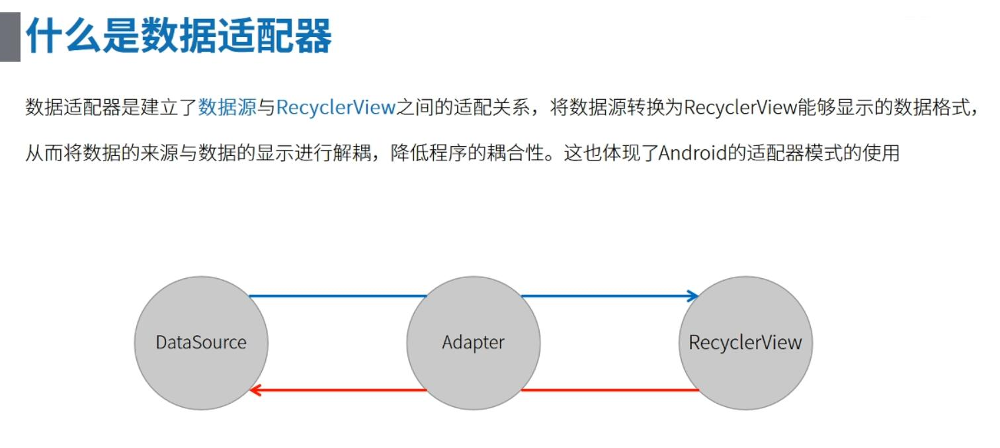
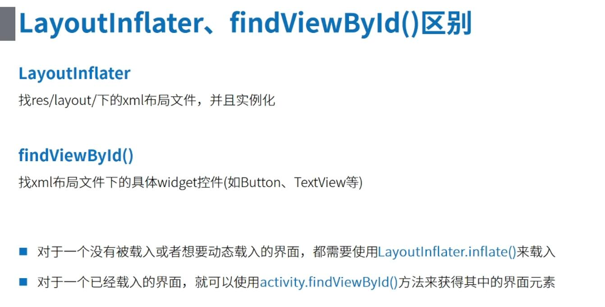
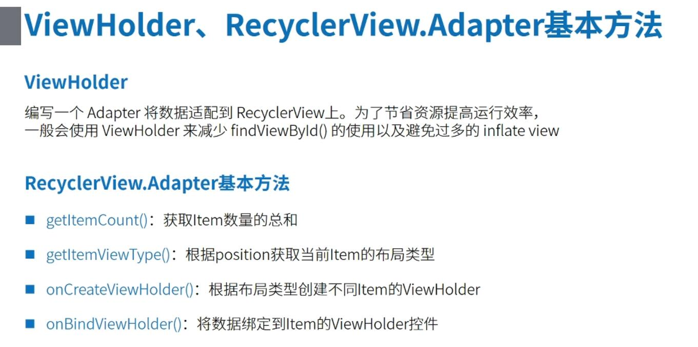
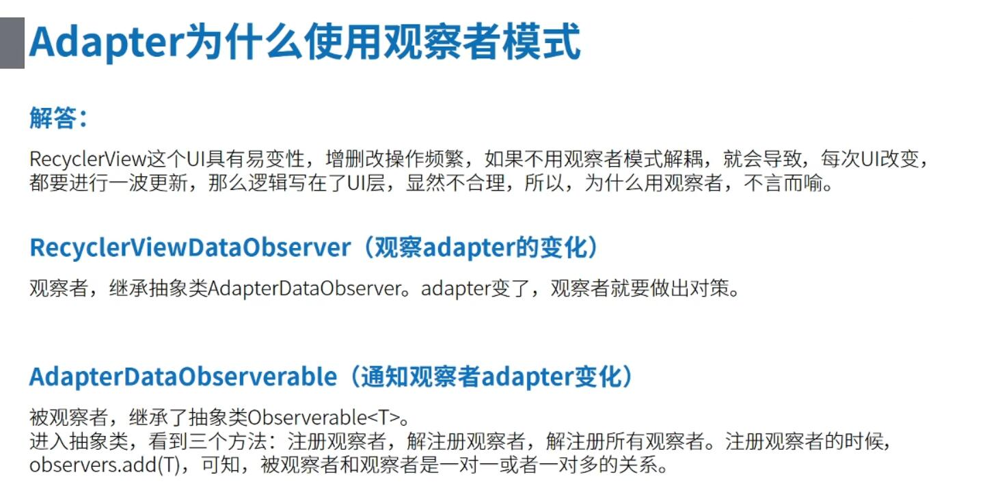
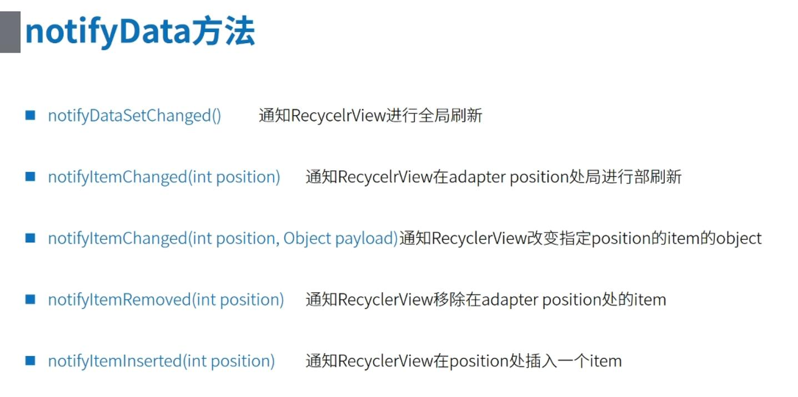
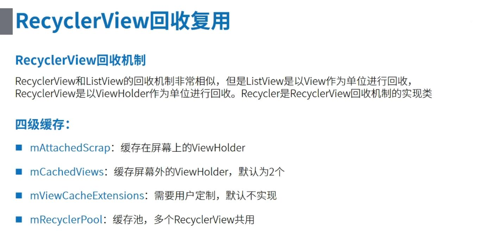

## 走进面向接口编程，实战多样式Adapter架构 ##

### 1、需求 ###

> 在讲实现多样式 Adapter 架构需求之前，我们先要了解下 Adapter (适配器)是个什么玩意……

&emsp;**数据适配器的概念**

&emsp;&emsp;

> RecyclerView 在 android.support.v7 包中的 22.1.0 版本加入，用于替代 ListView，解决 ListView 无法实现的横向列表以及横向和竖向双向列表。

> 在 RecyclerView 和 ListView 中，都是通过 LayoutInflater 来加载列表中子项目的布局，那 LayoutInflater 与 findViewById 的区别是什么？

&emsp;**LayoutInflater 与 findViewById 的区别**

&emsp;&emsp;

> 主要区别:
> &emsp;1.LayoutInflater 用于布局加载，findViewById 用于子控件加载
> &emsp;2.LayoutInflater 用于加载未被载入的布局，而 findViewById 是从已被载入的布局中去获取子控件

> 废话讲的差不多了，这个需求目的还没讲…………

&emsp;**需求**

> 当你需要使用 RecyclerView 来实现一个列表时，可以以此架构为模板，实现自己的多样式Adapter架构

### 2、原理 ###

> RecyclerView 中的 ViewHolder 用于缓存列表中的子项目的布局以及控件，Adapter 用于将数据源填充到 RecyclerView 中

&emsp;

> Adapter 本身是以观察者模式的方式将数据源填充或更新到 RecyclerView 中的

&emsp;

> 在 Adapter 中调用以下方法将数据源重新更新到 RecyclerView 的界面上

&emsp;

> RecyclerView 的回收机制

&emsp;

### 3、资料 ###

无

### 4、样例 ###

> 本样例就是当前文件夹下的 VariousAdapter 工程，其中 library 是对多样式 Adapter 的架构封装，app 是对 Adapter 的使用。

> —— 具体详情可参考该工程，并导入 AndroidStudio，解读对应代码文件，动手才行。

> RViewAdapter.java 继承 RecyclerView.Adapter，重写该类函数
> 
> RViewHolder.java 继承 RecyclerView.ViewHolder，重写该类函数
> 
> ItemListener.java 列表中 item 的长按、点击事件接口
> 
> RViewCreate.java 列表中 item 的创建RViewHelper所需要的数据接口
> 
> RViewItem.java 列表中 item 需要继承的接口封装
> 
> RViewItemManager.java 管理多样式 item 的管理器
> 
> RViewHelper.java RecyclerView的管理类
> 
> SwipeRefreshHelper.java 下拉刷新的帮助类
