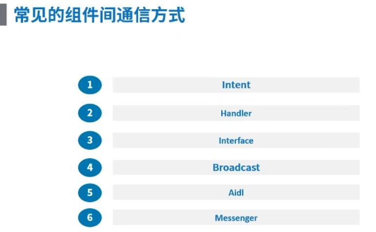
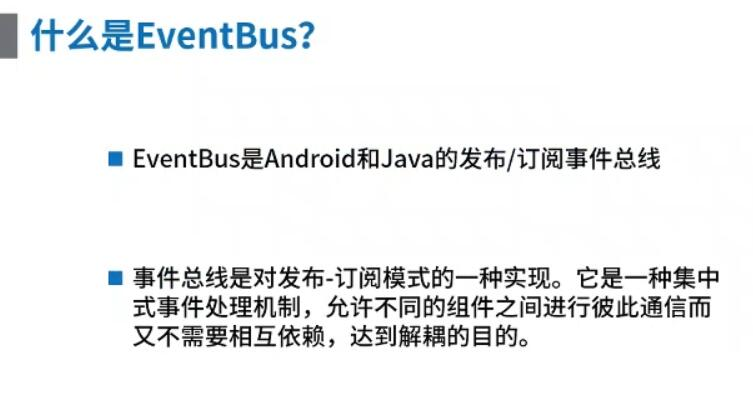
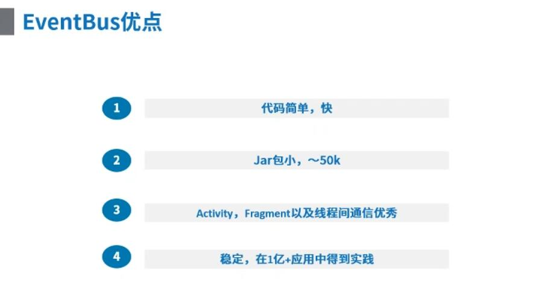
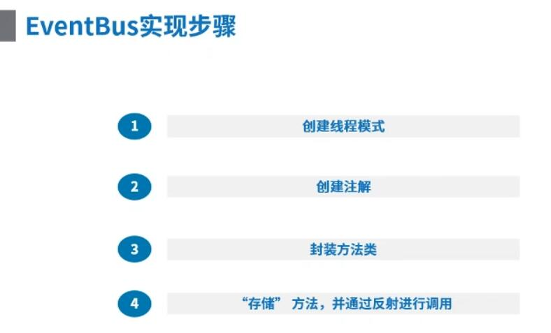

## Eventbus原理详解与手写架构 ##

### 1、需求 ###

> &emsp;&emsp;组件与组件之间的通信、线程与线程之间的通信，可以选择已经非常成熟的 Android 通信框架 Eventbus，那这个非常成熟的通信框架的原理是怎么实现的？？

### 2、原理 ###

**常见的线程通信方式**

&emsp;

**什么是 EventBus?**

&emsp;

**EventBus 优点**

&emsp;

**EventBus 实现步骤**

&emsp;

### 3、资料 ###

> 无

### 4、样例 ###

> &emsp;&emsp;本样例就是当前文件目录下的 EventBus 工程，在工程中的 com.leezp.eventbus.bus 包下就是 EventBus 的原理代码，首先我们先看看怎么使用 EventBus 框架……

**MainActivity.java 的代码：**
```
public class MainActivity extends AppCompatActivity {

    @Override
    protected void onCreate(Bundle savedInstanceState) {
        super.onCreate(savedInstanceState);
        setContentView(R.layout.activity_main);

        EventBus.getDefault().register(this);

        findViewById(R.id.tvTiaozhuan).setOnClickListener(new View.OnClickListener() {
            @Override
            public void onClick(View v) {
                Intent intent = new Intent();
                intent.setClass(MainActivity.this, SecondActivity.class);
                startActivity(intent);
            }
        });
    }

    // Subscrible是个注解，它的作用是：只是一个标记，它标记的方法都将被 EventBus 给收录
    // ThreadMode 一个枚举，它代表着 EventBus 通过 post 发送消息时，接收的线程是在主线程还是子线程
    @Subscrible(threadMode = ThreadMode.MAIN)
    public void getMessage(EventBean bean) {
        Log.e("===>Main", bean.toString());
        Log.e("=== Main ThreadName ", Thread.currentThread().getName());
    }

//    @Subscrible
//    public void getMessage1(EventBean bean) {
//        Log.e("===>Main", bean.toString());
//    }
}
```

> 其中 EventBus.getDefault().register(this) 是将 EventBus 注册到 Activity 中

> @Subscrible(threadMode = ThreadMode.MAIN) 是注解该方法能被 EventBus 调用

**SecondActivity.java的代码**
```
public class SecondActivity extends AppCompatActivity {

    @Override
    protected void onCreate(Bundle savedInstanceState) {
        super.onCreate(savedInstanceState);
        setContentView(R.layout.activity_second);

        findViewById(R.id.tvSend).setOnClickListener(new View.OnClickListener() {
            @Override
            public void onClick(View v) {
                //  发送信息给 MainActivity
//                EventBus.getDefault().post(new EventBean("依依", "小鸟依人"));

                new Thread() {
                    @Override
                    public void run() {
                        super.run();
                        EventBus.getDefault().post(new EventBean("依依", "小鸟依人"));
                        Log.e("=== Second ", Thread.currentThread().getName());
                    }
                }.start();
            }
        });
    }
}
```

> EventBus.getDefault().post(new EventBean("依依","小鸟依人")); 是发送信息，先前 MainActivity 中注解的方法就会被调用

> 其中具体的原理：

> 1.EventBus.java——EventBus 的原理

> 2.Subscrible.java——MainActivity 中的 Subscrible 注解

> 3.SubscribleMethod.java——Subscrible 注解标明的方法信息

> 4.ThreadMode.java——枚举类，其中主要用于形容主线程、子线程的枚举标志