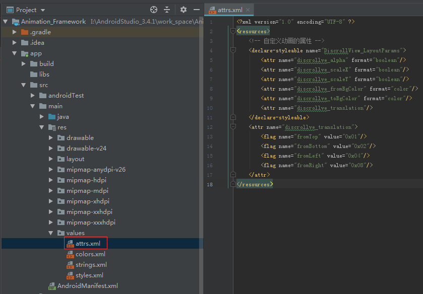
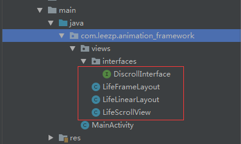
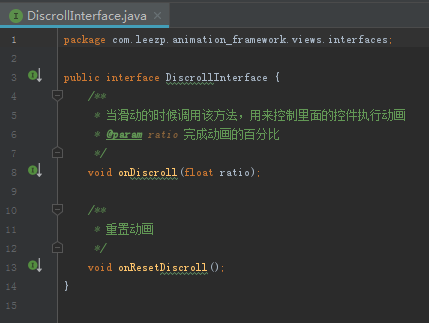
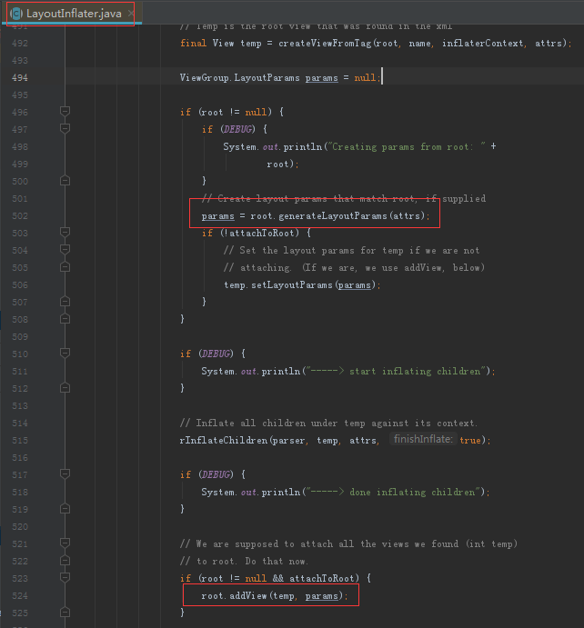

## 滑动列表中不同子项目实现不同动画效果 ##

### 1、需求 ###

> &emsp;&emsp;可以滑动的控件有很多，常用的有 RecyclerView、ListView、ScrollView，当我们做一个滑动列表时，策划或者产品要求我们的列表中的子控件可以以不同的动画显示在用户的眼前时，我们可以以下面提到的方式来完成这个需求……

### 2、知识点 ###

> ** 1. 自定义属性 **

> ** 2. 重写控件 **

> ** 3. xml布局文件中引用重写的控件 **

> ** 4. xml布局文件中使用自定义属性 **

### 3、资料 ###

&emsp;&emsp;1. <a href="https://blog.csdn.net/lmj623565791/article/details/45022631">Android 深入理解Android中的自定义属性</a>

### 4、样例 ###

> &emsp;&emsp;本样例就是当前文件夹下的 Animation_Framework 工程（文件夹），其中只保留了需要修改以及新增的文件内容，如果你想使用该 Demo，就需重新创建一个 Android 项目，将 Animation_Framework 里的文件复制出来覆盖掉新建的 Android 项目里的文件

> &emsp;&emsp;首先我们应该先自定义属性，如下所示：



> &emsp;&emsp;从中我们可以发现，自定义的属性有六个，分别是：  
> &emsp;&emsp;&emsp;&emsp; - discrollve_alpha——透明度  
> &emsp;&emsp;&emsp;&emsp; - discrollve_scaleX——X轴方向缩放  
> &emsp;&emsp;&emsp;&emsp; - discrollve_scaleY——Y轴方向缩放  
> &emsp;&emsp;&emsp;&emsp; - discrollve_fromBgColor——起始颜色  
> &emsp;&emsp;&emsp;&emsp; - discrollve_toBgColor——结束颜色  
> &emsp;&emsp;&emsp;&emsp; - discrollve_translation——起始平移位置

> &emsp;&emsp;重写控件，此用例是以 ScrollView 为样例，因此重写的控件是 ScrollView，如果你需重写 RecyclerView、ListView，你需要理解本例，然后举一反三，实现你的需求……重写的控件如下所示：



> &emsp;&emsp;从中我们可以看到，重写的控件有 ScrollView、LinearLayout、FrameLayout 以及新建了个接口（DiscrollInterface），DiscrollInterface 的代码如下所示：



> 此接口用于降低控件之间耦合度，主要功能用于 ScrollView 提醒 FrameLayout 执行动画

> LifeFrameLayout 的代码如下所示：

```
import android.animation.ArgbEvaluator;
import android.content.Context;
import android.util.AttributeSet;
import android.widget.FrameLayout;

import com.leezp.animation_framework.views.interfaces.DiscrollInterface;

public class LifeFrameLayout extends FrameLayout implements DiscrollInterface {
    // 平移的自定义属性
    /**
     * xml文件中的top|left 其实是top与left进行或预算
     * 0001 | 0100 = 0101
     * 0101 & 0001 = 0001 通过与运算，提取出top值
     */
    public static final int TRANSLATION_FROM_TOP = 0x01;
    public static final int TRANSLATION_FROM_BOTTOM = 0x02;
    public static final int TRANSLATION_FROM_LEFT = 0x04;
    public static final int TRANSLATION_FROM_RIGHT = 0x08;

    // 颜色估值器
    private static ArgbEvaluator sArgbEvaluator = new ArgbEvaluator();

    private boolean mDiscrollveAlpha; //是否需要透明度动画
    private boolean mDiscrollveScaleX; //是否需要x轴方向缩放
    private boolean mDiscrollveScaleY; //是否需要y轴方向缩放
    private int mDiscrollveTranslation; //平移值
    private int mDiscrollveFromBgColor; //背景颜色变化开始值
    private int mDiscrollveToBgColor; //背景颜色变化结束值
    private int mHeight; //view的高度
    private int mWidth; //view的宽度

    public void setmDiscrollveAlpha(boolean mDiscrollveAlpha) {
        this.mDiscrollveAlpha = mDiscrollveAlpha;
    }

    public void setmDiscrollveScaleX(boolean mDiscrollveScaleX) {
        this.mDiscrollveScaleX = mDiscrollveScaleX;
    }

    public void setmDiscrollveScaleY(boolean mDiscrollveScaleY) {
        this.mDiscrollveScaleY = mDiscrollveScaleY;
    }

    public void setmDiscrollveTranslation(int mDiscrollveTranslation) {
        this.mDiscrollveTranslation = mDiscrollveTranslation;
    }

    public void setmDiscrollveFromBgColor(int mDiscrollveFromBgColor) {
        this.mDiscrollveFromBgColor = mDiscrollveFromBgColor;
    }

    public void setmDiscrollveToBgColor(int mDiscrollveToBgColor) {
        this.mDiscrollveToBgColor = mDiscrollveToBgColor;
    }

    @Override
    protected void onSizeChanged(int w, int h, int oldw, int oldh) {
        super.onSizeChanged(w, h, oldw, oldh);
        mWidth = w;
        mHeight = h;
    }

    public LifeFrameLayout(Context context, AttributeSet attrs) {
        super(context, attrs);
    }

    @Override
    public void onDiscroll(float ratio) {
        // 判断是否有动画的属性，开启动画
        if (mDiscrollveAlpha) {
            setAlpha(ratio);
        }
        if (mDiscrollveScaleX) {
            setScaleX(ratio);
        }
        if (mDiscrollveScaleY) {
            setScaleY(ratio);
        }
        // 判断平移 0代表view本该处于的位置
        if (isTranslationFrom(TRANSLATION_FROM_BOTTOM)) {
            setTranslationY(mHeight*(1-ratio));
        }
        if (isTranslationFrom(TRANSLATION_FROM_TOP)) {
            setTranslationY(-mHeight*(1-ratio));
        }
        if(isTranslationFrom(TRANSLATION_FROM_LEFT)) {
            setTranslationX(-mWidth*(1-ratio));
        }
        if (isTranslationFrom(TRANSLATION_FROM_RIGHT)) {
            setTranslationX(mWidth*(1-ratio));
        }
        // 颜色渐变
        if (mDiscrollveFromBgColor != -1 && mDiscrollveToBgColor != -1) {
            setBackgroundColor((int) sArgbEvaluator.evaluate(ratio, mDiscrollveFromBgColor,mDiscrollveToBgColor));
        }
    }

    private boolean isTranslationFrom(int translationMask) {
        if (mDiscrollveTranslation == -1) {
            return false;
        }
        return (mDiscrollveTranslation & translationMask) == translationMask;
    }

    @Override
    public void onResetDiscroll() {
        // 控件重置
        int ratio = 0;
        if (mDiscrollveAlpha) {
            setAlpha(ratio);
        }
        if (mDiscrollveScaleX) {
            setScaleX(ratio);
        }
        if (mDiscrollveScaleY) {
            setScaleY(ratio);
        }
        // 判断平移 0代表view本该处于的位置
        if (isTranslationFrom(TRANSLATION_FROM_BOTTOM)) {
            setTranslationY(mHeight*(1-ratio));
        }
        if (isTranslationFrom(TRANSLATION_FROM_TOP)) {
            setTranslationY(-mHeight*(1-ratio));
        }
        if(isTranslationFrom(TRANSLATION_FROM_LEFT)) {
            setTranslationX(-mWidth*(1-ratio));
        }
        if (isTranslationFrom(TRANSLATION_FROM_RIGHT)) {
            setTranslationX(mWidth*(1-ratio));
        }
    }
}

```

> onDiscroll(float ratio) 传递百分比参数，按百分比执行动画

> LifeLinearLayout 的代码如下所示：

```
import android.content.Context;
import android.content.res.TypedArray;
import android.util.AttributeSet;
import android.view.View;
import android.view.ViewGroup;
import android.widget.LinearLayout;

import com.leezp.animation_framework.R;

public class LifeLinearLayout extends LinearLayout {
    public LifeLinearLayout(Context context, AttributeSet attrs) {
        super(context, attrs);
        setOrientation(VERTICAL);
    }

    @Override
    public LayoutParams generateLayoutParams(AttributeSet attrs) {
        return new LifeLineLayoutParams(getContext(), attrs);
    }

    @Override
    public void addView(View child, int index, ViewGroup.LayoutParams params) {
        LifeLineLayoutParams p = (LifeLineLayoutParams) params;
        if (!isDiscrollveable(p)) { //判断如果没有设置自定义属性，就不用偷梁换柱
            super.addView(child,index,params);
        } else {
            // 在 child view 外面包裹一层容器----偷梁换柱
            LifeFrameLayout mf = new LifeFrameLayout(getContext(), null);
            mf.setmDiscrollveAlpha(p.mDiscrollveAlpha);
            mf.setmDiscrollveScaleX(p.mDiscrollveScaleX);
            mf.setmDiscrollveScaleY(p.mDiscrollveScaleY);
            mf.setmDiscrollveTranslation(p.mDiscrollveTranslation);
            mf.setmDiscrollveFromBgColor(p.mDiscrollveFromBgColor);
            mf.setmDiscrollveToBgColor(p.mDiscrollveToBgColor);
            mf.addView(child);
            super.addView(mf, index, params);
        }
    }

    private boolean isDiscrollveable(LifeLineLayoutParams p) {
        return p.mDiscrollveAlpha ||
                p.mDiscrollveScaleX ||
                p.mDiscrollveScaleY ||
                p.mDiscrollveTranslation != -1 ||
                (p.mDiscrollveFromBgColor != -1 &&
                        p.mDiscrollveToBgColor != -1);
    }

    private class LifeLineLayoutParams extends LayoutParams {
        private final boolean mDiscrollveAlpha; //是否需要透明度动画
        private final boolean mDiscrollveScaleX; //是否需要x轴方向缩放
        private final boolean mDiscrollveScaleY; //是否需要y轴方向缩放
        private final int mDiscrollveTranslation; //平移值
        private final int mDiscrollveFromBgColor; //背景颜色变化开始值
        private final int mDiscrollveToBgColor; //背景颜色变化结束值

        public LifeLineLayoutParams(Context context, AttributeSet attrs) {
            super(context,attrs);
            // 获取自定义属性
            TypedArray a = context.obtainStyledAttributes(attrs, R.styleable.DiscrollView_LayoutParams);
            mDiscrollveAlpha = a.getBoolean(R.styleable.DiscrollView_LayoutParams_discrollve_alpha, false);
            mDiscrollveScaleX = a.getBoolean(R.styleable.DiscrollView_LayoutParams_discrollve_scaleX, false);
            mDiscrollveScaleY = a.getBoolean(R.styleable.DiscrollView_LayoutParams_discrollve_scaleY, false);
            mDiscrollveTranslation = a.getInt(R.styleable.DiscrollView_LayoutParams_discrollve_translation, -1);
            mDiscrollveFromBgColor = a.getColor(R.styleable.DiscrollView_LayoutParams_discrollve_fromBgColor, -1);
            mDiscrollveToBgColor = a.getColor(R.styleable.DiscrollView_LayoutParams_discrollve_toBgColor, -1);
            a.recycle();
        }
    }
}

```

> 在布局的加载过程中，先执行 generateLayoutParams 函数，然后执行 addView 函数，依据如下（来自LayoutInflater的源码分析）：



> 因此我们先在 generateLayoutParams 函数中去获取到自定义的属性，然后再在 addView 中判断是否是拥有自定义属性的子控件，如果有，则将 LifeFrameLayout 加入来包裹子控件，这样就让 LifeFrameLayout 的动画来实现子控件的动画效果（偷梁换柱），这一步只是将有动画的子控件设置了 LifeFrameLayout，具体启动动画还需 LifeScrollView

> LifeScrollView 的代码如下所示：

```
import android.content.Context;
import android.util.AttributeSet;
import android.view.View;
import android.widget.ScrollView;

import com.leezp.animation_framework.views.interfaces.DiscrollInterface;

public class LifeScrollView extends ScrollView {
    LifeLinearLayout mContent;
    public LifeScrollView(Context context, AttributeSet attrs) {
        super(context, attrs);
    }

    @Override
    protected void onFinishInflate() {
        super.onFinishInflate();
        mContent = (LifeLinearLayout) getChildAt(0);
    }

    @Override
    protected void onScrollChanged(int l, int t, int oldl, int oldt) {
        super.onScrollChanged(l, t, oldl, oldt);
        int scrollviewHeight = getHeight();
        // 监听滑动状态--->childView从下面冒出来多少/childView.getHeight() = 动画的执行百分比ratio
        // 拿到里面每个子控件，让他们按照ratio动起来
        for (int i = 0; i < mContent.getChildCount(); i++) {
            View child = mContent.getChildAt(i);
            if (child instanceof LifeFrameLayout) {
                DiscrollInterface discrollInterface = (DiscrollInterface) child;
                // child 离 parent 顶部的高度
                int childTop = child.getTop();
                int childHeight = child.getHeight();
                // t:滑出的高度
                // child 离屏幕顶部的高度
                int absoluteTop = (childTop - t);
                if (absoluteTop <= scrollviewHeight) {
                    // child 浮现的高度 = scrollview的高度 - child离屏幕的高度
                    int visibleGap = scrollviewHeight - absoluteTop;
                    // 百分比 = child 浮现的高度/child的高度
                    float ratio = visibleGap/(float)childHeight;
                    // clamp 确保 ratio 在0-1这个范围
                    discrollInterface.onDiscroll(clamp(ratio,1f,0f));
                } else {
                    discrollInterface.onResetDiscroll();
                }
            }
        }
    }

    // 求三个数的中间大小的一个数
    private float clamp(float value, float max, float min) {
        return Math.max(Math.min(value,max),min);
    }

}
```

> xml 布局的内嵌：ScrollView->LinearLayout，为什么说这个呢？因为 LifeScrollView 获取了 LifeLinearLayout 作为自己的属性，然后通过 LifeLinearLayout 来获取到 LifeFrameLayout，并通过监听 ScrollView 的 onScrollChanged 函数来启动 LifeFrameLayout 的动画效果

> 最后就是在 xml 布局中引用重写的控件以及使用自定义属性：

```
<?xml version="1.0" encoding="utf-8"?>
<LinearLayout xmlns:android="http://schemas.android.com/apk/res/android"
    xmlns:app="http://schemas.android.com/apk/res-auto"
    xmlns:tools="http://schemas.android.com/tools"
    android:layout_width="match_parent"
    android:layout_height="match_parent"
    android:orientation="vertical"
    tools:context=".MainActivity">

    <com.leezp.animation_framework.views.LifeScrollView
        android:layout_width="match_parent"
        android:layout_height="match_parent"
        android:scrollbars="none">

        <com.leezp.animation_framework.views.LifeLinearLayout
            android:layout_width="match_parent"
            android:layout_height="match_parent"
            android:orientation="vertical">

            <ImageView
                android:layout_width="match_parent"
                android:layout_height="750dp"
                android:scaleType="fitXY"
                android:src="@drawable/app_navigate"/>
            
            <TextView
                android:layout_width="match_parent"
                android:layout_height="100dp"
                android:text="Hello World"
                android:textStyle="bold"
                android:textSize="25sp"
                android:gravity="center"
                android:background="#ff0000"
                app:discrollve_alpha="true"
                app:discrollve_scaleX="true"/>

            <TextView
                android:layout_width="match_parent"
                android:layout_height="100dp"
                android:text="I'm super man"
                android:textSize="25sp"
                android:textStyle="bold"
                android:gravity="center"
                android:background="#00ff00"
                app:discrollve_scaleY="true"/>

            <TextView
                android:layout_width="match_parent"
                android:layout_height="100dp"
                android:text="Are you?"
                android:textSize="35sp"
                android:textStyle="bold"
                android:gravity="center"
                app:discrollve_fromBgColor="#ff0000"
                app:discrollve_toBgColor="#ffff00"/>

            <TextView
                android:layout_width="match_parent"
                android:layout_height="100dp"
                android:text="I Guess"
                android:textSize="25sp"
                android:textStyle="bold"
                android:gravity="center"
                android:background="#ffff00"
                app:discrollve_translation="fromLeft|fromBottom"/>

            <TextView
                android:layout_width="match_parent"
                android:layout_height="100dp"
                android:text="You are Hulk!"
                android:textSize="30sp"
                android:textStyle="bold"
                android:gravity="center"
                android:background="#00ffff"
                app:discrollve_translation="fromRight"/>
            
            <TextView
                android:layout_width="match_parent"
                android:layout_height="100dp"
                android:text="......"
                android:textSize="35sp"
                android:textStyle="bold"
                android:gravity="center"/>

            <TextView
                android:layout_width="match_parent"
                android:layout_height="100dp"
                android:text="Yes, I'm right"
                android:textSize="25sp"
                android:textStyle="italic"
                android:gravity="center"
                android:background="#ff00ff"
                app:discrollve_translation="fromTop"/>

        </com.leezp.animation_framework.views.LifeLinearLayout>

    </com.leezp.animation_framework.views.LifeScrollView>

</LinearLayout>
```

> 可以发现 LifeScrollView 与 LifeLinearLayout 以及自定义属性 app:discrollve_translation 等的存在，结果展示如下：

