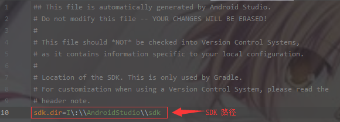

## Android Gradle 研究——1 ##


#### 1. gradle 是什么 ####

> 官方解释是: Gradle is an open-source build automation tool focused on flexibility and performance. Gradle build scripts are written using a Groovy or Kotlin DSL.
> 译文：Gradle 是一个灵活且高性能的开源自动构建工具，它的构建是由 Groovy 或 Kotlin DSL 编写的

> Gradle 是通过组织的一系列 task 来完成自动化构建的，以 AndroidStudio 的 Gradle 打包 APK 为例，整个过程它会进行资源处理、javac 编译、dex 打包、apk 打包、签名、对齐等等步骤，每一个步骤就对应到 gradle 里面的一个 task,AndroidStudio 生成一个 APK 需要经过的 task，如下所示（Build 视图中可以看到）：

```
Executing tasks: [:app:assembleDebug] in project C:\Users\Administrator\AndroidStudioProjects\GradleDemoOne

> Task :app:preBuild UP-TO-DATE
> Task :app:preDebugBuild UP-TO-DATE
> Task :app:compileDebugAidl NO-SOURCE
> Task :app:generateDebugBuildConfig
> Task :app:compileDebugRenderscript NO-SOURCE
> Task :app:mainApkListPersistenceDebug
> Task :app:generateDebugResValues
> Task :app:generateDebugResources
> Task :app:mergeDebugResources
> Task :app:createDebugCompatibleScreenManifests
> Task :app:extractDeepLinksDebug
> Task :app:processDebugManifest
> Task :app:processDebugResources
> Task :app:compileDebugKotlin
> Task :app:javaPreCompileDebug
> Task :app:compileDebugJavaWithJavac
> Task :app:compileDebugSources
> Task :app:mergeDebugShaders
> Task :app:compileDebugShaders
> Task :app:generateDebugAssets
> Task :app:mergeDebugAssets
> Task :app:processDebugJavaRes NO-SOURCE
> Task :app:dexBuilderDebug
> Task :app:checkDebugDuplicateClasses
> Task :app:mergeDebugJavaResource
> Task :app:mergeDebugJniLibFolders
> Task :app:validateSigningDebug
> Task :app:mergeDebugNativeLibs
> Task :app:stripDebugDebugSymbols
> Task :app:mergeExtDexDebug
> Task :app:mergeDexDebug
> Task :app:packageDebug
> Task :app:assembleDebug

BUILD SUCCESSFUL in 39s
24 actionable tasks: 24 executed
```

> **这些 task 都是 groovy 或者 kotlin 语言编写而成的**，目前以 groovy 编写的 task 居多，groovy 和 kotlin 都是基于 jvm 的语言，都是面向对象的语言（即一切皆是对象），因此（对比 Java）在 gradle 里，???.gradle 这些脚本文件的本质就是类的定义，一些配置项就是方法的调用，{}闭包里面就是需要传入的参数

> 例如：一个 AndroidStudio 工程的最外层 build.gradle，它对应的是 Project 类，其中的 buildscript 对应的就是 Project 类的 void buildscript(Closure configureClosure) 方法（Ctrl+鼠标左键 可以找到对应的方法）

**小结：**
&emsp;&emsp;**1. AndroidStudio 中的打包 APK 是通过 Gradle 来构建的**
&emsp;&emsp;**2. Gradle 是通过 groovy 和 kotlin 来编写的**

#### 2. AndroidStudio 的 Gradle 项目讲解 ####

> Gradle 项目的结构


> 项目结构的思维图：


**settings.gradle**

> 内容展示


> settings.gradle 对应 Settings 类，gradle 构建过程中，会根据 settings.gradle 生成 Settings 的对象，其中几个主要的方法有：

- include(String... projectPaths)
- includeFlat(String... projectNames)
- project(String path)

> include ———— 子项目在根工程中的下一级
> includeFlat ———— 子项目和根工程在同一级
> project ———— 指定子模块的位置

```
// project 指定子模块的位置的示例代码

include ':app'
project(':app').projectDir = new File('./app')
```

**根工程build.gradle**

> 内容展示


> 此处的 build.gradle 对应 Project 类，会根据 build.gradle 生成 Project 对象，其中几个主要的方法有：

- buildscript // 配置脚本的依赖项
- allprojects // 配置项目及子项目的依赖项
- respositories // 配置仓库地址
- dependencies // 配置项目的依赖包

**gradlew/gradlew.bat**

> gradlew : Linux 的执行脚本

> gradlew.bat : Windows 的执行脚本

> 这两个脚本文件的作用就是下载 gradle、执行 gradle 命令，它就是整个工程运行的入口，没有它我们需要自己去下载 gradle，然后还要指定 gradle 的路径去运行本工程，这样就会使得整个项目运行变得更复杂

**gradle-wrapper.jar/gradle-wrapper.properties**

> gradle-wrapper.jar : gradlew 运行需要的依赖 jar 包

> gradle-wrapper.properties : gradlw 的配置，其中主要是 gradle 的版本和 gradle 得下载地址、存储地址，内容展示


> gradle 的缓存路径展示


**local.properties**

> 内容展示



**gradle.properties**

> 内容展示：


**子项目的 build.gradle**

> 内容展示：


> 此处的 build.gradle 对应 Project 类，会根据 build.gradle 生成 Project 对象，其中几个主要方法有：

- defaultConfig // 指定默认的属性，会运用到所有的 variants 上
- buildTypes // 一些编译属性可以在这里配置，可配置的所有属性在<a href="https://google.github.io/android-gradle-dsl/current/com.android.build.gradle.internal.dsl.BuildType.html">这里</a>
- release // 发布版本

> 依赖

|新配置|已弃用配置|行为|
|:--:|:--:|:--:|
|implementation|compile|Gradle 会将依赖项添加到编译类路径，并将依赖项打包到构建输出。不过，当您的模块配置 implementation 依赖项时，会让 Gradle 了解**您不希望该模块在编译时将该依赖项泄露给其他模块。也就是说，其他模块只有在运行时才能使用该依赖项**。使用此依赖项配置代替 api 或 compile（已弃用）可以显著缩短构建时间，因为这样可以减少构建系统需要重新编译的模块数。例如，如果 implementation 依赖项更改了其 API，Gradle 只会重新编译该依赖项以及直接依赖于它的模块。大多数应用和测试模块都应使用此配置。|
|api|compile|Gradle 会将依赖项添加到编译类路径和构建输出。当一个模块包含 api 依赖项时，会让 Gradle 了解该模块要以传递方式将该依赖项导出到其他模块，以便**这些模块在运行时和编译时都可以使用该依赖项**。此配置的行为类似于 compile（现已弃用），但使用它时应格外小心，只能对您需要以传递方式导出到其他上游消费者的依赖项使用它。 这是因为，如果 api 依赖项更改了其外部 API，Gradle 会在编译时重新编译所有有权访问该依赖项的模块。 因此，拥有大量的 api 依赖项会显著增加构建时间。除非要将依赖项的 API 公开给单独的模块，否则库模块应改用 implementation 依赖项。|
|compileOnly|provided|Gradle 只会将依赖项添加到编译类路径（也就是说，不会将其添加到构建输出）。如果**您创建 Android 模块时在编译期间需要相应依赖项，但它在运行时可有可无，此配置会很有用。**如果您使用此配置，那么您的库模块必须包含一个运行时条件，用于检查是否提供了相应依赖项，然后适当地改变该模块的行为，以使该模块在未提供相应依赖项的情况下仍可正常运行。这样做不会添加不重要的瞬时依赖项，因而有助于减小最终 APK 的大小。 此配置的行为类似于 provided（现已弃用）。**注意：您无法将 compileOnly 配置与 AAR 依赖项配合使用。**|
|runtimeOnly|apk|Gradle 只会将依赖项添加到构建输出，以便**在运行时使用。也就是说，不会将其添加到编译类路径。** 此配置的行为类似于 apk（现已弃用）。|
|annotationProcessor|compile|**要添加对作为注释处理器的库的依赖关系，您必须使用 annotationProcessor 配置将其添加到注释处理器类路径。**这是因为，使用此配置可以将编译类路径与注释处理器类路径分开，从而提高构建性能。如果 Gradle 在编译类路径上找到注释处理器，则会禁用避免编译功能，这样会对构建时间产生负面影响（Gradle 5.0 及更高版本会忽略在编译类路径上找到的注释处理器）。如果 JAR 文件包含以下文件，则 Android Gradle 插件会假定依赖项是注释处理器：META-INF/services/javax.annotation.processing.Processor。 如果插件检测到编译类路径上包含注释处理器，则会生成构建错误。|
|lintChecks|无|使用此配置可以添加您希望 Gradle 在构建项目时执行的 lint 检查。**注意：使用 Android Gradle 插件 3.4.0 及更高版本时，此依赖项配置不再将 lint 检查打包在 Android 库项目中。要将 lint 检查依赖项包含在 AAR 库中，请使用下面介绍的 lintPublish 配置。**|
|lintPublish|无|在 Android 库项目中使用此配置可以添加您希望 Gradle 编译成 lint.jar 文件并打包在 AAR 中的 lint 检查。这会使得使用 AAR 的项目也应用这些 lint 检查。如果您之前使用 lintChecks 依赖项配置将 lint 检查包含在已发布的 AAR 中，则需要迁移这些依赖项以改用 lintPublish 配置。|

> implementation 依赖图解


> api 依赖图解


> compileOnly 依赖图解

	编译时


	运行时

&emsp;&emsp;&emsp;

> runtimeOnly 依赖图解

	编译时


	运行时

&emsp;&emsp;&emsp;

> build.gradle 的渠道

```
// 渠道 flavor(productFlavors) dimension(flavorDimensions) variant 示例代码

flavorDimensions "size", "color"

productFlavors {
    big {
        dimension "size"
    }
    small {
        dimension "size"
    }
    blue {
        dimension "color"
    }
    red {
        dimension "color"
    }
}
```

> 在 android gradle plugin 3.x 之后，每个 flavor 必须对应一个 dimension，可以理解为 flavor 的分组，然后不同 dimension 里的 flavor 两两组合形成一个 variant

> 那么生成的 variant 对应的就是 bigBlue，bigRed，smallBlue，smallRed

> 每个 variant 可以对应的使用 variantImplementation 来引入特定的依赖，比如：bigBlueImplementation，只有在 编译 bigBlue variant的时候才会引入