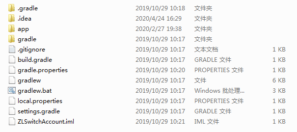
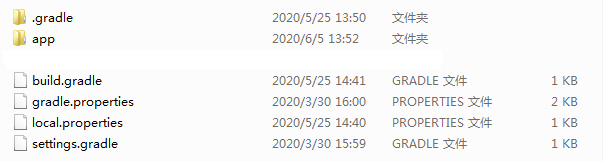
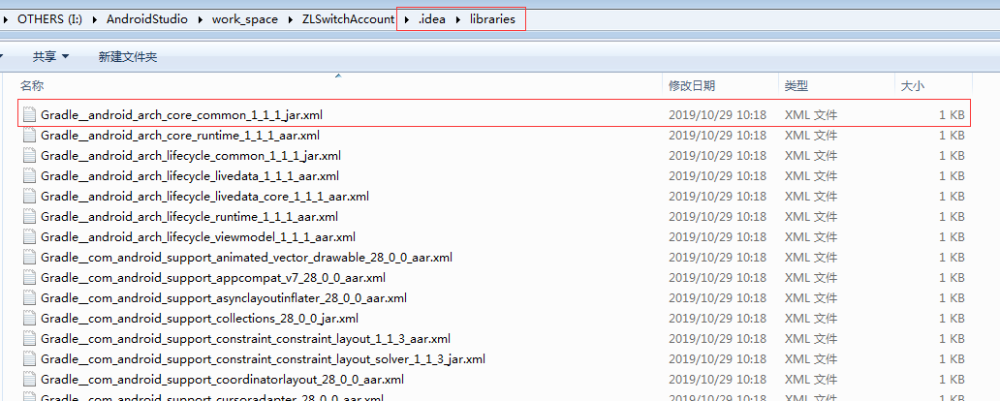
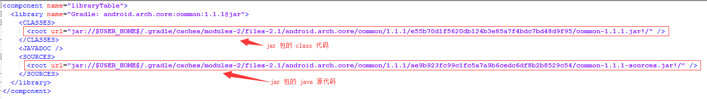
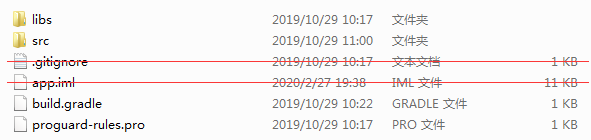
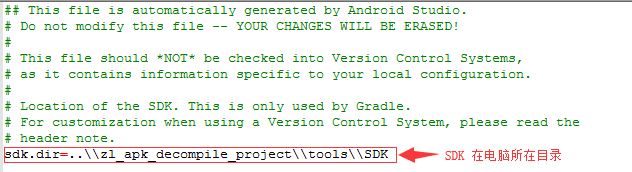
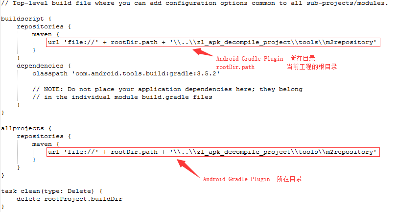
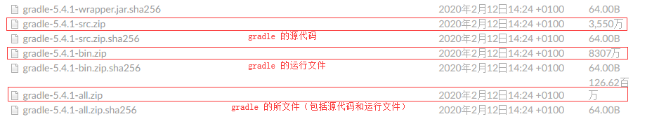
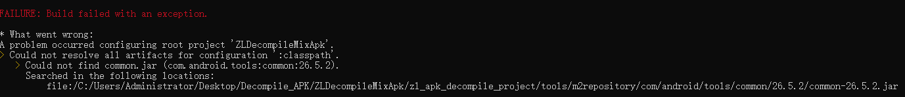
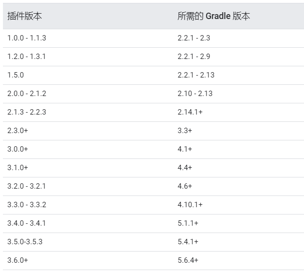

## Android Gradle 研究-2-Android 工程的离线 Gradle 运行环境 ##

#### 1. Android 工程（打破 AndroidStudio 工程结构） ####

> AndroidStudio 工程目录的结构<a href="https://github.com/Leezps/personal-summary/blob/master/2020-2-18/2020-2-18(Android%20Gradle%20research-1).md">说明</a>

> AndroidStudio 工程创建的目录结构如下



> 删除多余文件的离线 Gradle 工程的目录结构如下



> .gradle 文件夹可以删除，gradle 自动构建工具编译工程时，会生成 .gradle 文件夹
> .idea 文件夹可以删除，.idea 文件夹里面存储了从网上下载下来的 jar 包映射关系，用于 AndroidStudio 寻找对应的 jar 包，它是根据 build.gradle 中的配置 AndroidStudio 自动生成的文件



> Gradle_android_arch_core_common_1_1_1_jar.xml 文件内容如下:



> gradle 文件夹可以删除，gradle 文件夹里面储存了 gradlew 所需要的 jar 包以及工程编译所需要的 gradle 自动构建工具的版本以及其下载地址

> .gitignore 文件可以删除，它只是用于 git 提交时，忽视某些文件以及文件夹，如果你用的是 SVN 提交代码或者是 git 提交时，不忽视文件以及文件夹，就可以将其删除

> gradlew 与 gradlew.bat 可以删除，它是 AndroidStudio 的启动命令行的脚本工具，它会检测 gradle 自动构建工具是否存在，如果不存在，它会去下载，如果存在，就会使用 gradle 自动构建工具执行后续命令，因为离线，所以我们需自己下载 gradle 自动构建工具，既然我们自己下载了 gradle 自动构建工具，就不需要它去检测是否存在 gradle 自动构建工具，当然保留它也可以，你需要将下载下来的 gradle 自动构建工具放到 gradle 文件夹中 gradle-wrapper.properties 文件所指定的文件夹目录下，这样 gradlew 检测到有对应版本的 gradle，就不会去下载了，然后执行后续命令

> ZLSwitchAccount.iml 文件可以删除，它是 AndroidStudio 根据 build.gradle 自动生成的模块文件，对于不依赖 AndroidStudio 的 Android 工程没有意义

> **最后剩下的文件如上面 Gradle 工程的目录结构**

#### 2. Android 工程中的 app 目录结构 ####

> 相对于 AndroidStudio 工程的目录结构如下(红色线划掉的文件是离线 Gradle 工程不需要的文件):



> .gitignore 文件可以删除，该文件是 git 的忽略文件，对于不使用 git 代码提交工具的工程可以删除该文件

> app.iml 文件可以删除，它是 AndroidStudio 根据 build.gradle 自动生成的模块文件，对于不依赖 AndroidStudio 的 Android 工程没有意义

#### 3. Android 工程中的相关配置修改(未提及的文件不做修改) ####

> local.properties 文件作如下修改：



	从有网的电脑的 AndroidStudio IDE中，复制对应的 SDK 到离线的电脑中

> 根目录下的 build.gradle 文件作如下修改:



> 根目录下命令行生成 apk(执行如下命令):

```
..\\zl_apk_decompile_project\\tools\\gradle-5.4.1\\bin\\gradle assembleRelease
```

> 命令前部分是 Gradle 存放的地址，assembleRelease 是生成 APK 的命令代码

> Gradle 的下载地址：<a href="https://services.gradle.org/distributions/">https://services.gradle.org/distributions</a>



> 将 gradle-5.4.1-all.zip 下载下来，解压之后就可以用于上方命令的前部分 Gradle 存放地址

> 如果你只想研究下 Gradle，不需要运行，直接下载 gradle-5.4.1-src.zip 就行了

> 如果你只想运行 Gradle，不研究 Gradle，直接下载 gradle-5.4.1-bin.zip 就行了

> 执行命令生成 APK，因为没下载 Android Gradle Plugin，会出现如下情况：



	可以从 C:\Users\Administrator\.gradle\caches\modules-2\files-2.1\ 中拷贝对应的 jar 
	包到这个缺少的文件目录下,也可以从 https://mvnrepository.com/ 中找到对应的 jar 包，然后
	下载放到这个目录中

> <a href="https://mvnrepository.com/">Maven Repository(Maven 仓库)</a> 中找到对应的 jar 包下载

> Android Gradle Plugin 所需 Gradle 的版本



> 查看地址：<a href="https://developer.android.com/studio/releases/gradle-plugin#updating-gradle">Android Gradle Plugin 所需 Gradle 的版本</a>

#### 4. 参考网页 ####

1. <a href="https://www.jianshu.com/p/6f3da4ac6b6e">离线安装、配置Android Studio开发环境</a>
