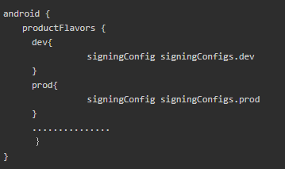
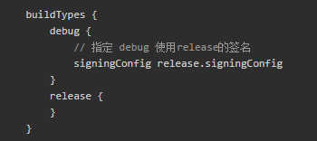

### build.gradle 的 productFlavors 设置 signingConfig 在 Debug 模式下无效问题 ###

> build.gradle 中 productFlavors 的 flavor 里指定 signingConfig （使用前先定义）就可以指定 release 包的签名配置，但对 debug 包无效

> 如果想 debug 包也使用不同的签名配置，可以显示的指定 debug 使用 release 的签名配置

> 也可以使用如下代码

	android {
		…………
		signingConfigs {
			default_sign {
				keyAlias 'androiddebugkey'
				keyPassword 'android'
				storeFile file('../keystore/default/debug.keystore')
				storePassword 'android'
			}
			ysdk_sign {
				keyAlias 'androiddebugkey'
				keyPassword 'android'
				storeFile file('../keystore/ysdk_debug/debug.keystore')
				storePassword 'android'
			}
		}
		buildTypes {
			release {
				minifyEnabled false
				proguardFiles getDefaultProguardFile('proguard-android.txt'), 'proguard-rules.pro'
				// release 模式将签名文件设置为空，那就只能使用 productFlavors 中设置的签名文件
	            signingConfig null
	        }
	        debug {
				// debug 模式将签名文件设置为空，那就只能使用 productFlavors 中设置的签名文件
	            signingConfig null
	        }
	    }
		flavorDimensions "sdks"
	    productFlavors {
			ysdk {
	            applicationId "com.tencent.tmgp.yybtestsdk"
	            signingConfig signingConfigs.ysdk_sign
	            dimension "sdks"
	        }
			zulong {
	            applicationId "com.zulong.sdk.test"
	            signingConfig signingConfigs.default_sign
	            dimension "sdks"
	        }
		}
	}

这样就可以完成 gradle 脚本控制不同 flavor 在 Debug 模式下使用不同的签名